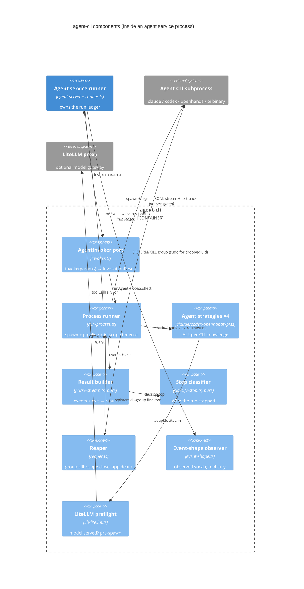

# agent-cli — component diagram (C4 level 3)

Inside `packages/js/agent-cli`, the shared library every agent SERVICE uses to drive its
CLI subprocess. One `AgentStrategy` per CLI carries all per-agent knowledge; everything else
is agent-agnostic machinery. The consumer (an agent service's runner, e.g. claude-agent's)
provides the Effect platform layers and receives both the final `InvocationResult` and the
live event stream (which it feeds to its run ledger).

## Reading notes

- **All agent-specific knowledge lives in one component** — the strategies. Adding an agent is
  one new `AgentStrategy` (+ a Live layer line in invoker.ts); nothing else changes. This is
  the seam the `integrate-agent` skill builds on.
- **The runner owns the subprocess lifecycle end to end**: spawn (with the container-mode sudo
  uid drop), the timeout (handled where the collected events are still in scope — a timed-out
  run still reports partial usage), and teardown via the reaper (no orphan can outlive its run
  and bill invisibly).
- **Two pure leaves** — result builder and stop classifier — carry the accounting-critical
  logic (partial results, usage-limit detection) and are unit-tested without any process.
- **The package never touches the ledger or the statestore**: events flow OUT through the
  consumer's `onEvent`; the consumer (agent-server's runner) owns persistence. That keeps
  agent-cli dependency-free of h's runtime.
