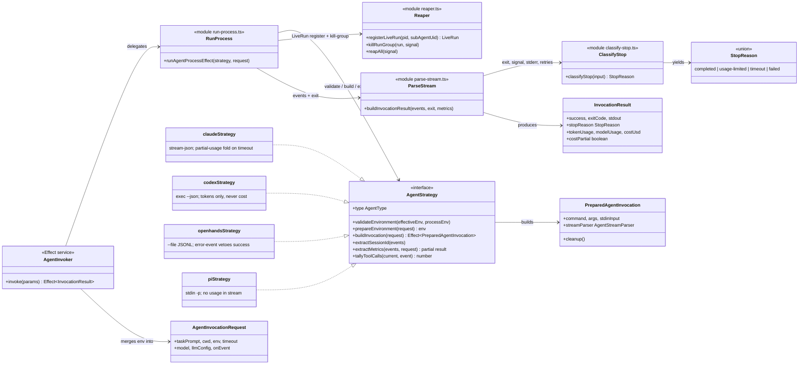

# agent-cli — code diagram (C4 level 4)

Zooming into the load-bearing seam of `packages/js/agent-cli`: the `AgentStrategy` contract
and the types that flow through a run. Deliberately NOT an exhaustive member dump — only the
members that tell the story (the [component diagram](./agent-cli-components.md) is the level
above; this level exists because every agent integration is written against exactly these
shapes — the `integrate-agent` skill's "CLI strategy" piece).

## Reading notes

- **`AgentStrategy` is the whole integration surface**: the four realizations differ ONLY in
  what each note says — stream shape, invocation flags, and what usage/cost their CLI reports.
  `integrate-agent` adds a fifth realization; nothing above the interface changes.
- **`extractMetrics` is where accounting honesty lives**: claude's folds partial per-call
  usage when the terminal result event is missing (`costPartial: true`); codex/pi/openhands
  return what their CLIs actually expose — absence stays absent, never a fabricated zero.
- **`StopReason` is orthogonal to `success`** — a usage-limited run can exit 0; the
  classifier reads exit + signal + stderr + the stream's rate-limit retry count, and the
  watcher's fallback/auto-deny machinery keys on it downstream.
- **`PreparedAgentInvocation.cleanup`** runs on every exit path (the openhands temp task
  file); the reaper covers the PROCESS side of the same promise.
