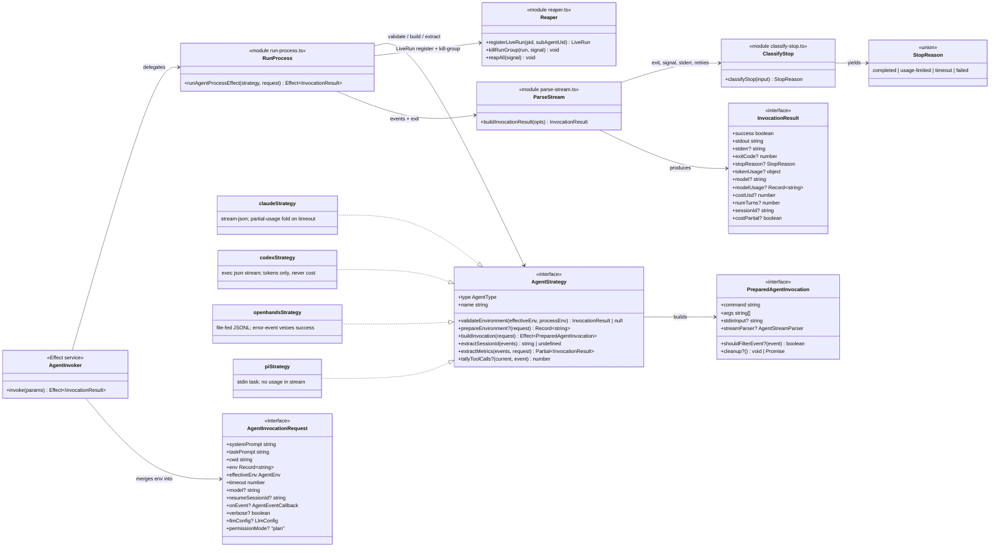

# agent-cli — code diagram (C4 level 4)

Zooming into the load-bearing seam of `packages/js/agent-cli`: the `AgentStrategy` contract
and the types that flow through a run. GENERATED deterministically from the TypeScript AST by
`tools/diagrams/gen-code-diagram.mjs` (members are code truth; scope/topology/notes are curated in
the manifest comment below) — only the symbols that tell the story (the [component diagram](./agent-cli-components.md) is the level
above; this level exists because every agent integration is written against exactly these
shapes — the `integrate-agent` skill's "CLI strategy" piece).

<!-- gen:c4-code {
  "direction": "LR",
  "classes": [
    {"id": "AgentInvoker", "kind": "interface", "file": "packages/js/agent-cli/src/invoker.ts", "symbol": "AgentInvokerService", "stereotype": "Effect service"},
    {"id": "RunProcess", "kind": "module", "file": "packages/js/agent-cli/src/agents/run-process.ts", "functions": ["runAgentProcessEffect"]},
    {"id": "Reaper", "kind": "module", "file": "packages/js/agent-cli/src/agents/reaper.ts", "functions": ["registerLiveRun", "killRunGroup", "reapAll"]},
    {"id": "ParseStream", "kind": "module", "file": "packages/js/agent-cli/src/agents/parse-stream.ts", "functions": ["buildInvocationResult"]},
    {"id": "ClassifyStop", "kind": "module", "file": "packages/js/agent-cli/src/agents/classify-stop.ts", "functions": ["classifyStop"]},
    {"id": "AgentStrategy", "kind": "interface", "file": "packages/js/agent-cli/src/agents/types.ts", "symbol": "AgentStrategy"},
    {"id": "claudeStrategy", "kind": "const", "file": "packages/js/agent-cli/src/agents/claude.ts", "symbol": "claudeStrategy", "note": "stream-json; partial-usage fold on timeout"},
    {"id": "codexStrategy", "kind": "const", "file": "packages/js/agent-cli/src/agents/codex.ts", "symbol": "codexStrategy", "note": "exec json stream; tokens only, never cost"},
    {"id": "openhandsStrategy", "kind": "const", "file": "packages/js/agent-cli/src/agents/openhands.ts", "symbol": "openhandsStrategy", "note": "file-fed JSONL; error-event vetoes success"},
    {"id": "piStrategy", "kind": "const", "file": "packages/js/agent-cli/src/agents/pi.ts", "symbol": "piStrategy", "note": "stdin task; no usage in stream"},
    {"id": "AgentInvocationRequest", "kind": "interface", "file": "packages/js/agent-cli/src/agents/types.ts", "symbol": "AgentInvocationRequest"},
    {"id": "PreparedAgentInvocation", "kind": "interface", "file": "packages/js/agent-cli/src/agents/types.ts", "symbol": "PreparedAgentInvocation"},
    {"id": "InvocationResult", "kind": "interface", "file": "packages/js/agent-cli/src/agents/types.ts", "symbol": "InvocationResult"},
    {"id": "StopReason", "kind": "union", "file": "packages/js/agent-cli/src/agents/classify-stop.ts", "symbol": "StopReason"}
  ],
  "relations": [
    ["AgentInvoker", "RunProcess", null, "delegates"],
    ["AgentInvoker", "AgentInvocationRequest", null, "merges env into"],
    ["RunProcess", "AgentStrategy", null, "validate / build / extract"],
    ["AgentStrategy", "PreparedAgentInvocation", null, "builds"],
    ["RunProcess", "Reaper", null, "LiveRun register + kill-group"],
    ["RunProcess", "ParseStream", null, "events + exit"],
    ["ParseStream", "ClassifyStop", null, "exit, signal, stderr, retries"],
    ["ParseStream", "InvocationResult", null, "produces"],
    ["ClassifyStop", "StopReason", null, "yields"]
  ]
} -->

## Reading notes

- **`AgentStrategy` is the whole integration surface**: the four realizations differ ONLY in
  what each note says — stream shape, invocation flags, and what usage/cost their CLI reports.
  `integrate-agent` adds a fifth realization; nothing above the interface changes.
- **`extractMetrics` is where accounting honesty lives**: claude's folds partial per-call
  usage when the terminal result event is missing (`costPartial: true`); codex/pi/openhands
  return what their CLIs actually expose — absence stays absent, never a fabricated zero.
- **`StopReason` is orthogonal to `success`** — a usage-limited run can exit 0; the
  classifier reads exit + signal + stderr + the stream's rate-limit retry count, and the
  watcher's fallback/auto-deny machinery keys on it downstream.
- **`PreparedAgentInvocation.cleanup`** runs on every exit path (the openhands temp task
  file); the reaper covers the PROCESS side of the same promise.
