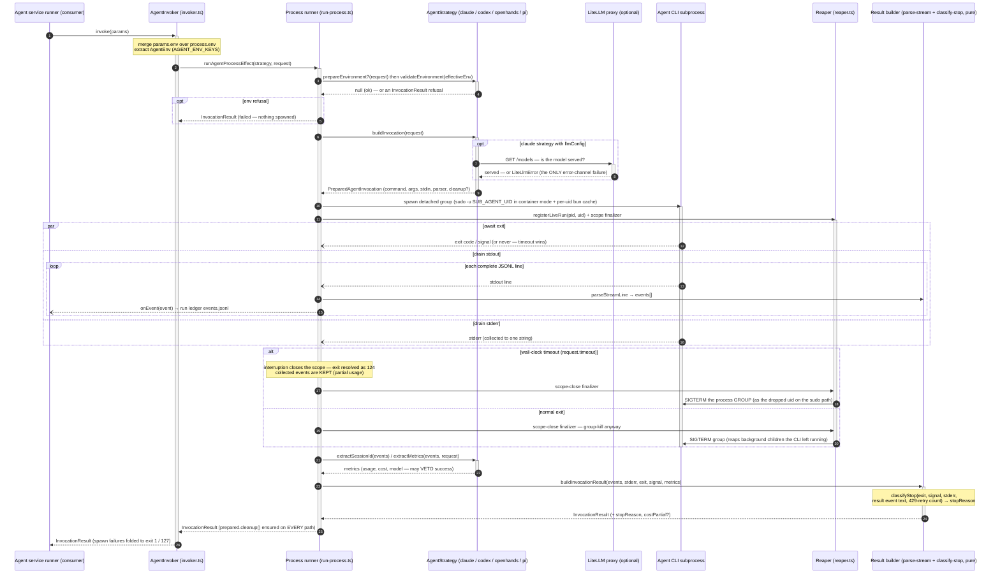

# agent-cli — sequence diagram (one agent run)

One invocation through `packages/js/agent-cli`, from the consumer's `invoke(params)` to the
`InvocationResult` it always gets back: env validation, the strategy build (with claude's
LiteLLM preflight), the spawned subprocess with its three concurrent drains, the timeout
path that keeps partial events, the reaper's group-kill guarantee, and the pure
build-and-classify tail. The [C4 component diagram](./agent-cli-c4-component.md) is the
structural view of the same machinery; the [class diagram](./agent-cli-class.md) has the
exact member shapes.

## Reading notes

- **The consumer always gets an `InvocationResult`** — the error channel carries only
  `LiteLlmError` (step 8). Timeouts become structured exit-124 results (steps 17–18), spawn
  failures exit-1, command-not-found exit-127 (step 26): the runner never needs a catch-all.
- **A timeout keeps the evidence** (steps 17–18): it is handled where `streamEvents` is
  still in scope, so a throttle-stretched run still reports partial usage and its 429 retry
  count — which is how `classifyStop` (steps 23–24) can call it `usage-limited` rather than
  a bare `timeout`. `stopReason` is orthogonal to `success`; the watcher's fallback/auto-deny
  machinery keys on it downstream.
- **No orphan outlives the run** (steps 11, 17–20): the reaper group-kills on EVERY scope
  close — including exit 0, where the platform's own release skips cleanup — and the
  process-exit hook reaps live groups on app death, so a background child the CLI left
  running can't linger and bill invisibly.
- **All per-agent knowledge sits in the `Strategy` lane** (steps 3–4, 6–9, 21–22): validate,
  build, extract. The other lanes are agent-agnostic machinery — adding an agent touches
  only that lane (the `integrate-agent` seam).
- **The package never persists anything**: events flow OUT through `onEvent` (step 15); the
  consumer's run ledger owns the write.
