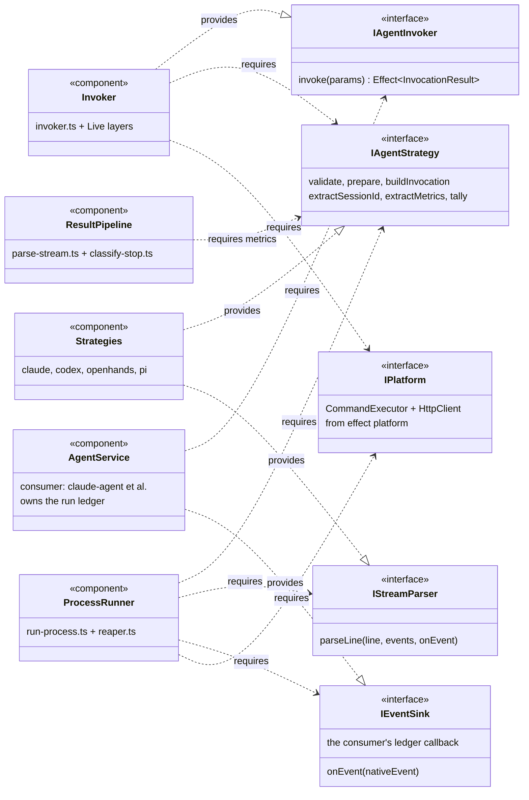

# agent-cli — UML component diagram

The INTERFACE-centric view of `packages/js/agent-cli` — distinct from the
[C4 component diagram](./agent-cli-c4-component.md) (which shows collaboration structure):
here the first-class citizens are the CONTRACT POINTS — what each component PROVIDES
(realization, `..|>`) and REQUIRES (dependency, `..>`). This is the view that answers "what
must I implement, and what may I depend on?"

**Encoding note:** mermaid has no native UML component type; the convention (diagrams skill)
is `classDiagram` with `<<component>>` / `<<interface>>` stereotypes — provides = `..|>`,
requires = `..>`.

## Reading notes

- **The dependency direction tells the reuse story**: `Strategies` provide two interfaces
  and require NONE of agent-cli's — a fifth agent implements `IAgentStrategy` (+ optionally
  `IStreamParser`) and touches nothing else. That is the `integrate-agent` seam stated as
  interfaces.
- **`IEventSink` inverts the ledger dependency**: the consumer PROVIDES the sink, agent-cli
  only requires it — which is why the package carries no ledger, statestore, or h-runtime
  dependency (the C4 view says "runtime-free"; this view shows the mechanism).
- **`IPlatform` is the only outward requirement** (Effect's CommandExecutor + HttpClient),
  satisfied by layers the consumer composes — the whole package is testable by substituting
  those two.
- The C4 component diagram remains the "who collaborates with whom" view; use this one when
  the question is contracts, that one when the question is structure, and the
  [code diagram](./agent-cli-class.md) when the question is exact member shapes.
