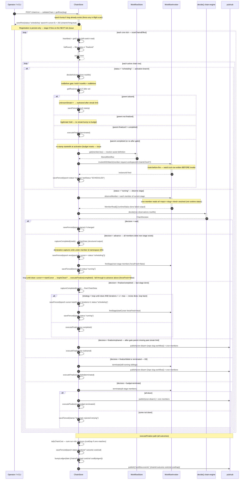

# chain-run-engine-sequence — chain engine stage progression (one tick)

The ENGINE side of `h chain run`: from the operator's `POST /chain/run` registration through
every cron-tick stage advance, the loop-until-clean body, to terminal finalization. The CLI side
(expression parsing → one `POST /chain/run`) is modeled separately in
[h-cli-chain-run-sequence](./h-cli-chain-run-sequence.md) — this diagram begins where that one ends.

Source files: `packages/js/engine-core/src/chain-scan.ts`,
`chain-engine.ts`, `chain-members.ts`.

## Reading notes

- **Mark-before-fire** (step 3): registration persists the `scheduling` row BEFORE the operator gets
  202, but stage 0 does NOT fire in the request handler — it fires on the next tick's activation
  branch (issue #79a). A crash between registration and the tick leaves a healable `scheduling` row.
- **Epoch fence** (step 18 `saveFenced`): every row-mutating action re-reads the row and no-ops
  when the epoch moved. A concurrent re-registration creates epoch N+1; this tick's decision at epoch
  N becomes a no-op — safe.
- **Activation gates** (steps 7–15, issues #78/#79a): `notBefore` holds without a streak; `after` a
  missing parent counts as UNKNOWN and streaks to `orphaned`; a parent finalized non-completed →
  `terminated` immediately; a completed parent seeds the child's chain data (step 14), and the
  `startedAt` is re-stamped at activation so the wall-clock budget counts work time, not wait time.
- **Cron member observation path** (step 20 note): a cron member self-armed its own recurrence via
  the §10 `arm-*` pattern — the chain never fired it and never reads its flaky runtime instance
  status. It reads `wf:<repo>:<slug>:<kind>.resolved` instead; `done` ↔ goal met on that row.
  Transient run failures never fail the chain — the member retries on its own clock.
- **Declarative captures / D5 namespace** (step 28): `captureCompleted` writes each completed
  member's structured output into the chain data. A member with an `id` writes under `data[id]` so
  concurrent stage members never clobber; a downstream member's dotted `inputs` path (`id.field`)
  reads it back.
- **Loop-until-clean intercepts** (two scan-side branches; the engine is strategy-agnostic): (1)
  **advance / review stage done**: when `cursor === loop.startCursor` and `loopIsClean`, the scan
  calls `executeFinalize(completed)` — stopping the loop; when NOT clean it falls through to
  `executeAdvance(nextStage, false)` to fire the revise stage with `forceFresh=false`. (2)
  **finalize/completed / revise stage done**: the revise stage is the last stage in the loop segment,
  so the engine reports `finalize/completed`; if `iterations + 1 < maxIterations` the scan calls
  `executeAdvance(startCursor, forceFresh=true)` + `loop.iterations++` to loop back to the review
  stage. The iteration budget is the backstop.
- **D6 atomic teardown** (finalize/failed branch): a non-completed finalize terminates the still-running
  siblings first, THEN publishes `cron-disarm` for every cron member (the chain never writes `cron:sub`;
  the subscriber is the cron scan's single writer), THEN finalizes the chain row — in that order, never
  the reverse.
- **costGap** (step 47): zero matching `run:*` mirrors is flagged `costGap: true`, never silently $0.
  A gap means the run ledger mirror didn't land (best-effort write, MCP server down) — the ledger is
  wrong, not the cost.
