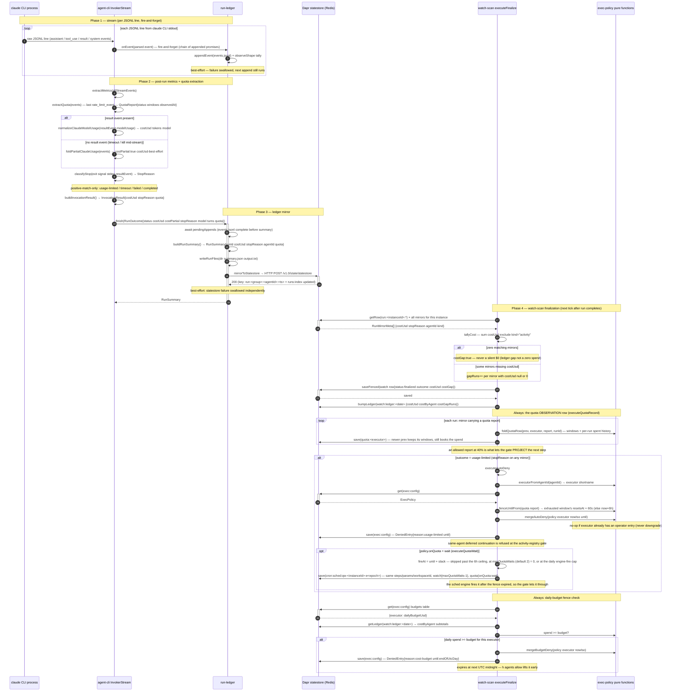

# cost-accounting-sequence — agent run usage to day ledger, quota row and budget fence

How a single agent run's cost AND rate-limit headroom flow from CLI stream events all the way to
the fences: the agent-cli metrics + quota extraction, the run-ledger statestore mirror, the
watch-scan cost tally, the `quota:` observation row every finalize writes, and the three
containment actions (usage-limited auto-deny fenced until the observed reset, the quota-wait
continuation, and the daily-budget fence). The quota GATE that reads the row before a fire is on
[implement-pr-run-sequence](./implement-pr-run-sequence.md).

Source files: `packages/js/agent-cli/src/agents/claude.ts`, `packages/js/agent-cli/src/agents/classify-stop.ts`,
`packages/js/agent-cli/src/agents/quota.ts`, `packages/js/run-ledger/src/run-ledger.ts`,
`packages/js/engine-core/src/watch-scan.ts`, `packages/js/engine-core/src/quota.ts`,
`packages/js/engine-core/src/exec-policy.ts`.

## Reading notes

- **Fire-and-forget event appends** (step 3): `onEvent` runs synchronously on the invoker's
  callback but each `events.jsonl` write is chained as a promise — `finish()` awaits the whole chain
  so the file is complete before `summary.json` lands. Failures are individually swallowed; a failed
  append never blocks the next line.
- **Partial path** (step 8): when the process is killed or times out before a `result` event
  arrives, `foldPartialClaudeUsage` folds per-call model usage off `assistant` events. The
  resulting `costPartial: true` flag on the ledger record signals "cumulative-up-to-the-stop, not a
  final accounting" — a partial run with no observable cost still reads as a cost gap, not $0.
- **classifyStop is positive-match-only** (step 9): it returns `usage-limited` ONLY when the exit
  code, signal, or a parsed stream event positively matches; unknown exits default to `failed` or
  `completed`, never inferred as usage-limited. Context-window exhaustion is explicitly excluded.
- **Statestore mirror is best-effort** (step 16 note): the `mirrorToStatestore` call is independently
  `Effect.ignore`d so a Redis or Dapr sidecar outage never breaks the run. The on-disk
  `summary.json` + `events.jsonl` are the source of truth; the mirror is the queryable index.
- **costGap invariant** (step 22): zero matching `run:<instanceId>:*` mirrors is ALWAYS flagged,
  never a silent $0. A gap means the mirror didn't land — the ledger is incomplete, not the cost.
  Gap-run count (`gapRuns`) accumulates separately so the operator can distinguish "truly zero cost"
  from "unknown cost."
- **The quota row is an observation, the exec row is a decision** (executeQuotaRecord): the
  `quota:<executor>` row records what the CLI last SAID about the account's windows plus a
  per-run `history` of how much each run spent of them, on EVERY finalize — a healthy 40% report is
  what lets the pre-fire gate estimate a step's cost. When a newer observation is already in the
  row (a parallel run finalized later), its windows are kept and only this run's spend is booked.
- **The fence expires at the observed reset** (fenceUntilFrom): a 5h limit hit ten minutes before
  its reset no longer idles the executor for six hours. Without a report the flat 6h default stands.
- **The quota wait is a `cron:sched` continuation** (executeQuotaWait): the same shape the
  usage-limit fallback arms, under the SAME identity, at reset + slack — after the fence has expired,
  so the gate lets it through — with `maxQuotaWaits` counting down and `quota: {onQuota: wait}` on
  the trigger so a still-hot window on wake defers again instead of refusing. Fail-closed on the
  daily engine-fire cap like every other engine fire.
- **auto-deny no-downgrade guarantee** (mergeAutoDeny note): `mergeAutoDeny` checks whether the executor
  already has an operator entry (reason `"operator"`, never-expiring). If so, it is a no-op — the
  engine never replaces a permanent deny with an expiring one. `h agents allow` is the only path
  that lifts either kind.
- **Budget fence UTC reset**: the expiring `DeniedEntry` has `until` set to the
  last millisecond of the current UTC day (midnight). The fence self-lifts at the start of the next
  UTC day with no engine action; `h agents allow` lifts it early.
