# cron-siblings-state — five engine row lifecycles

The five cron-sibling primitives share one build-pattern — a policy row in a registry, evaluated by
a pure `decide()` on the 60-second tick, acting on workflows through a closed vocabulary, epoch-fenced,
single-writer (`workflow-svc`). What differs is the JOB each one does and therefore the states its row
moves through. This diagram shows all five state machines side-by-side so their structural similarity
and differences are visible at once.

Status literals are read from the model files (`watch.model.ts`, `chain.model.ts`, `cron.model.ts`,
`discover.model.ts`, `schedule.model.ts`) — not from prose.

```mermaid
stateDiagram-v2
  direction LR

  state "Watch (watch:sub:<id>)" as W {
    [*] --> W_scheduling : registerWatchForFire\n(mark-before-fire)
    W_scheduling : scheduling
    W_scheduling --> W_watching : scan sees instance RUNNING/PENDING\n(budget not yet breached)
    W_watching : watching
    W_watching --> W_finalized : budget expired → terminate\nor COMPLETED/FAILED/TERMINATED\nor orphaned (UNKNOWN streak)
    W_scheduling --> W_finalized : orphaned (UNKNOWN streak limit)
    W_finalized : finalized\n(outcome: completed / failed / terminated\n/ budget-terminated / orphaned\n/ usage-limited)
    W_finalized --> [*]
  }

  state "Chain (chain:sub:<id>)" as C {
    [*] --> C_scheduling : registerChainForFire\n(stage 0 armed — fires on next tick)
    C_scheduling : scheduling
    C_scheduling --> C_running : activation gates satisfied\n→ fireStage(0) + saveFenced
    C_running : running
    C_running --> C_scheduling : advance: all stage members done\nnext stage exists → cursor++ epoch+1
    C_running --> C_finalized : all stages done (completed)\nor member failed/terminated (D6)\nor budget-terminated / orphaned
    C_scheduling --> C_finalized : after-chain failed / unfulfilled\nor orphaned (parent absent streak)
    C_scheduling --> C_finalized : disarmed (h chain disarm)
    C_running --> C_finalized : disarmed (h chain disarm)
    C_finalized : finalized\n(outcome: completed / failed / terminated\n/ budget-terminated / orphaned\n/ unfulfilled / disarmed)
    C_finalized --> [*]
  }

  state "Recur cron (cron:sub:<repo>:<slug>:<wf>)" as R {
    [*] --> R_active : register-cron activity\n(§10 arm-* — run's closing bracket)
    R_active : active
    R_active --> R_active : tick due + not in-flight + not resolved\n→ re-fire same instanceId (fresh)
    R_active --> R_inactive : goal resolved (wf: row .resolved=true)\nor budget exhausted (maxFires)\nor kill switch (disabled)
    R_inactive : inactive\n(outcome: resolved / budget-exhausted / disabled)
    R_inactive --> [*]
  }

  state "Discovery cron (cron:discover:<repo>:<label>)" as D {
    [*] --> D_active : register-discover activity\n(§10 arm-* — provision workflow step)
    D_active : active
    D_active --> D_active : tick due + not in-flight + daily cap not hit\n→ fire ONE new issue (oldest first)
    D_active --> D_inactive : operator disarm only\n(no resolved handshake — runs until disarmed)
    D_inactive : inactive
    D_inactive --> [*]
  }

  state "Scheduled-fire (cron:sched:<id>)" as S {
    [*] --> S_armed : arm via /workflow/run?at=…\nor watcher fallback action\nor pause/resume
    S_armed : armed
    S_armed --> S_fired : fireAt reached (or in the past)\nand notAfter not yet passed
    S_armed --> S_expired : notAfter passed before fireAt reached\n(time-critical window closed — never fires)
    S_armed --> S_disarmed : operator disarm (h schedule rm)
    S_fired : fired\n(one-shot complete)
    S_expired : expired\n(window missed — never fired)
    S_disarmed : disarmed\n(cancelled before firing)
    S_fired --> [*]
    S_expired --> [*]
    S_disarmed --> [*]
  }
```

## Reading notes

- **Shared build-pattern**: every sibling has a REGISTRATION path that writes an initial row
  (mark-before-fire or mark-before-arm), a SCAN path that observes live state and calls a pure
  `decide()`, and epoch-fenced row mutations that no-op when a concurrent re-registration moved the
  epoch. The scan runs on the same 60-second `workflow-cron-tick` for all five.
- **What differs is the action vocabulary**: watch RE-fires ONE instance on failure; chain FIRES THE
  NEXT stage; recur cron RE-FIRES THE SAME workflow on a clock; discover FANS OUT one fire per new
  source item; sched fires ONE workflow ONCE at an absolute time.
- **Watch `scheduling` → `watching`**: registration always writes `scheduling`; the scan upgrades it
  to `watching` once it observes the instance in a live state. The distinction matters for orphan
  detection: a `scheduling` row whose instance never appears (crash between write and invoke) streaks
  to `orphaned` in the same way a `watching` row with an UNKNOWN instance does.
- **Chain `scheduling` revisited on advance**: unlike watch, a chain row bounces between `running`
  and `scheduling` on each stage boundary (`cursor++`, `epoch+1`) — the activation branch of the
  scan re-fires the new stage. The advance bumps the epoch so a stale scan decision for the previous
  stage no-ops.
- **`unfulfilled` and `disarmed`** on chain are set OUTSIDE `decide()`: `unfulfilled` (issue #91)
  fires when a parent's structured output didn't produce the inputs the child needs; `disarmed` is
  an operator action (`h chain disarm`) — not part of the engine's `decide()` cycle.
- **Discovery cron's `inactive`** is OPERATOR-ONLY — the engine never deactivates it (no goal, no
  budget). An active discovery cron runs until `h cron rm` is called.
- **Sched `armed` → `fired`** is a one-shot: the scan deactivates the row immediately after firing;
  a subsequent tick sees `status !== "armed"` and returns `wait`. The three terminal outcomes
  (`fired`, `expired`, `disarmed`) carry no further scan work.
- **Recur cron `fires` counter**: counts invocations against `budget.maxFires`; on reach →
  `inactive` (outcome `budget-exhausted`). Absent from the diagram body (internal counter, not a
  state), but it is the only stop other than `resolved` and operator disarm.
