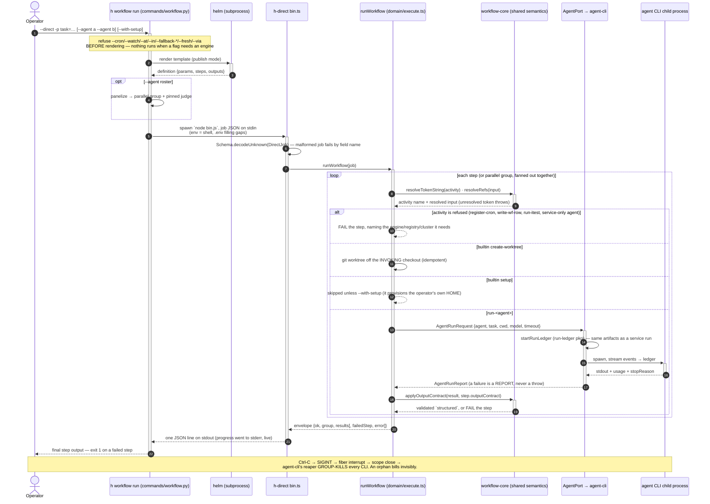

# direct-run-sequence — a workflow on the direct substrate, end to end

What happens between `h workflow run <template> --direct -p …` and the answer on stdout: the CLI
renders the template locally, hands the definition to the `h-direct` runner on stdin, and the
runner walks the steps in-process — resolving tokens, cutting worktrees, spawning agent CLIs as
child processes, and validating each output contract. No Dapr, no services, no registries.

The service-substrate counterpart is [implement-pr-run-sequence](./implement-pr-run-sequence.md)
(the same composition, fired at workflow-svc and supervised by the watcher). What one agent
invocation does inside `agent-cli` — shared verbatim by both substrates — is
[agent-cli-sequence](./agent-cli-sequence.md). The structural view of both substrates is
[system-c4-container](./system-c4-container.md).

## Reading notes

- **The wire is the definition** (step 8). What crosses into the runner is the same
  `{params, steps}` artifact the service path would have POSTed — which is what makes the two
  substrates auditably symmetric rather than symmetric by claim.
- **Refusals happen twice, both loud, both before work.** Machinery flags are refused CLI-side
  before the render (step 2); engine/registry/cluster ACTIVITIES are refused per step (step 13).
  Neither is a skip: a silently-skipped `register-cron` would report a recurrence that was never
  armed, and a skipped `run-itest` a gate that never ran.
- **Steps 11–12 are the parity seam.** Token/`$ref` resolution and contract validation are called
  out of `workflow-core`, the same module `generic.workflow.ts` and the run-* activities use. The
  one deliberate difference: engine-side each run-* ACTIVITY applies the contract; here the
  EXECUTOR does, because `AgentPort` is contract-agnostic. Same validator, same consequence.
- **A failed agent run is a report, not a throw** (step 19) — that is what lets `h delegate` keep
  three answers when the fourth agent is missing. The executor converts it to a step failure;
  `runDelegate` does not.
- **No engine brackets.** `generic.workflow.ts` wraps a run in `write-wf-row(running/done)` and an
  `armCron` closing bracket. Neither appears here: both write registries this substrate does not
  have, and the activities behind them are refused by name.
- **The reaper is load-bearing, not incidental** (final note). The interrupt path was validated by
  killing a live run and confirming zero surviving CLI processes — an orphaned agent keeps working
  and keeps billing with nothing recording it.
- **A chain adds one outer loop** around this whole diagram: `runChain` walks stages, runs each
  stage's members through `runWorkflow` concurrently, threads captures/inputs into the chain data
  via `contractFor`, and re-enters at the review stage for `loop-until-clean`. Its stage arithmetic
  and threading contracts come from `workflow-core` too; the durable `decide()` engine does not,
  because it exists only for runs that outlive the process watching them.
