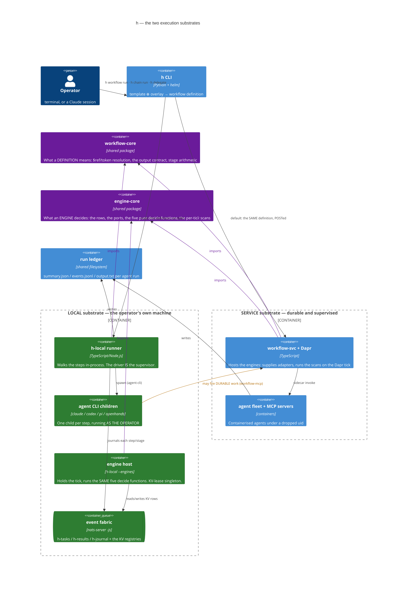

# execution-substrates-c4-container — one composition, two executors

h composes work ONE way and executes it TWO ways. The `h` CLI renders a template into a workflow
definition — `{params, steps, outputs}` — and then either fires that definition at workflow-svc
(the SERVICE substrate: Dapr engine, agent fleet, registries, supervision) or executes it in its
own process (the LOCAL substrate: agent CLIs as child processes, no infrastructure at all).

This diagram exists to answer the question that kept getting answered in prose: *what actually
differs between them, and how do they relate?* The service side is drawn in full in
[system-c4-container](./system-c4-container.md) — it is collapsed here to one box on purpose. One
local run step by step: [local-run-sequence](./local-run-sequence.md).

## Reading notes

- **The two purple boxes are the whole symmetry claim, and there are two of them for a reason.**
  `workflow-core` owns what a DEFINITION means; `engine-core` owns what an ENGINE decides — the
  rows, the ports, the five pure `decide` functions and the per-tick scans. Both hosts import
  both, and `scripts/check-runtime-parity.mjs` fails the build if either grows a private copy.
  The split matters because it is what made the engine host possible at all: while the engines
  lived inside `apps/workflow-svc/src/domain/`, a second substrate could not reach them. That
  directory no longer exists — workflow-svc is adapters, routers and a composition root, which is
  the thesis stated structurally rather than argued.
- **workflow-svc is a HOST, not the owner of the engines.** It supplies one adapter set and runs
  the scans on the Dapr cron tick; `h-local --engines` supplies another and runs the same
  `decide` against KV rows. A pure decision found sitting in an `apps/*` domain folder that both
  hosts need is a parity bug that has not happened yet.
- **The local boundary now contains infrastructure, and that is the change.** It was once true
  that the local substrate simply had no engines. Today `h events up` brings up a nats-server
  with JetStream (three streams plus the KV registries) and the engine host beside it, so
  `--cron`, `--at`/`--in`, `--watch` and discovery fan-out all run here. What is still refused,
  and each names what it lacks rather than saying "not supported":
<!-- local-refusals:begin -->
  - `--retry` and `--fallback-*` — both RE-FIRE, which needs something that outlives the run, and
    nothing outlives a foreground shell.
  - `--via` — no agent service to route through. `--fresh` — no durable Dapr instance to purge.
<!-- local-refusals:end -->
  - `--budget` is NOT refused: the driver enforces it between steps. It declines to start more
    work past the deadline but cannot kill a running agent — `--timeout` bounds that instead, the
    same weaker-by-one-step rule the chain-wide budget applies between stages.
  - Activities: `run-itest` (needs an ephemeral k8s namespace and always will) and the
    service-only agents. `write-wf-row` and `register-cron` are refused for a DIFFERENT reason
    worth keeping straight — both are implemented here, but they are engine BRACKETS on either
    substrate, so a template naming one is a composition error, not a capability gap.
    `register-discover` is a builtin: `h cron discover add --local` runs the same one-step
    provision workflow, so the activity really does write the row.
  The refusals are classified `pending` vs `permanent` in `local-runtime/domain/activities.ts`,
  and `scripts/check-refusal-classification.mjs` fails the build if a refusal outlives the engine
  it was waiting for — which is why this list shrinks by deletion rather than by anyone
  remembering to revisit it.
- **The amber edge is the composition point** (and the answer to "can local agents create
  workflows in container mode?" — yes). A local agent inherits the repo's `.mcp.json` (local execution
  deliberately does not rewrite it), and compose publishes workflow-mcp on the same localhost port
  that file names. Triggers are data, so nothing cares who fired them. **Local execution does not lack
  access to durability; it lacks durability of its own.**
- **One ledger, both substrates.** `h runs`, obs-mcp and the viz read local runs beside service
  runs, because the ledger moved into its own package rather than staying inside the HTTP server.
  With no watcher on the local side, that ledger is also its ONLY cost accounting — which is why a
  cost the agent did not report shows as `—`, never as `$0`.
- **The security asymmetry is the boundary, read literally.** A fleet agent runs containerised
  under a dropped uid (`SUB_AGENT_UID`); a local agent runs as the OPERATOR, with their
  environment, credentials and checkout. `--worktree` and `--plan` contain the blast radius;
  neither is a sandbox.
- **Choose by lifetime, not by weight.** Work that must outlive the session, recur, or be
  supervised belongs on the service substrate however heavy it feels. Work you are waiting on
  belongs here.
