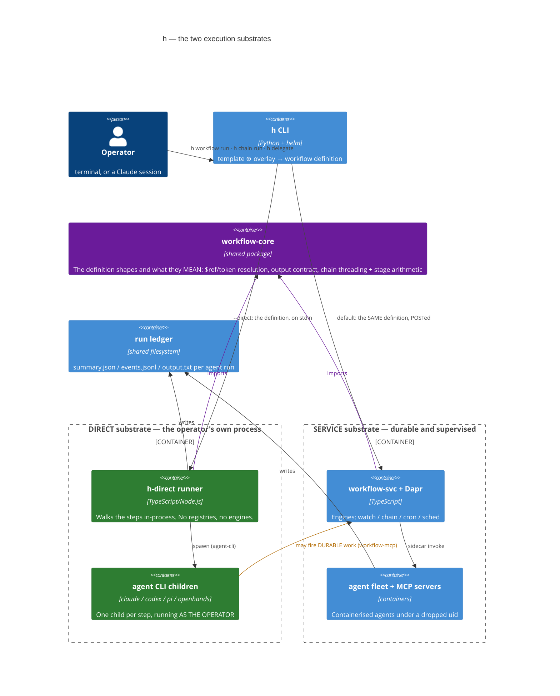

# execution-substrates-c4-container — one composition, two executors

h composes work ONE way and executes it TWO ways. The `h` CLI renders a template into a workflow
definition — `{params, steps, outputs}` — and then either fires that definition at workflow-svc
(the SERVICE substrate: Dapr engine, agent fleet, registries, supervision) or executes it in its
own process (the DIRECT substrate: agent CLIs as child processes, no infrastructure at all).

This diagram exists to answer the question that kept getting answered in prose: *what actually
differs between them, and how do they relate?* The service side is drawn in full in
[system-c4-container](./system-c4-container.md) — it is collapsed here to one box on purpose. One
direct run step by step: [direct-run-sequence](./direct-run-sequence.md).

## Reading notes

- **The purple box is the whole symmetry claim.** Both executors import the definition shapes AND
  the semantics that give them meaning from `packages/js/workflow-core`; `scripts/check-runtime-parity.mjs`
  fails the build if either grows a private copy. Symmetry is structural, not a convention someone
  has to remember — and that guard found two live drifts the day it was written, both in a private
  copy of the step shapes that had quietly made every PANEL unrunnable through the workflows MCP.
- **The direct boundary contains no infrastructure — that IS the substrate.** No Dapr sidecar, no
  Redis, no container. What it therefore cannot offer is the ENGINES: supervision, recurrence,
  sequencing. Those exist so that a workflow never supervises, recurs or sequences itself; run
  in-process, the driver IS the supervisor. So `--direct` refuses `--cron/--watch/--budget/--retry/
  --at/--in/--fallback-*/--fresh/--via` BY NAME, and the runner refuses the `register-cron`,
  `write-wf-row`, `register-discover` and `run-itest` activities rather than skipping them — a
  silently-skipped gate reports a guarantee that never happened.
- **The amber edge is the composition point** (and the answer to "can direct agents create
  workflows in container mode?" — yes). A direct agent inherits the repo's `.mcp.json` (direct mode
  deliberately does not rewrite it), and compose publishes workflow-mcp on the same localhost port
  that file names. Triggers are data, so nothing cares who fired them. **Direct mode does not lack
  access to durability; it lacks durability of its own.**
- **One ledger, both substrates.** `h runs`, obs-mcp and the viz read direct runs beside service
  runs, because the ledger moved into its own package rather than staying inside the HTTP server.
  With no watcher on the direct side, that ledger is also its ONLY cost accounting — which is why a
  cost the agent did not report shows as `—`, never as `$0`.
- **The security asymmetry is the boundary, read literally.** A fleet agent runs containerised
  under a dropped uid (`SUB_AGENT_UID`); a direct agent runs as the OPERATOR, with their
  environment, credentials and checkout. `--worktree` and `--plan` contain the blast radius;
  neither is a sandbox.
- **Choose by lifetime, not by weight.** Work that must outlive the session, recur, or be
  supervised belongs on the service substrate however heavy it feels. Work you are waiting on
  belongs here.
