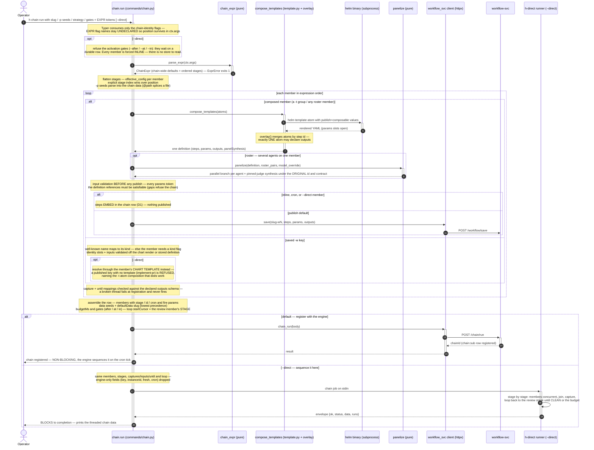

# h chain run — sequence diagram (composition, CLI side)

What happens between typing `h chain run --slug s -p spec=@spec.md <EXPR>` and the chain
starting: the hand-parsed expression grammar, per-member resolution (compose-on-fire,
panelize, validate-before-publish), and then the SUBSTRATE FORK — either the single
`POST /chain/run` that hands a durable row to the engine and returns immediately, or
`--direct`, which sequences the identical members in this process and blocks.

The engine-side story — stage progression on the cron tick, epoch fences, D6 teardown — is
[chain-run-engine-sequence](./chain-run-engine-sequence.md). One direct run's steps are
[direct-run-sequence](./direct-run-sequence.md). Structure of the same code: the
[class diagram](./h-cli-class.md).

## Reading notes

- **Position IS the grammar** (steps 1–3): a flag binds to the workflow it *follows*; before
  the first workflow it's a chain-wide default. That only works because Typer never declares
  the EXPR flag names — click would consume them wherever they sat in argv.
- **A refused chain leaves no durable footprint**: member-input validation and the
  capture/until schema checks (the notes before and after the publish branch) run BEFORE the
  publish (steps 10–11) and the registration (steps 12–13) — an unsatisfiable member fails
  the whole command while nothing has been written anywhere.
- **The panel is invisible below the contract** (steps 8–9): panelize replicates the
  contract-carrying step into per-agent branches (contract stripped) and re-hangs the pinned
  judge's synthesis under the member's ORIGINAL step id + contract, so captures,
  loop-until-clean, and the watcher see an unchanged member.
- **The CLI registers; the engine executes** (steps 12–16): `h chain run` returns at step 16
  with only registry writes done — the chain engine fires stage after stage on the
  workflow-cron-tick, joins concurrent members, threads structured outputs through the chain
  data, and survives a closed laptop.
- **One kind table on both sides**: the kinds named here (`implement-pr`, `review-pr`,
  `revise-pr`, `answer`) are the closed `MEMBER_KINDS` vocabulary — the CLI validates against
  the same contract halves the engine's `chain-members.ts` executes (`test_kind_sync` pins
  the pairing).
