# h CLI — class diagram (generated)

The structure of `cli/h` (package `h-cli`), the `h` command: a Typer composition root wiring
command groups over a small pure core (expression parser, overlay, panelize) and thin
adapters (helm subprocess, httpx clients). The CLI *composes and registers*; it never
executes — everything durable happens in workflow-svc. GENERATED deterministically from the
Python AST by `uvx vizzle doc --dir docs/diagrams` (see the `generated-diagrams` plugin
skill; members are code truth via
`py-extract`; scope/topology/notes are curated in the manifest comment below). The
[chain-run sequence diagram](./h-cli-chain-run-sequence.md) shows these classes in motion.

<!-- gen:c4-code {
  "direction": "LR",
  "classes": [
    {"id": "Main", "kind": "external", "stereotype": "Typer composition root main.py", "note": "wires the command groups onto one Typer app"},
    {"id": "ChainCmd", "kind": "module", "file": "cli/h/src/h_cli/commands/chain.py", "functions": ["run", "list_", "rm"], "consts": ["WELL_KNOWN", "KIND_MODEL_PARAMS", "KIND_CONTRACT_SUPPLIES", "WRITE_KINDS"], "stereotype": "Typer app chain.py"},
    {"id": "WorkflowCmd", "kind": "module", "file": "cli/h/src/h_cli/commands/workflow.py", "functions": ["publish", "run", "pause", "resume", "terminate"], "stereotype": "Typer app workflow.py"},
    {"id": "TemplateCmd", "kind": "module", "file": "cli/h/src/h_cli/commands/template.py", "functions": ["compose", "compose_templates", "template_role"], "stereotype": "Typer app template.py"},
    {"id": "Views", "kind": "external", "stereotype": "Typer apps", "note": "watch / cron / schedule / agents / status / doctor / feature: registry views + ops"},
    {"id": "Config", "kind": "module", "file": "cli/h/src/h_cli/config.py", "functions": ["agent_identity_params", "baked_models_suit", "resolve_agent_url", "charts_roots", "chart_root_for"], "consts": ["AGENT_IDENTITY", "MODEL_PARAM_SLOTS", "FROZEN_EXECUTOR_KEYS"], "stereotype": "settings config.py", "note": "env > consumer .h/config.toml > h-checkout default; charts_roots/chart_root_for = the chart search path (consumer primary, stock fallback)"},
    {"id": "ChainExprParser", "kind": "module", "file": "cli/h/src/h_cli/infrastructure/chain_expr.py", "functions": ["parse_expr", "effective_config"]},
    {"id": "ChainExpr", "kind": "class", "file": "cli/h/src/h_cli/infrastructure/chain_expr.py", "symbol": "ChainExpr"},
    {"id": "MemberRef", "kind": "class", "file": "cli/h/src/h_cli/infrastructure/chain_expr.py", "symbol": "MemberRef"},
    {"id": "WorkflowConfig", "kind": "class", "file": "cli/h/src/h_cli/infrastructure/chain_expr.py", "symbol": "WorkflowConfig"},
    {"id": "Overlay", "kind": "module", "file": "cli/h/src/h_cli/infrastructure/overlay.py", "functions": ["overlay"]},
    {"id": "Panelize", "kind": "module", "file": "cli/h/src/h_cli/infrastructure/panelize.py", "functions": ["roster_pairs", "panelize"], "consts": ["JUDGE_ACTIVITY"]},
    {"id": "Helm", "kind": "module", "file": "cli/h/src/h_cli/infrastructure/helm.py", "functions": ["render_workflow", "to_wire_json"], "stereotype": "subprocess adapter helm.py"},
    {"id": "SvcClient", "kind": "module", "file": "cli/h/src/h_cli/infrastructure/workflow_svc.py", "functions": ["save", "run_saved", "chain_run", "chain_list", "pause", "terminate"], "stereotype": "httpx adapter workflow_svc.py"},
    {"id": "AgentClient", "kind": "module", "file": "cli/h/src/h_cli/infrastructure/agent_service.py", "functions": ["submit_workflow"], "stereotype": "httpx adapter agent_service.py"},
    {"id": "HelmBin", "kind": "external", "stereotype": "external subprocess", "note": "helm template with the template gate"},
    {"id": "Svc", "kind": "external", "stereotype": "external HTTP :8003", "note": "workflow-svc, owner of every registry row"},
    {"id": "AgentSvc", "kind": "external", "stereotype": "external HTTP", "note": "agent services, POST /workflow babysitter"}
  ],
  "relations": [
    ["Main", "ChainCmd", null],
    ["Main", "WorkflowCmd", null],
    ["Main", "TemplateCmd", null],
    ["Main", "Views", null],
    ["ChainCmd", "ChainExprParser", null, "parse_expr(ctx.args)"],
    ["ChainExprParser", "ChainExpr", null, "produces"],
    ["ChainExpr", "MemberRef", null, "stages of"],
    ["MemberRef", "WorkflowConfig", null, "config"],
    ["ChainCmd", "TemplateCmd", null, "compose on fire"],
    ["ChainCmd", "Panelize", null, "roster members"],
    ["ChainCmd", "Config", null, "identity + baked-model rules"],
    ["ChainCmd", "SvcClient", null, "save + chain_run"],
    ["WorkflowCmd", "Helm", null, "render publish mode"],
    ["WorkflowCmd", "Config", null, "agent / model / via"],
    ["WorkflowCmd", "SvcClient", null, "publish / run / pause / terminate"],
    ["WorkflowCmd", "AgentClient", null, "via an agent babysitter"],
    ["TemplateCmd", "Helm", null, "render atoms"],
    ["TemplateCmd", "Overlay", null, "merge by step id"],
    ["Views", "SvcClient", null, "registry reads"],
    ["Helm", "HelmBin", null, "subprocess"],
    ["SvcClient", "Svc", null, "HTTP"],
    ["AgentClient", "AgentSvc", null, "POST /workflow"]
  ]
} -->

```mermaid
classDiagram
  direction LR

  class Main {
    <<Typer composition root main.py>>
    wires the command groups onto one Typer app
  }

  class ChainCmd {
    <<Typer app chain.py>>
    +WELL_KNOWN : dict~str, tuple~str, str~~
    +KIND_MODEL_PARAMS : dict~str, tuple~str, ...~~
    +KIND_CONTRACT_SUPPLIES : dict~str, frozenset~str~~
    +WRITE_KINDS
    +run(ctx, slug, param, local, with_setup, resume, no_journal, strategy, max_iterations, after, at, in_) None
    +list_(local) None
    +rm(chain_id) None
  }

  class WorkflowCmd {
    <<Typer app workflow.py>>
    +publish(template, key, schedule, workspace_id, disabled) None
    +run(keys, param, inline, agent, model, instance_id, fresh, watch, budget, retry, cron, max_fires, fallback_agent, fallback_model, fallback_after, fallback_max, at, in_, via, local, with_setup, allow_external, resume, no_journal) None
    +pause(instance_id, key, at, in_, param, workspace_id) None
    +resume(sched_id) None
    +terminate(instance_id) None
  }

  class TemplateCmd {
    <<Typer app template.py>>
    +compose(templates, save) None
    +compose_templates(templates) dict~str, Any~
    +template_role(name) str
  }

  class Views {
    <<Typer apps>>
    watch / cron / schedule / agents / status / doctor / feature: registry views + ops
  }

  class Config {
    <<settings config.py>>
    +AGENT_IDENTITY : dict~str, tuple~str, str~~
    +MODEL_PARAM_SLOTS : tuple~str, ...~
    +FROZEN_EXECUTOR_KEYS : frozenset~str~
    +agent_identity_params(agent) dict~str, str~ | None
    +baked_models_suit(agent) bool
    +resolve_agent_url(agent) str | None
    +charts_roots() tuple~Path, ...~
    +chart_root_for(template) Path | None
    env > consumer .h/config.toml > h-checkout default; charts_roots/chart_root_for = the chart search path (consumer primary, stock fallback)
  }

  class ChainExprParser {
    <<module chain_expr.py>>
    +parse_expr(tokens) ChainExpr
    +effective_config(defaults, member) WorkflowConfig
  }

  class ChainExpr {
    <<class>>
    +defaults : WorkflowConfig
    +stages : tuple~tuple~MemberRef, ...~, ...~
    +members : tuple~MemberRef, ...~
  }

  class MemberRef {
    <<class>>
    +key : str | None
    +templates : tuple~str, ...~
    +config : WorkflowConfig
    +label : str
  }

  class WorkflowConfig {
    <<class>>
    +agents : tuple~str, ...~
    +model : str | None
    +budget : str | None
    +fresh : bool
    +kind : str | None
    +stage : str | None
    +cron : str | None
    +max_fires : str | None
    +id : str | None
    +inline : bool
    +captures : tuple~tuple~str, str~, ...~
    +inputs : tuple~tuple~str, str~, ...~
    +until : str | None
  }

  class Overlay {
    <<module overlay.py>>
    +overlay() dict~str, Any~
  }

  class Panelize {
    <<module panelize.py>>
    +JUDGE_ACTIVITY
    +roster_pairs(roster, identity) list~tuple~str, str~~
    +panelize(definition, roster, model_override) dict~str, Any~
  }

  class Helm {
    <<subprocess adapter helm.py>>
    +render_workflow(template, values, file_values, include_local) str
    +to_wire_json(rendered_yaml) str
  }

  class SvcClient {
    <<httpx adapter workflow_svc.py>>
    +save(key, steps, params, schedule, workspace_id, disabled, outputs) Any
    +run_saved(key, params, instance_id, fresh, watch, cron, at, in_) Any
    +chain_run(body) Any
    +chain_list() Any
    +pause(instance_id, key, params, at, in_, workspace_id) Any
    +terminate(instance_id) Any
  }

  class AgentClient {
    <<httpx adapter agent_service.py>>
    +submit_workflow(agent_url, body) Any
  }

  class HelmBin {
    <<external subprocess>>
    helm template with the template gate
  }

  class Svc {
    <<external HTTP :8003>>
    workflow-svc, owner of every registry row
  }

  class AgentSvc {
    <<external HTTP>>
    agent services, POST /workflow babysitter
  }

  Main --> ChainCmd
  Main --> WorkflowCmd
  Main --> TemplateCmd
  Main --> Views
  ChainCmd --> ChainExprParser : parse_expr(ctx.args)
  ChainExprParser --> ChainExpr : produces
  ChainExpr --> MemberRef : stages of
  MemberRef --> WorkflowConfig : config
  ChainCmd --> TemplateCmd : compose on fire
  ChainCmd --> Panelize : roster members
  ChainCmd --> Config : identity + baked-model rules
  ChainCmd --> SvcClient : save + chain_run
  WorkflowCmd --> Helm : render publish mode
  WorkflowCmd --> Config : agent / model / via
  WorkflowCmd --> SvcClient : publish / run / pause / terminate
  WorkflowCmd --> AgentClient : via an agent babysitter
  TemplateCmd --> Helm : render atoms
  TemplateCmd --> Overlay : merge by step id
  Views --> SvcClient : registry reads
  Helm --> HelmBin : subprocess
  SvcClient --> Svc : HTTP
  AgentClient --> AgentSvc : POST /workflow
```

## Reading notes

- **Content vs machinery is the load-bearing split**: unbounded CONTENT rides `-p key=value`
  (`@path` splices a file); the closed machinery vocabulary is FLAGS (`--agent`, `--model`,
  `--fresh`, `--via`, the chain-expression grammar). `ChainCmd`'s tables are that closed
  vocabulary written down: kinds, their model slots, their contract-supplied params.
- **The pure core is dependency-free by design** — `chain_expr`, `overlay`, `panelize` take
  tokens/dicts in and return structure out, no Typer/click/httpx/helm. That's what makes the
  grammar, the merge semantics, and the roster transform unit-testable without a stack, and
  why `panelize` receives `AGENT_IDENTITY` as an argument instead of importing `Config`.
- **One `AGENT_IDENTITY` table** (`Config`) is the single expansion both `h workflow run
  --agent` and `h chain run … --agent` use — `--agent` means the same thing everywhere.
  `WorkflowConfig.agents` cardinality is the panel dimension: one name is identity params,
  several are a roster that routes through `Panelize`.
- **Typer never declares the EXPR flag names** — click consumes declared options wherever
  they sit in argv, which would destroy their POSITION, and position is the grammar's scoping
  rule (a flag binds to the workflow it follows). Hence the hand parser on `ctx.args`.
- **The CLI's writes go through exactly two doors**: `SvcClient` (workflow-svc owns every
  registry row) and `AgentClient` (`--via` routes a fire through an agent's babysitter).
  `SvcClient`'s diagrammed members are the story subset — the full surface also covers the
  watch/cron/sched/exec-policy reads and `provision_discover`.
