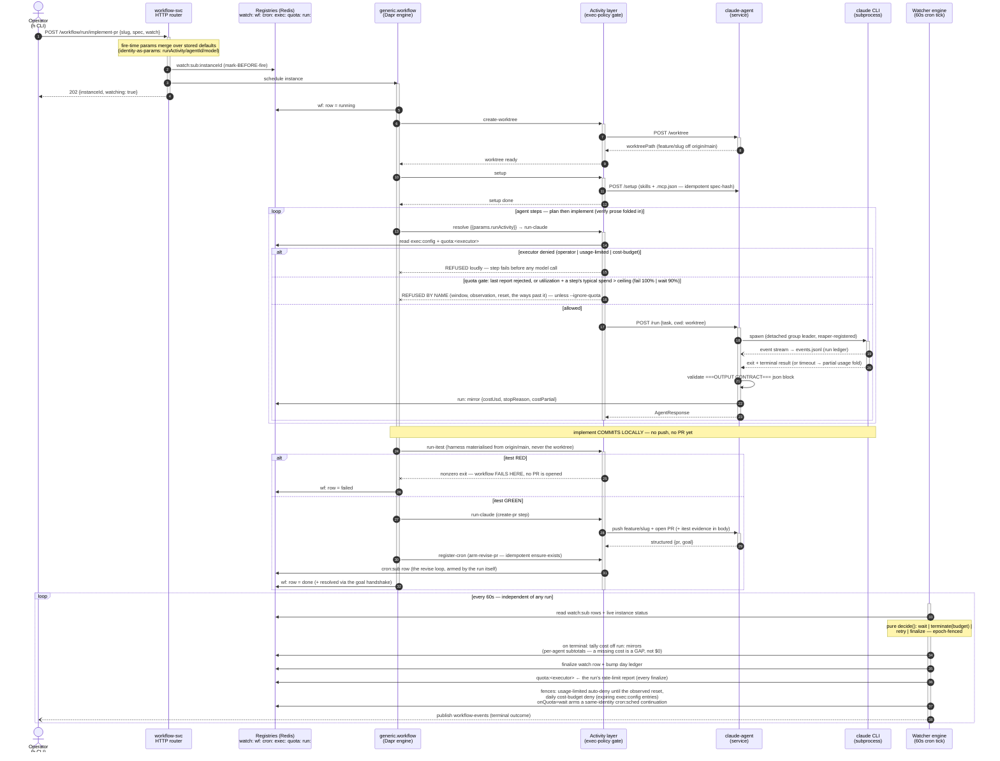

# implement-pr — one run, end to end

The flagship workflow (`h workflow run implement-pr -p slug=… -p spec=@… --watch`): a feature
worktree is cut, an agent plans and implements, the machine-executed itest gate blocks a red
build BEFORE any PR exists, create-pr pushes and opens the PR, and the run arms its own revise
loop. The watcher engine supervises from outside on the cron tick — a workflow never supervises
itself.

Composed from `implement ⊕ verify ⊕ run-itest ⊕ create-pr ⊕ arm-revise-pr`
(`docs/h-builds-h-runbook.md`). Step order: worktree → setup → plan → implement → itest →
create-pr → arm-revise-pr.

## Reading notes

- **Mark-before-fire** (step 2): supervision is registered before the run exists, so a crash
  between the two leaves a `scheduling` row the scan heals — never a silently unsupervised run.
- **The gate** (steps 12–13): every `run-*` activity passes through the exec-policy gate; a
  denied executor is refused on EVERY fire path (chains, crons, re-fires, panels) with no
  per-path code. The QUOTA gate sits in the same place and reads the `quota:` OBSERVATION row
  beside the `exec:` POLICY row: it projects whether this step fits the executor's remaining
  window (utilization + the mean spend of that executor's recent steps) and refuses by name when
  it does not — before anything is paid for. `--on-quota`/`--ignore-quota` ride the fire
  descriptor and reach it as step input, so the gate mode is the same on a chain member, a cron
  re-fire and a sched continuation. A row whose reset has passed never blocks (stale-in-favour).
- **The itest gate** (steps 21–23): the one machine-executed check — a red build fails the
  workflow before a PR exists, so reviewers never see a broken branch.
- **The watcher lane** (bottom loop): the run never supervises itself; budgets, retries, cost
  tallies, and the two auto-fences all live in the engine on the tick.
