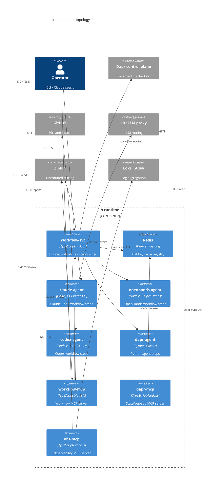

# system-c4-container — h container topology

The topology of the SERVICE substrate inside the `h` system boundary: workflow-svc (the engine),
the agent fleet, the three MCP servers, Redis/Dapr, and the observability spine. For the outer
view see [system-c4-context](./system-c4-context.md).

**This is one of h's two execution substrates.** The same composed definition can instead run on
the LOCAL substrate — agent CLIs as child processes of the `h` CLI, with none of the containers
below. The fork, and what each substrate can and cannot offer, is
[execution-substrates-c4-container](./execution-substrates-c4-container.md).

## Reading notes

- **workflow-svc is the only engine host**: all five cron-sibling scan engines (watch, chain, cron,
  discover, sched) run inside workflow-svc on the `workflow-cron-tick` Dapr binding (60-second
  interval). No other service writes `watch:*`, `chain:*`, or `cron:*` registry keys.
- **Agent fleet shares a pattern**: each agent service (`claude-agent`, `openhands-agent`, etc.)
  implements the same `IAgentRunner` port over its own CLI/subprocess, and registers the shared
  `POST /workflow` babysitter endpoint (which writes a `watch:sub` row before forwarding). The fleet
  is extensible: adding a new agent is one new app + one `run-*` activity registration in
  workflow-svc. Only the four most common agents are shown; pi-agent, kimi-agent, and others follow
  the same shape.
- **Redis is the single shared store**: the flat keyspace (no per-app prefix — `keyPrefix: none`)
  lets any service read each other's registry keys. Single-writer per prefix is the structural
  invariant: only workflow-svc writes `watch:*`/`chain:*`/`cron:*`/`wf:*`; agents write `run:*`.
- **MCP servers are agent-runtime dependencies**: workflow-mcp (workflow orchestration), dapr-mcp
  (state/pub-sub/actor inspection), and obs-mcp (traces/logs/run-ledger) are wired into every
  agent's Claude session via `.mcp.json`. A downed MCP server silently removes those tools from the
  agent — observability is not the only casualty.
- **obs-mcp has no Dapr sidecar**: it reads Zipkin (HTTP) and the run ledger (filesystem) directly;
  it is therefore absent from the Kubernetes deployment and only available in Docker/local. Its
  `--app-port` is an MCP SSE listener, not a sidecar port.
- **Dapr control plane** (placement scheduler) is Helm-managed separately from the app images.
  `actorStateStore: "true"` on the Redis component is load-bearing for Dapr Workflows, which run
  on the actor runtime.
