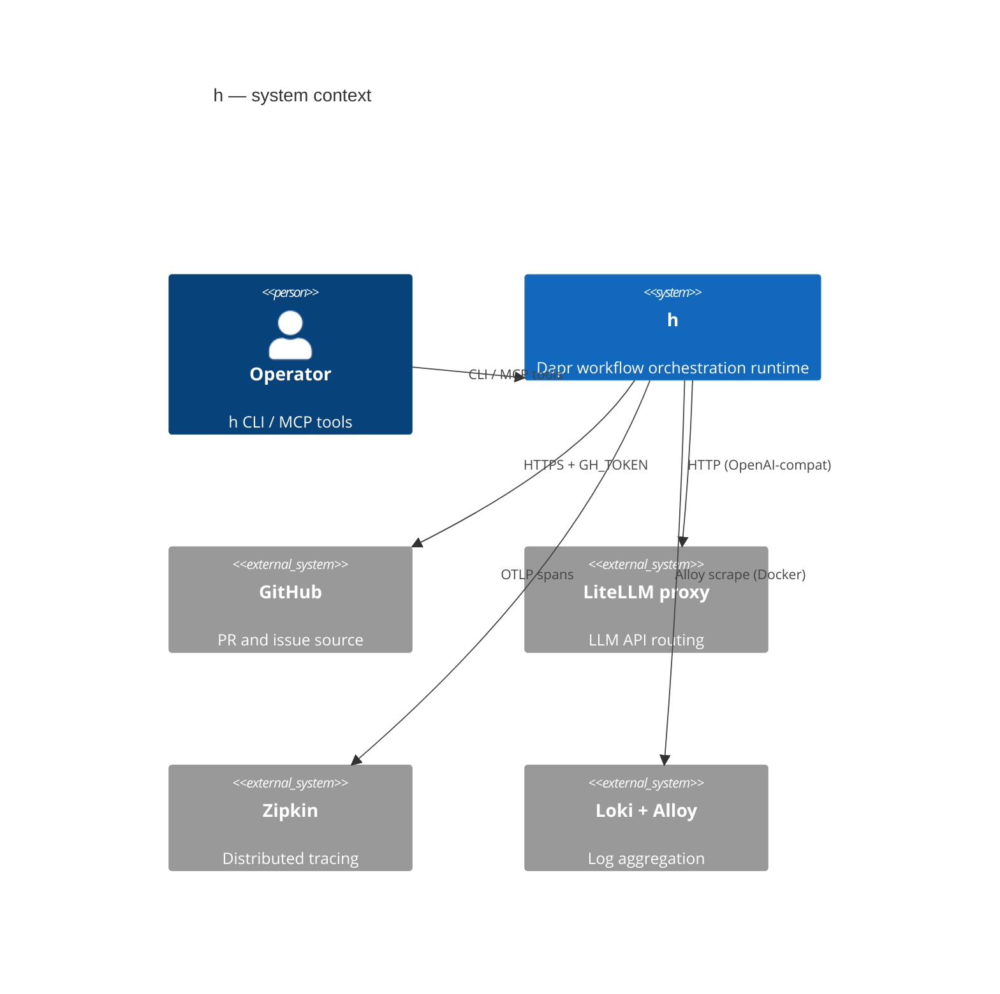

# system-c4-context — h system context

The outermost C4 view: the `h` runtime as a black box, its human operator, and the external systems
it integrates with. This is the entry-level picture — the container and component breakdowns are in
[system-c4-container](./system-c4-container.md).

## Reading notes

- **h is the runtime**: the single system boundary encloses everything in `apps/` and `packages/` —
  workflow-svc, the agent fleet, the MCP servers, Redis, Dapr — all of which are containers inside
  the boundary in the [container view](./system-c4-container.md).
- **Operator interaction surfaces**: the `h` CLI (`cli/h/`) for fire/inspect, and the Claude Code
  MCP session (dapr/workflows/obs MCP servers) for inspection and orchestration from inside a Claude
  agent.
- **GitHub** is both the CI gate source and the issue discovery source for `h-builds-h`: the
  `github-source-reader.ts` adapter (`ISourceReader` port in workflow-svc) reads open issues via the
  GitHub REST API; the github MCP (`api.githubcopilot.com/mcp/`) lets agent runs read/write PRs.
- **LiteLLM proxy** is the agent fleet's LLM routing layer: every agent's `ANTHROPIC_BASE_URL` /
  `OPENAI_BASE_URL` points here; the proxy handles model routing, retries, and cost metering. Usage
  metrics flow back through the claude-CLI's `result` event and eventually into the run ledger.
- **Zipkin** receives OTLP spans from every service via W3C traceparent propagation. The join key
  across traces, logs, and run ledger is `workflowInstanceId`.
- **Loki + Alloy** scrape only Docker/compose containers (not host-mode `dapr run` processes); the
  run ledger is the primary agent-output surface for host-mode observability.
