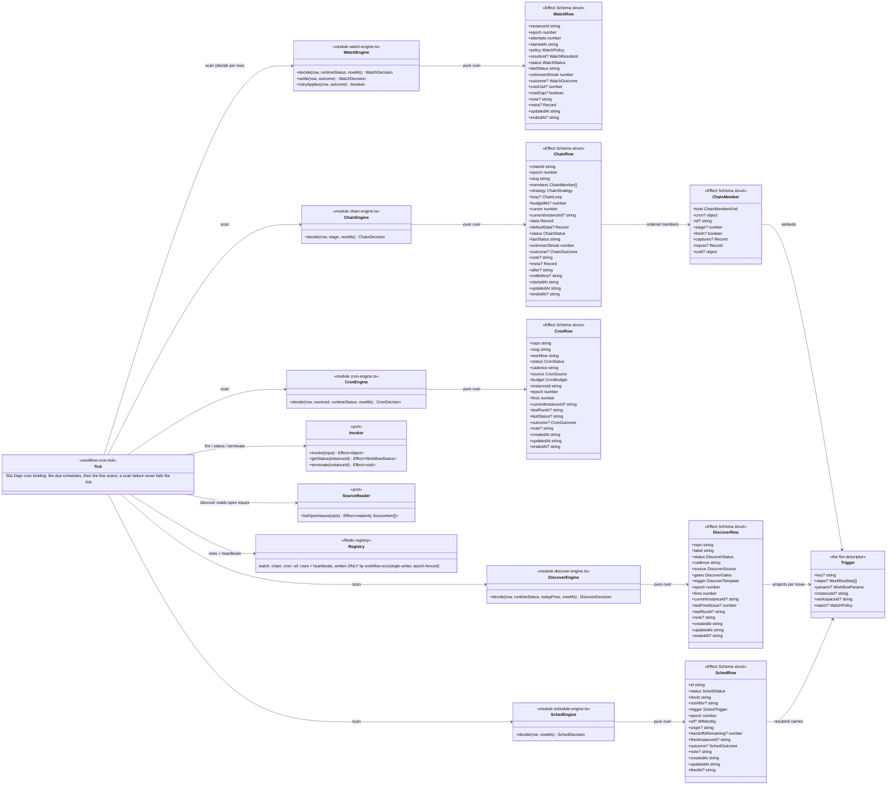

# workflow-svc — class diagram (generated)

The engine spine of workflow-svc: the five cron-siblings — watch (supervise), chain
(sequence), cron (recur), discover (fan out), sched (fire once) — as five registry ROW
models evaluated by five pure `decide` functions on the shared workflow-cron-tick, acting
through the invoker port's closed vocabulary. One build-pattern, five instances; the
`Trigger` fire descriptor is the one shape every fire carrier embeds or projects. GENERATED
from the TypeScript AST (members are code truth — the `schema` kind reads the Effect
`Schema.Struct` consts; scope/topology/notes curated in the manifest below). The
[tick sequence diagram](./workflow-svc-tick-sequence.md) shows one tick walking this spine.

<!-- gen:c4-code {
  "direction": "LR",
  "classes": [
    {"id": "Tick", "kind": "external", "stereotype": "workflow-cron-tick", "note": "60s Dapr cron binding: fire due schedules, then the five scans; a scan failure never fails the tick"},
    {"id": "Trigger", "kind": "schema", "file": "apps/workflow-svc/src/domain/models/workflow.model.ts", "symbol": "Trigger", "stereotype": "the fire descriptor"},
    {"id": "WatchRow", "kind": "schema", "file": "apps/workflow-svc/src/domain/models/watch.model.ts", "symbol": "WatchRow"},
    {"id": "WatchEngine", "kind": "module", "file": "apps/workflow-svc/src/domain/watch-engine.ts", "functions": ["decide", "settle", "retryApplies"]},
    {"id": "ChainRow", "kind": "schema", "file": "apps/workflow-svc/src/domain/models/chain.model.ts", "symbol": "ChainRow"},
    {"id": "ChainMember", "kind": "schema", "file": "apps/workflow-svc/src/domain/models/chain.model.ts", "symbol": "ChainMember"},
    {"id": "ChainEngine", "kind": "module", "file": "apps/workflow-svc/src/domain/chain-engine.ts", "functions": ["decide"]},
    {"id": "CronRow", "kind": "schema", "file": "apps/workflow-svc/src/domain/models/cron.model.ts", "symbol": "CronRow"},
    {"id": "CronEngine", "kind": "module", "file": "apps/workflow-svc/src/domain/cron-engine.ts", "functions": ["decide"]},
    {"id": "DiscoverRow", "kind": "schema", "file": "apps/workflow-svc/src/domain/models/discover.model.ts", "symbol": "DiscoverRow"},
    {"id": "DiscoverEngine", "kind": "module", "file": "apps/workflow-svc/src/domain/discover-engine.ts", "functions": ["decide"]},
    {"id": "SchedRow", "kind": "schema", "file": "apps/workflow-svc/src/domain/models/schedule.model.ts", "symbol": "SchedRow"},
    {"id": "SchedEngine", "kind": "module", "file": "apps/workflow-svc/src/domain/schedule-engine.ts", "functions": ["decide"]},
    {"id": "Invoker", "kind": "interface", "file": "apps/workflow-svc/src/domain/ports/IWorkflowInvoker.ts", "symbol": "WorkflowInvokerService", "stereotype": "port"},
    {"id": "SourceReader", "kind": "interface", "file": "apps/workflow-svc/src/domain/ports/ISourceReader.ts", "symbol": "SourceReaderService", "stereotype": "port"},
    {"id": "Registry", "kind": "external", "stereotype": "Redis registry", "note": "watch: chain: cron: wf: rows + heartbeats, written ONLY by workflow-svc (single-writer, epoch-fenced)"}
  ],
  "relations": [
    ["Tick", "WatchEngine", null, "scan (decide per row)"],
    ["Tick", "ChainEngine", null, "scan"],
    ["Tick", "CronEngine", null, "scan"],
    ["Tick", "DiscoverEngine", null, "scan"],
    ["Tick", "SchedEngine", null, "scan"],
    ["WatchEngine", "WatchRow", null, "pure over"],
    ["ChainEngine", "ChainRow", null, "pure over"],
    ["CronEngine", "CronRow", null, "pure over"],
    ["DiscoverEngine", "DiscoverRow", null, "pure over"],
    ["SchedEngine", "SchedRow", null, "pure over"],
    ["ChainRow", "ChainMember", null, "ordered members"],
    ["ChainMember", "Trigger", null, "embeds"],
    ["DiscoverRow", "Trigger", null, "projects per issue"],
    ["SchedRow", "Trigger", null, "resubmit carries"],
    ["Tick", "Invoker", null, "fire / status / terminate"],
    ["Tick", "SourceReader", null, "discover reads open issues"],
    ["Tick", "Registry", null, "rows + heartbeats"]
  ]
} -->

## Reading notes

- **One build-pattern, five instances**: each sibling is a policy ROW in the registry, a
  pure `decide` over that row plus observed state, and a closed action vocabulary executed
  by the scan — where a watch RE-fires one instance, a chain fires the NEXT stage, a cron
  re-fires the SAME workflow until its goal resolves, a discover fires ONE workflow per
  newly-seen source item, and a sched fires ONCE at an absolute time. The load-bearing
  invariant: a workflow never supervises, sequences, or recurs ITSELF.
- **`Trigger` is the one fire shape** — `WorkflowRequest` and `ChainMember` embed it, the
  discover row projects one per issue, the sched row's resubmit carries one. Mark-before-fire
  and the derived readable `instanceId` hold on every path because they live in this one
  type's handling.
- **The pure/effectful split is the testing seam**: the `decide` functions know nothing of
  Dapr, Redis, or HTTP — the effectful `*-scan.ts` siblings (not diagrammed; see the tick
  sequence) read rows, observe live state, call `decide`, and execute the verdict
  epoch-fenced.
- **Ports keep the domain clean**: `Invoker` wraps the Dapr workflow client (fire/status/
  terminate — the ONLY way an engine touches a workflow), `SourceReader` keeps GitHub types
  out of the domain (git-core's client adapts behind it).
- **Single-writer registry**: every row prefix here is written only by workflow-svc;
  everyone else reads. `epoch` fences stale scan decisions after a re-fire.
