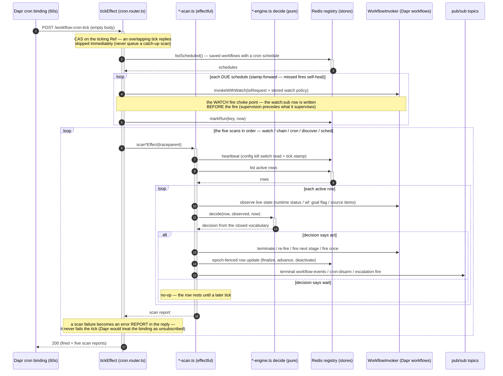

# workflow-cron-tick — sequence diagram (one tick)

One 60-second tick through workflow-svc: the CAS gate that drops overlapping ticks, the
due-schedule fire pass, then the five sibling scans — watch, chain, cron, discover, sched —
each reading its registry rows, asking its pure engine to decide, and acting through the
closed vocabulary. The scans share one shape (shown in detail once, in the loop); what
differs per sibling is the ACTION the decision names — that table is in the reading notes.
Structure of the same spine: the [class diagram](./workflow-svc-class.md).

## Reading notes

- **The CAS gate is deliberately not a semaphore** (the note after step 1): ticks fire far more
  often than scans take; a permit would QUEUE the second tick and produce exactly the
  catch-up scan the flag exists to avoid. The winner's reset runs in `Effect.ensuring`, so
  the flag clears on failure too.
- **One scan shape, five action vocabularies** (steps 6–16): the loop body is identical —
  rows, observation, pure `decide`, epoch-fenced act — and each sibling fills in its own
  verbs: **watch** terminates on wall-clock budget, retries the same id, escalates
  (fail-closed on `maxEngineFiresPerDay`), finalizes with a cost tally off the `run:`
  mirrors (zero matches → `costGap`, never a silent $0); **chain** joins the current stage,
  captures structured outputs into the chain data, fires the NEXT stage — terminal failure
  tears down siblings and publishes `cron-disarm` (D6); **cron** re-fires the SAME workflow
  until the `wf:` row's `resolved` goal flag or its budget trips; **discover** reads the
  source (oldest open issue first), dedupes against `wf:*`, fires at most ONE (serialized,
  daily-capped); **sched** fires ONCE at `fireAt` (or expires past `notAfter`) and
  deactivates.
- **Supervision precedes what it supervises** (step 4 and its note): every fire path — including this
  cron pass — registers the watch row in the same handler that schedules, which is why the
  watcher is the one registration allowed in a fire handler rather than an `arm-*` activity.
- **Epoch fencing makes stale decisions harmless** (step 14): every row-mutating action
  re-reads the row and no-ops when `epoch` moved — a re-fire created a new incarnation and
  this tick's verdict belongs to the old one.
- **Scan isolation** (the note after step 16): each scan's failure is caught into its report slot;
  a broken scan degrades one primitive for one minute instead of silencing the binding.
