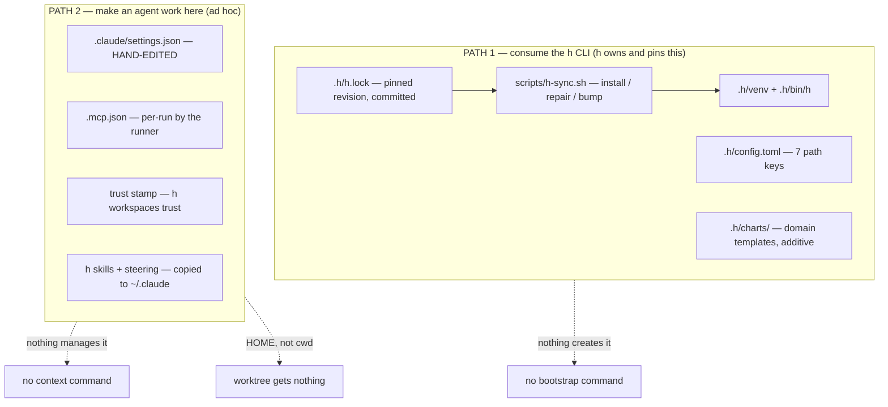

# Agent context management in the CLI

Status: Planning — the shape is settled (h adds committed resources to a repo it works on); the
open questions in §6 need answers before implementation
Established: 2026-08-31

## 1. The premise

h has two ways a repo becomes usable, and they are the same problem solved twice — badly the
second time.

**Path 1 — consuming the h CLI.** A repo declares `.h/config.toml` (seven path keys, discovered
by walking up from cwd), pins h in `.h/h.lock`, installs `.h/venv` via a `scripts/h-sync.sh` it
carries, and adds domain templates under `.h/charts/`. This half is good: pinned, reviewable,
additive to the stock chart set.

**Path 2 — making an agent able to work in that repo.** `.claude/settings.json` marketplaces and
`enabledPlugins`, the Claude Code trust stamp, `.mcp.json`, and h's own skills and runtime
steering. This half is ad hoc: hand-edited per repo, and the skills/steering half installs into
`~/.claude` — a HOME — rather than anywhere the repo can see.

Three gaps follow, and none is covered by either path:

1. **`h-sync.sh` is a bootstrap script that must be hand-copied into a repo before h can bootstrap
   it.** Neither h nor its plugin distributes it. Every consumer gets a copy that then drifts.
2. **Nothing creates `.h/` either** — `config.toml`, the lock, the charts skeleton are all
   hand-authored. `h doctor` reports the consumer config but no command produces one.
3. **None of Path 2 reaches a worktree**, which is the only place an agent actually runs. Context
   resolved from `~/.claude` is context the working directory does not have.

### 1.1 What made this urgent

Two incidents, both this week, both the same root cause:

- `skills/ways-of-working` and `skills/delegate-locally` sat unreachable for ten days. The only
  propagation path was a setup step copying into a HOME, which `--local` runs skip; CLAUDE.md
  pointed at `ways-of-working` the whole time. Fixed 2026-08-30 by symlinking `skills/` into
  `.claude/skills/` — the repo-as-context model, applied to h itself.
- Bootstrapping the plan-management plugin into vizzle was done entirely by hand: settings.json
  merge, a CLAUDE.md section, a branch, a PR. Mechanical work, repeated per repo.

## 2. Decisions already made

These are operator calls from 2026-08-30/31, not open questions. They constrain everything below.

1. **The working directory is the unit of provisioning.** An agent's cwd is configured by the
   workflow, and when the agent initialises it has everything it needs *there*. Not in a home.
2. **The operator's `~/.claude` is not a home for h's skills.** Implemented: h's skills are
   self-contained in this repo, reached via `.claude/skills/` symlinks; a SKILL.md names its
   scripts as `<skill-dir>/<rest>` so it works from whichever home serves it, and
   `scripts/check-steering.mjs` rejects a `~/.claude/...` path outright.
3. **h becomes a DEPENDENCY of a repo it works on.** When h works in a repo, it adds what it needs
   to operate, and those resources are COMMITTED and live in the repo long-term — the same stance
   `.h/h.lock` already takes ("COMMIT THIS FILE — it is what makes an h upgrade a reviewable
   change rather than something that happens to a machine").

4. **ONE plugin, not two.** A "transient plugin" carrying h's ways of working has no content:
   `ways-of-working` and `h-issues` declare "Applies to the h repo ONLY" in their own frontmatter,
   so they belong in a consumer repo neither persistently nor transiently. The single `h` plugin
   (`use-h`, `author-h-template`) is committed and enabled in the repo. This also settles §6.1:
   the plugin MECHANISM is the reference — skills reach a repo through the marketplace entry in
   `.claude/settings.json`, not as copied files. Only `.h/` config and charts are committed content.
5. **Genuinely transient context is provisioned into the WORKTREE, and is not a plugin.** The
   runtime steering ("you are an agent inside a workflow, here are your MCP servers") is true only
   during a run and actively FALSE for a human opening the repo, so it must never be committed. It
   needs no uninstall step: the worktree already supplies the lifetime, and deleting the worktree
   is the uninstall. The sorting test for any piece of context is **"is this still true when
   nobody is running h?"**
6. **h consumes h for CONFIG, not for INSTALLATION.** h gets its own `.h/config.toml` like any
   consumer, so path resolution goes through the identical code path (`config.py` forks on
   `IS_CHECKOUT` in NINE places today — every one a works-in-h/breaks-in-a-consumer bug waiting to
   happen, and h's consumer contract is currently exercised only by trxy). h does NOT get
   `.h/h.lock`, `.h/venv` or `.h/bin/h`: pinning h to a commit of itself carries no information,
   and a pinned venv would mean `uv run h` executing a STALE h while you edit `cli/h/` — the tool
   disagreeing with the source in front of you. The split is config vs installation.

### 2.1 The consequence worth naming

Decisions 1 and 3 together collapse most of the per-run provisioning problem. If a repo's h
context is committed, then **every worktree cut from that clone inherits it for free** — the same
way h's own worktrees now carry `.claude/skills/`. Bootstrap once, inherit forever. Per-run setup
shrinks to genuinely per-run things, and the `_helpers.tpl` setup steps that write into a HOME
stop having a reason to exist.

It also converts drift into a reviewable diff: committed context that falls behind the `h.lock`
pin is reconciled by a command, and the reconciliation shows up in a PR rather than happening to
a machine.

## 3. Current state (verified 2026-08-31)

### 3.1 The h plugin (`plugins/h/`)

Four files, two skills, no machinery — it is pure prose:

| File | What it is |
| --- | --- |
| `skills/use-h/SKILL.md` (+ `references/cli-reference.md`) | how to run domain workflows from a consumer repo |
| `skills/author-h-template/SKILL.md` (+ `references/starter-chart.md`) | how to author a domain chart under `.h/charts/` |
| `.claude-plugin/plugin.json`, `.codex-plugin/plugin.json` | manifests, parity-guarded by `scripts/check-plugins.mjs` |

`use-h` describes itself as applying to "a repo carrying `.h/config.toml`" — the plugin assumes
the bootstrap it cannot perform.

### 3.2 What a consumer repo carries (trxy-v2, the live example)

### 3.3 The precedent already in the CLI

`h workspaces trust` is already an agent-context command: it stamps Claude Code's per-project
trust for an h-MANAGED checkout and refuses external paths by name. It is one instance of the
general thing this plan formalises, and it proves the CLI is the right home — it already knows
the managed-workspace boundary, already resolves consumer config, already refuses loud.

## 4. The shape

One noun — **repo context** — whose lifecycle the CLI owns, so bootstrapping a consumer repo and
provisioning a worktree are the same code against different targets.

| Target | Creates | Reconciles |
| --- | --- | --- |
| a CLONE (bootstrap) | `.h/config.toml`, `h.lock`, `.h/charts/` skeleton, `h-sync.sh`, `.claude/settings.json` plugin entries, trust stamp | drift against the pin |
| a WORKTREE (per run) | only what the clone could not commit | same code, narrower scope |

Everything the clone commits, the worktree inherits. The two paths consolidate because the
committed artifact IS the provisioning.

Consequences for existing machinery:

- `h.setupSteps` in `cli/charts/workflows/templates/_helpers.tpl` stops copying skills into a HOME
  and stops writing steering there. What remains, if anything, calls the CLI.
- `h-sync.sh` stops being a per-repo hand-copy: h ships it and the CLI installs it.
- The `--with-setup` hazard on the local substrate disappears rather than being special-cased —
  there is no longer a step that writes into the operator's home.

## 4.1 The flow (operator, 2026-08-31)

Two steps, in order:

1. **Install the CLI into the repo.** This makes h a declared DEPENDENCY of the repo and writes
   the base config — `.h/config.toml`, the pin, `h-sync.sh`, and the `.h/venv` ignore rule.
2. **Use the CLI to initialise the plugin.** `.claude/settings.json` gains the h marketplace and
   the `h@h-marketplace` entry.

Step 2 depends on step 1, which is why the current chicken-and-egg is fatal: `h-sync.sh` is the
thing that installs the CLI, and today it must be hand-copied before h can do anything.

## 5. Verification still required

Neither is settled; both are cheap and must happen BEFORE code.

1. **Where project-scope steering is actually read from in a cwd.** `<cwd>/CLAUDE.md` is the
   project memory, but appending h's runtime steering into a target repo's own CLAUDE.md is more
   invasive than a home file was. `skills/install-steering.sh` already takes a destination as its
   second argument (`home="${2:-$HOME/.claude}"`), so the plumbing exists either way — confirm the
   destination that actually loads.
2. **That skills provisioning MERGES**, the way `mergeMcpConfig` does, so h's own checkout (which
   already carries `.claude/skills/`) is not clobbered by its own bootstrap.

## 6. Open questions (operator, before implementation)

1. ~~**Vendored or referenced?**~~ ANSWERED by decision §2.4 — REFERENCED, through the plugin
   marketplace entry, which is what the plugin mechanism is for. Copied content is limited to
   `.h/` config and charts.
2. **What is the command surface?** A new `h context` noun (`init`, `sync`, `check`), or extending
   `h workspaces` (which already holds `trust` and already means "a clone h manages")? Leaning
   toward the latter — it needs no new concept, and `trust` is already this.
3. **Does bootstrapping WRITE or EMIT?** h writing directly into a repo is convenient; emitting a
   diff the operator commits keeps h's changes reviewable. Decision 3 says the resources are
   committed, which does not by itself say who runs `git add`.
4. ~~**How much does a NON-h repo receive?**~~ ANSWERED by decision §2.4 — exactly the `h`
   plugin's two skills. The frontmatter "h repo ONLY" declaration IS the split, and it is already
   written. A related asymmetry STAYS and is correct: h enables `author-workflow-template` (stock
   charts), a consumer enables `author-h-template` (`.h/charts/`) — different audiences, genuinely
   different content, not an accident to unify away.
5. ~~**Is `.h/venv` committed?**~~ ANSWERED 2026-08-31 by inspecting trxy-v2: the repo's root
   `.gitignore:195` carries `.h/venv/` while `.h/config.toml`, `.h/h.lock` and `.h/charts/` are
   tracked. So the established split is *everything in `.h/` is committed except the virtualenv*,
   and the bootstrap must write that ignore rule as part of the scaffold — otherwise the first
   `git add -A` in a freshly bootstrapped repo commits a virtualenv.

## 7. Not in scope

- `bootstrap-repo` (the chart template) stays the GENESIS path — creating a repo that does not yet
  exist. This plan is about a repo that already exists and that h starts working in.
- Steering CONTENT (what a repo's CLAUDE.md should say about itself) is a separate effort, already
  scoped elsewhere as a per-repo knowledge-accumulation pass. This plan moves context, not prose.

## 8. Log

- **2026-08-31 — established.** Premise and current-state map verified against `plugins/h/`,
  `cli/h/src/h_cli/config.py`, and the live trxy-v2 consumer. Decisions in §2 recorded from the
  operator. Confirmed no overlap with `bootstrap-repo` (genesis path) or the self-improvement
  plan's steering-content fold.
- **2026-08-31 — §6.5 answered** from the live consumer rather than left open: trxy ignores
  `.h/venv/` and tracks the rest of `.h/`. Recorded as a scaffold requirement.
- **2026-08-31 — decisions §2.4-§2.6 recorded**, closing open questions 1 and 4: one plugin
  (referenced, not vendored); transient context belongs to the worktree and is not a plugin; h
  consumes its own config contract but never installs a pinned copy of itself. Open: §6.2 (command
  surface) and §6.3 (write vs emit).
