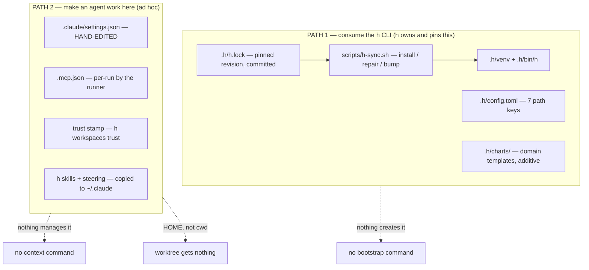

# Agent context management in the CLI

Status: Active — the CONTEXT half is built (`.h/skills` migration, `h workspaces link` with mode
profiles, the h-runtime refactor, the plugin publication); the BOOTSTRAP half (`h workspaces init`)
is what remains
Established: 2026-08-31

## 1. The premise

h has two ways a repo becomes usable, and they are the same problem solved twice — badly the
second time.

**Path 1 — consuming the h CLI.** A repo declares `.h/config.toml` (seven path keys, discovered
by walking up from cwd), pins h in `.h/h.lock`, installs `.h/venv` via a `scripts/h-sync.sh` it
carries, and adds domain templates under `.h/charts/`. This half is good: pinned, reviewable,
additive to the stock chart set.

**Path 2 — making an agent able to work in that repo.** `.claude/settings.json` marketplaces and
`enabledPlugins`, the Claude Code trust stamp, `.mcp.json`, and h's own skills and runtime
steering. This half is ad hoc: hand-edited per repo, and the skills/steering half installs into
`~/.claude` — a HOME — rather than anywhere the repo can see.

Three gaps follow, and none is covered by either path:

1. **`h-sync.sh` is a bootstrap script that must be hand-copied into a repo before h can bootstrap
   it.** Neither h nor its plugin distributes it. Every consumer gets a copy that then drifts.
2. **Nothing creates `.h/` either** — `config.toml`, the lock, the charts skeleton are all
   hand-authored. `h doctor` reports the consumer config but no command produces one.
3. **None of Path 2 reaches a worktree**, which is the only place an agent actually runs. Context
   resolved from `~/.claude` is context the working directory does not have.

### 1.1 What made this urgent

Two incidents, both this week, both the same root cause:

- `skills/ways-of-working` and `skills/delegate-locally` sat unreachable for ten days. The only
  propagation path was a setup step copying into a HOME, which `--local` runs skip; CLAUDE.md
  pointed at `ways-of-working` the whole time. Fixed 2026-08-30 by symlinking `skills/` into
  `.claude/skills/` — the repo-as-context model, applied to h itself.
- Bootstrapping the plan-management plugin into vizzle was done entirely by hand: settings.json
  merge, a CLAUDE.md section, a branch, a PR. Mechanical work, repeated per repo.

## 2. Decisions already made

These are operator calls from 2026-08-30/31, not open questions. They constrain everything below.

1. **The working directory is the unit of provisioning.** An agent's cwd is configured by the
   workflow, and when the agent initialises it has everything it needs *there*. Not in a home.
2. **The operator's `~/.claude` is not a home for h's skills.** Implemented: h's skills are
   self-contained in this repo, reached via `.claude/skills/` symlinks; a SKILL.md names its
   scripts as `<skill-dir>/<rest>` so it works from whichever home serves it, and
   `scripts/check-steering.mjs` rejects a `~/.claude/...` path outright.
3. **h becomes a DEPENDENCY of a repo it works on.** When h works in a repo, it adds what it needs
   to operate, and those resources are COMMITTED and live in the repo long-term — the same stance
   `.h/h.lock` already takes ("COMMIT THIS FILE — it is what makes an h upgrade a reviewable
   change rather than something that happens to a machine").

4. **ONE plugin, not two.** A "transient plugin" carrying h's ways of working has no content:
   `ways-of-working` and `h-issues` declare "Applies to the h repo ONLY" in their own frontmatter,
   so they belong in a consumer repo neither persistently nor transiently. The single `h` plugin
   (`use-h`, `author-h-template`) is committed and enabled in the repo. This also settles §6.1:
   the plugin MECHANISM is the reference — skills reach a repo through the marketplace entry in
   `.claude/settings.json`, not as copied files. Only `.h/` config and charts are committed content.
5. **Genuinely transient context is provisioned into the WORKTREE, and is not a plugin.** The
   runtime steering ("you are an agent inside a workflow, here are your MCP servers") is true only
   during a run and actively FALSE for a human opening the repo, so it must never be committed. It
   needs no uninstall step: the worktree already supplies the lifetime, and deleting the worktree
   is the uninstall. The sorting test for any piece of context is **"is this still true when
   nobody is running h?"**
6. **h consumes h for CONFIG, not for INSTALLATION.** (Config half LANDED 2026-08-31 — h now
   carries its own `.h/config.toml`.) h gets its own `.h/config.toml` like any
   consumer, so path resolution goes through the identical code path (`config.py` forks on
   `IS_CHECKOUT` in NINE places today — every one a works-in-h/breaks-in-a-consumer bug waiting to
   happen, and h's consumer contract is currently exercised only by trxy). h does NOT get
   `.h/h.lock`, `.h/venv` or `.h/bin/h`: pinning h to a commit of itself carries no information,
   and a pinned venv would mean `uv run h` executing a STALE h while you edit `cli/h/` — the tool
   disagreeing with the source in front of you. The split is config vs installation.

7. **THREE distribution mechanisms, each matched to a property — not one bucket.** The symlink
   route is the fallback for what cannot be a plugin, never the primary:

   | Content | Mechanism | Why |
   | --- | --- | --- |
   | published, versioned skills (`use-h`, `author-h-template`) | `.claude/settings.json` plugin entries | already works (trxy uses it today), smallest footprint, cross-agent |
   | unpublished / repo-private skills, h's own internal ones | `.h/skills/` + symlinks into pickup locations | there is no marketplace to publish them to |
   | rules / steering | `.h/rules/` → `.claude/CLAUDE.md`, or markers | not skill-shaped |

8. **`.h/skills/` in EVERY repo, h included — the flow-2 exception is deleted.** h moves
   `skills/` → `.h/skills/`, so the CLI links `.h/skills/*` into the pickup locations everywhere
   with no source-root parameter, no config key and no branch on repo kind. Parity is the point:
   one code path h's own development exercises daily.
9. **Nothing in `.h/` is gitignored except `.h/venv/`** (operator, 2026-08-31). `.h/` carries its
   OWN `.gitignore`, provisioned at init, so h never edits the repo's root one. h has no venv, so
   in h nothing under `.h/` is ignored at all.
10. **RETRACTED: "transient runtime steering" was an inflated category.** Read end to end,
   `apps/claude-agent/steering/h-runtime.md` is 49 lines of which ONE sentence is genuinely
   run-scoped; the rest is always-true (the vocabulary rule, verbatim duplication of CLAUDE.md's),
   stack-conditional (the MCP servers, `pubsub_publish`) or self-guarding (the output-contract
   rule, which states itself completely). **The real defect is accuracy, not lifetime**: the file
   asserts unconditionally that the MCP servers "are already wired into your environment", which
   was false in the session that found it and is false for every local-substrate run. What
   survives is narrower and about SCOPE: h must not write claims about a run anywhere outside that
   run's worktree — today it installs them into the operator's machine-global `~/.claude/CLAUDE.md`.
   Consequence: no second provisioning mechanism is needed, and rules live in `.h/` committed like
   everything else.
11. **Primitives are selected per MODE, and the selection is both configured and dynamic.** This is
   the mechanism for per-run context variation — not a new subsystem, just *which subset gets
   linked*. Two halves, mirroring `h.pluginSetupSteps` exactly (curated sources baked at publish;
   WHICH ones fire-time):
   - **Manifest** — profiles in `.h/` mapping a mode to its primitives (`[profiles.container]
     rules = ["h-runtime"]`). Reviewable in a diff, owned by the CLI, and it does not fight the
     skill frontmatter schema, which `check-plugins.mjs` pins to exactly name+description.
   - **Fire-time** — the link is a workflow SETUP STEP, so a run selects its primitives at
     invocation. That is what makes A/B possible: run A of a workflow with one skill, run B with
     another, same definition.
12. **Rules use a FALLBACK CHAIN, not a fixed location.** Own `<cwd>/.claude/CLAUDE.md` when the
   slot is free (verified to load alongside the repo's own `CLAUDE.md`, and removal is deleting one
   file); fall back to marker-based writing into the repo's `CLAUDE.md`/`AGENTS.md` when it is not.
   `skills/install-steering.sh` already implements the marker half. Three repos checked (h, trxy,
   vizzle) have the slot free, but three is an observation, not a guarantee — and another agent may
   have no free slot at all.

### 2.1 The consequence worth naming

Decisions 1 and 3 together collapse most of the per-run provisioning problem. If a repo's h
context is committed, then **every worktree cut from that clone inherits it for free** — the same
way h's own worktrees now carry `.claude/skills/`. Bootstrap once, inherit forever. Per-run setup
shrinks to genuinely per-run things, and the `_helpers.tpl` setup steps that write into a HOME
stop having a reason to exist.

It also converts drift into a reviewable diff: committed context that falls behind the `h.lock`
pin is reconciled by a command, and the reconciliation shows up in a PR rather than happening to
a machine.

## 3. Current state (verified 2026-08-31)

### 3.1 The h plugin (`plugins/h/`)

Four files, two skills, no machinery — it is pure prose:

| File | What it is |
| --- | --- |
| `skills/use-h/SKILL.md` (+ `references/cli-reference.md`) | how to run domain workflows from a consumer repo |
| `skills/author-h-template/SKILL.md` (+ `references/starter-chart.md`) | how to author a domain chart under `.h/charts/` |
| `.claude-plugin/plugin.json`, `.codex-plugin/plugin.json` | manifests, parity-guarded by `scripts/check-plugins.mjs` |

`use-h` describes itself as applying to "a repo carrying `.h/config.toml`" — the plugin assumes
the bootstrap it cannot perform.

### 3.2 What a consumer repo carries (trxy-v2, the live example)

### 3.4 What is actually h-only — the skill inventory (verified 2026-08-31)

h carries 10 internal skills; only FIVE genuinely cannot reach a consumer, and four say so in
their own frontmatter — the declaration IS the boundary, which is what makes selection checkable:

| h-only | Why |
| --- | --- |
| `ways-of-working` | declares "Applies to work on the h repo ONLY" |
| `h-issues` | declares h-only; encodes h's issue conventions and the loop's labels |
| `author-workflow-template` | declares h-only; h's STOCK charts — `author-h-template` is its published sibling |
| `integrate-agent` | declares h-only; coupled to `apps/<name>-agent/`, agent-cli, the activity registry |
| `diagrams` | h's canonical-diagram POLICY (`docs/diagrams/`, the index, naming) |

**The h plugin is UNDER-POPULATED, and that is the real gap.** Consumers get two skills when at
least two more already serve them: `delegate-locally` (the local substrate IS what consumers use)
and `analyze-workflow-run` (consumers have runs; its script is env-configurable, not path-bound).
`observe-h` and `workflow-orchestrator` are publishable in principle but gated on a running stack.
So the consumer work is mostly MOVING skills into the plugin, not building distribution.

`linear` is misfiled: it reads and writes Linear issues via `LINEAR_API_KEY` and has nothing to do
with h. It belongs in its own plugin or outside this repo. Filed as issue #121.
*Revisit when: that issue is picked up.*

### 3.3 The precedent already in the CLI

`h workspaces trust` is already an agent-context command: it stamps Claude Code's per-project
trust for an h-MANAGED checkout and refuses external paths by name. It is one instance of the
general thing this plan formalises, and it proves the CLI is the right home — it already knows
the managed-workspace boundary, already resolves consumer config, already refuses loud.

## 4. The shape

One noun — **repo context** — whose lifecycle the CLI owns, so bootstrapping a consumer repo and
provisioning a worktree are the same code against different targets.

| Target | Creates | Reconciles |
| --- | --- | --- |
| a CLONE (bootstrap) | `.h/config.toml` + `.h/.gitignore`, `h.lock`, `.h/charts/` skeleton, `.claude/settings.json` plugin entries, trust stamp | drift against the pin |
| a WORKTREE (per run) | the symlinks for the run's selected profile (§2.11) | same code, narrower scope |

(Superseded in detail by §2.7-§2.12: `h-sync.sh` is NOT scaffolded (§4.2), and what a worktree
gets is a profile SELECTION rather than "whatever the clone could not commit" — since §2.9 means
the clone commits everything but the venv.)

Everything the clone commits, the worktree inherits. The two paths consolidate because the
committed artifact IS the provisioning.

Consequences for existing machinery:

- `h.setupSteps` in `cli/charts/workflows/templates/_helpers.tpl` stops copying skills into a HOME
  and stops writing steering there. What remains, if anything, calls the CLI.
- `h-sync.sh` stops being a per-repo hand-copy: h ships it and the CLI installs it.
- The `--with-setup` hazard on the local substrate disappears rather than being special-cased —
  there is no longer a step that writes into the operator's home.

## 4.1 The flow (operator, 2026-08-31)

Two steps, in order:

1. **Install the CLI into the repo.** This makes h a declared DEPENDENCY of the repo and writes
   the base config — `.h/config.toml`, the pin, `h-sync.sh`, and the `.h/venv` ignore rule.
2. **Use the CLI to initialise the plugin.** `.claude/settings.json` gains the h marketplace and
   the `h@h-marketplace` entry — AND the plugin is then actually INSTALLED, per scope. Those are
   two different things, and conflating them is what this step originally got wrong (corrected
   2026-09-01, see §8): a settings entry DECLARES a plugin, `~/.claude/plugins/installed_plugins.json`
   is what makes it LOAD. trxy has carried the declaration since 2026-08-13 (`18c0bc5d`, "install
   the h plugin") and the plugin has never loaded once — measured from a run ledger, not inferred:
   seven plugins in the agent's init event, `h` not among them, and no `h@h-marketplace` key in the
   install registry while all seven that loaded have one.

   So `init` writes the entries and then runs the install, per scope, and VERIFIES by reading the
   registry back rather than trusting the command's success line (the per-scope pinning trap: a
   marketplace update moves no install, and `--scope user` leaves every project scope behind).
   Verification is the load-bearing half — the failure this corrects was silent for 19 days
   precisely because nothing ever read back what the declaration claimed.

Step 2 depends on step 1, which is why the current chicken-and-egg is fatal: `h-sync.sh` is the
thing that installs the CLI, and today it must be hand-copied before h can do anything.

## 4.2 `h-sync.sh` is retired, and the two-h model that replaces it

The scaffold must NOT write `h-sync.sh`. Every operation it performs — read the pin, compare
against `.h/venv/bin/h --version-json`, `uv pip install h-cli @ git+<repo>@<sha>`, rewrite the pin
from `origin/main`, exit 1 on drift — is a CLI operation, and its one structural justification
("install h when you have no h") contradicts decision §2.3, that the CLI is the prerequisite.

What remains true is a real circularity: **the pinned h cannot upgrade itself past its own pin.**
So there are deliberately TWO h's, the shape nvm and rbenv use:

- the **bootstrap** h — whatever is on PATH or in a checkout; it runs `init` and `sync`;
- the **pinned** h — `.h/venv`, invoked through `.h/bin/h`; it runs the repo's work at a revision
  an upgrade makes reviewable.

Under the CLI model the bootstrap role is filled by the same tool rather than a hand-copied shell
script. The CI case (a runner clones with no h) is a documented one-liner —
`uvx --from git+<repo>@<sha>#subdirectory=cli/h h …` — not a committed file. trxy still carries the
script; leaving it is harmless, moving it is a deliberate follow-up.
*Revisit when: `h workspaces sync` lands and trxy is next touched.*

## 4.3 The `h-runtime.md` refactor

Decision §2.10 makes this content work rather than mechanism work. What survives:

- **DROP** the vocabulary section — verbatim duplication of CLAUDE.md's, which says so itself.
- **DROP** the output-contract section — `h.outputContractEpilogue` states the rule completely,
  per step, beside the schema it governs. Two copies of a protocol is how protocols drift.
  (Proven: this session's `--local` runs installed no steering and still validated their contracts.)
- **MAKE CONDITIONAL** the MCP claims — "already wired into your environment" is asserted as fact
  and is false locally and whenever the stack is down.
- **KEEP** what is true in container mode: you are a step in a workflow, how to reach runtime
  state, how to hand work to another workflow.

The result is smaller and honest in every environment that loads it, and it becomes the first
consumer of the §2.11 mode profiles: linked in container mode, absent locally.

## 5. Verification — DONE (2026-08-31)

Both items ran before any code was written. Both changed the design.

1. **Project-scope steering: BOTH files load.** A headless session in a scratch project carrying
   two distinct codewords — one in `<cwd>/CLAUDE.md`, one in `<cwd>/.claude/CLAUDE.md` — reported
   BOTH verbatim. So h's runtime steering goes into **`<cwd>/.claude/CLAUDE.md`**, a file the
   target repo does not own, instead of being appended into the repo's own `CLAUDE.md`. That
   removes the invasiveness objection entirely: no edit to a file the repo authored, and
   `install-steering.sh`'s existing second argument already points anywhere. It stays TRANSIENT
   per decision §2.5 — provisioned into the worktree, never committed, listed in
   `.git/info/exclude`.
2. **`mergeMcpConfig` is the model to copy, and it already states the rule.** Its `merge` mode
   preserves the project's own entries and other top-level keys while h's win on a name conflict,
   and an unparseable project file falls back to h's config rather than throwing. Skills
   provisioning takes the same shape: h's skills are ADDED beside whatever `.claude/skills/`
   already exists, and a same-named skill already present is the repo's, so it wins — the
   `cp -rn` rule that already governs the HOME copy, applied to the working directory. This
   matters for h itself, whose checkout carries both real skill directories and the symlinks into
   `skills/`; a clobbering bootstrap would destroy them.

Its `replace` mode is worth carrying over too, unchanged in meaning: an agent executing untrusted
specs inherits nothing from the cwd. Not needed today, and the seam should exist.

## 5.1 The nine forks, classified (verified 2026-08-31)

Decision §2.6 rests on removing `IS_CHECKOUT` forks. Reading them, they are THREE kinds and only
one is about invocation — which bounds how much §2.6 actually changes:

| Kind | Count | Fate |
| --- | --- | --- |
| Path DEFAULTS (runs, worktrees, workspace, dotenv) | 4 | Dissolved by h's own `.h/config.toml` — they are `_setting(env, key, default)` and the default stops being consulted. This IS the dogfooding win. |
| "Where are my own assets" (stock charts, local runner, version string) | 3 | STAY. Source tree vs wheel bundle, `git describe` vs package version. Intrinsic to source-vs-artifact invocation. |
| Safety boundary (`managed_roots()`) | 1 | Neither. Checkout mode adds h's own repo as a third root a local run may work in; a wheel install has no checkout, so that root would be site-packages nonsense. |

Two consequences for implementation:

- **The invocation difference is already configuration.** Both asset forks sit behind config keys
  (`charts_dir`, `local_bin`); the fork only selects the DEFAULT. So this is one code path with two
  default sets, not two code paths — `.h/config.toml` overrides whichever it wants.
- **Source-mode trades pinning for SKEW — now filed as issue #120.** `LOCAL_BIN` is `packages/js/local-runtime/dist/bin.js`,
  a separate build artifact, so a current Python CLI can run against a stale JS runner. The packaged
  path ships both together and "cannot skew" (its own comment). This is the failure mode to watch
  for h-on-h, because it presents as h behaving like an older version of itself. Partly guarded by
  `check-workspace-built`; `h doctor` reports the runner as built.

`IS_CHECKOUT` appears in only three files — `config.py`, `infrastructure/workspace.py` (the
boundary), `infrastructure/local_runtime.py` (an error message). The fork is contained.

## 6. Open questions (operator, before implementation)

1. ~~**Vendored or referenced?**~~ ANSWERED by decision §2.4 — REFERENCED, through the plugin
   marketplace entry, which is what the plugin mechanism is for. Copied content is limited to
   `.h/` config and charts.
2. ~~**What is the command surface?**~~ ANSWERED (operator, 2026-08-31) — EXTEND `h workspaces`.
   It already means "a clone h manages" and already carries `trust`, an agent-context command, so
   the bootstrap needs no new noun.
3. ~~**Does bootstrapping WRITE or EMIT?**~~ ANSWERED (operator, 2026-08-31) — h WRITES the files
   and NEVER commits them. The model is `npm install`: installing produces a diff, and whoever is
   carrying out the change — operator or agent — commits it later as part of their own change.
   So the bootstrap is not a git author, and its output is reviewable by construction.
4. ~~**How much does a NON-h repo receive?**~~ ANSWERED by decision §2.4 — exactly the `h`
   plugin's two skills. The frontmatter "h repo ONLY" declaration IS the split, and it is already
   written. A related asymmetry STAYS and is correct: h enables `author-workflow-template` (stock
   charts), a consumer enables `author-h-template` (`.h/charts/`) — different audiences, genuinely
   different content, not an accident to unify away.
5. ~~**Is `.h/venv` committed?**~~ ANSWERED 2026-08-31 by inspecting trxy-v2: the repo's root
   `.gitignore:195` carries `.h/venv/` while `.h/config.toml`, `.h/h.lock` and `.h/charts/` are
   tracked. So the established split is *everything in `.h/` is committed except the virtualenv*,
   and the bootstrap must write that ignore rule as part of the scaffold — otherwise the first
   `git add -A` in a freshly bootstrapped repo commits a virtualenv.

## 7. Not in scope

- `bootstrap-repo` (the chart template) stays the GENESIS path — creating a repo that does not yet
  exist. This plan is about a repo that already exists and that h starts working in.
- Steering CONTENT (what a repo's CLAUDE.md should say about itself) is a separate effort, already
  scoped elsewhere as a per-repo knowledge-accumulation pass. This plan moves context, not prose.

## 8. Log

- **2026-08-31 — established.** Premise and current-state map verified against `plugins/h/`,
  `cli/h/src/h_cli/config.py`, and the live trxy-v2 consumer. Decisions in §2 recorded from the
  operator. Confirmed no overlap with `bootstrap-repo` (genesis path) or the self-improvement
  plan's steering-content fold.
- **2026-08-31 — §6.5 answered** from the live consumer rather than left open: trxy ignores
  `.h/venv/` and tracks the rest of `.h/`. Recorded as a scaffold requirement.
- **2026-08-31 — decisions §2.4-§2.6 recorded**, closing open questions 1 and 4: one plugin
  (referenced, not vendored); transient context belongs to the worktree and is not a plugin; h
  consumes its own config contract but never installs a pinned copy of itself. Open: §6.2 (command
  surface) and §6.3 (write vs emit).
- **2026-08-31 — §6.2 and §6.3 answered** (extend `h workspaces`; write but never commit, on the
  `npm install` model). All five open questions are now closed. REMAINING BEFORE `Active`: the §5
  verification pass, which was paused by the operator before it ran.
- **2026-08-31 — §5.1 added**: the nine `IS_CHECKOUT` forks classified from the source. Only four
  are dissolved by §2.6; three are intrinsic to source-vs-artifact invocation and one is a safety
  boundary. Named the skew risk source-mode accepts. The §5 steering-location experiment is still
  UNRUN.
- **2026-08-31 — the skew risk was designed out and DELEGATED as issue #120**, so it does not
  block this plan. Settled shape: a checkout-only `bun run build --filter=local-runtime` as a
  SEPARATE subprocess before the runner spawn, which stays byte-identical (`["node", runner]`,
  own process group, inherited stderr). The runner is deliberately NOT wrapped in `bun run`: the
  Ctrl-C path signals the process it spawned, and that SIGINT must reach node so agent-cli's
  reaper group-kills the agent CLIs — an intermediate script-runner would make that depend on its
  own signal forwarding, and the failure mode is orphaned CLIs that keep billing. Measured:
  `--filter=local-runtime` builds the whole 7-package closure, ~104-190ms fully cached, and turbo
  writes nothing to stdout so the result envelope is safe.
- **2026-08-31 — decision §2.6's CONFIG half is IMPLEMENTED.** h carries `.h/config.toml`
  declaring `workspace_dir`, `worktrees_dir`, `runs_dir` and `dotenv` as relative paths, so those
  four settings now resolve through the SAME code a consumer takes rather than through
  `IS_CHECKOUT` defaults. Verified as a true no-op: the seven resolved paths are byte-identical
  before and after, `h doctor` reports the config discovered, and a mutation probe confirmed the
  file is authoritative rather than merely present. `charts_dir`/`local_bin` are deliberately NOT
  declared — §5.1's asset-location forks, where the difference is real. The INSTALLATION half
  (`h.lock`, `.h/venv`, `.h/bin/h`) remains correctly absent. Suite: 501 pass.
- **2026-08-31 — decisions §2.7-§2.12 recorded** after working the context model end to end:
  three mechanisms rather than one bucket; `.h/skills/` everywhere (the flow-2 exception deleted);
  nothing in `.h/` ignored but the venv; the "transient steering" category RETRACTED as inflated,
  with an accuracy-and-scope rule in its place; mode profiles plus fire-time selection on the
  `h.pluginSetupSteps` precedent; and a fallback chain for rules. Added §3.4 (the skill inventory —
  five genuinely h-only, the plugin under-populated, `linear` misfiled), §4.2 (`h-sync.sh` retired,
  the two-h model) and §4.3 (the `h-runtime.md` refactor).
- **2026-08-31 — the CONTEXT half is IMPLEMENTED** (four commits, all pushed):
  1. **`skills/` → `.h/skills/`** (§2.8). Atomic across `H_SKILLS_DIR` in seven run scripts, five
     compose mounts, three Dockerfile COPYs, three guards and the docs. k8s needed nothing — its
     manifests name `/h-skills`, which the images still provide. Found and fixed a latent bug:
     `check-steering` derived a skill's name from a fixed path index, which the extra directory
     level silently shifted into `.h/skills/skills/…` expectations.
  2. **`h workspaces link`** (§2.11) — skills become relative symlinks, rules become one
     marker-delimited block. Selection is `--skill`/`--rule` > profile > everything. Pruning is
     unconditional for links h owns, because selection without pruning means run B inherits run
     A's context; a real directory or a foreign link is never touched. Removing the last rule block
     DELETES the steering file — an empty one cannot be told from a failed write. 10 unit tests.
  3. **`h-runtime.md` refactored** (§4.3) into `.h/rules/`, losing the vocabulary section and the
     output-contract rule and gaining conditional MCP language. `H_RULES_DIR` mirrors
     `H_SKILLS_DIR` across run scripts, compose, three images and both k8s manifests. The `local`
     profile selects NO rules, so a local agent is no longer told it is inside a Dapr workflow.
  4. **`delegate-locally` + `analyze-workflow-run` published** (§3.4), plugin 0.1.4 → 0.2.0. ONE
     copy: they live in `plugins/h/skills/` and `.h/skills/<name>` symlinks into them, so the
     plugin publishes them and h still loads them. h deliberately does NOT enable its own plugin —
     the marketplace source is GitHub, so it would run a published copy against a live source tree,
     the same trap that keeps `.h/venv` out of h.

  Verified throughout: every guard, 511 CLI tests, compose config parses, and the goldens re-blessed
  after reviewing that the only change was the one setup-step line, in 11 templates.
- **2026-08-31 — §5 verification DONE, and it moved the design.** Steering: both `<cwd>/CLAUDE.md`
  and `<cwd>/.claude/CLAUDE.md` load, proven with a two-codeword probe, so h writes the one the
  repo does not own and never edits the repo's own file. Skills: `mergeMcpConfig` supplies the
  merge semantics AND the precedent that the project's own entries survive. Status → **Active**.
- **2026-09-01 — §4.1 step 2 was WRONG, found by dogfooding trxy.** The step defined "initialise
  the plugin" as writing the marketplace + `enabledPlugins` entries into `.claude/settings.json`.
  That is exactly the state trxy has been in since 2026-08-13, and the h plugin has never loaded
  there: `use-h`, `author-h-template`, `delegate-locally` and `analyze-workflow-run` were absent
  from all 54 skills an agent loaded in a trxy worktree. Enabled is not installed. Had `h
  workspaces init` been built to this spec it would have reproduced the broken state and reported
  success. §4.1 corrected to require the install AND a read-back of `installed_plugins.json`.

  The same session produced a SECOND instance of the identical class, which is why it is worth
  naming rather than just fixing: `h doctor` reports `codex ok` from `shutil.which` while codex
  cannot authenticate, and a two-agent panel lost half its roster to it at run time — after paying.
  `check-env-local` had the right answer all along (it reads each strategy's `validateEnvironment`)
  but is wired into `up-host.sh`, so the local substrate has no auth preflight at all.

  **The class: h reports PRESENCE where the operator needs READINESS.** A binary on PATH is not an
  agent that can run; a settings entry is not a plugin that loads; and in both cases the gap is
  silent and only surfaces after a run has been paid for. Both surfaces have an authority that
  already knows the true answer and is simply not being asked. Proposed: doctor asks the runner
  (`agents.probe` → `AGENT_STRATEGIES[...].validateEnvironment`) and reads the plugin registry,
  making `h doctor` a readiness report rather than a presence report. `init` provisions, `doctor`
  verifies.
