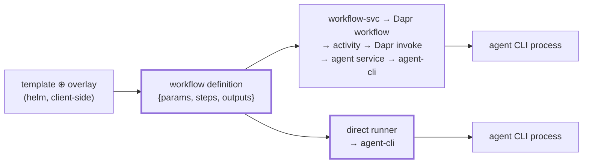

# Direct execution runtime

Status: Active — a second execution substrate for the SAME composition stack: `h` drives agent CLIs
as local child processes via `agent-cli`, with no Dapr, no services, and no registries. **All five
phases (P1–P5) are built and live-validated.** Stays open pending the durable-context lift below
(ARCHITECTURE.md's composition/principles sections still describe one substrate).
Established: 2026-08-06

## Why

Everything h has built so far buys **durability across machines**: workspaces, supervision,
recurrence, sequencing, a queryable ledger — the things an agent cannot give itself when the run
outlives the process that started it. That is the right shape for unattended, long-horizon work
(the h-builds-h loop), and it is why the stack is Dapr-shaped.

It is the wrong shape for the other mode of working: a driver sitting at a terminal (a human, or
Claude Code itself) who wants to hand a bounded piece of work to codex, pi, or openhands **right
now**, in this checkout, and read the answer back in a minute. Today that costs a control plane, a
sidecar per service, Redis, and a stack bring-up. The value on offer — a panel of three agents
answering the same question, or a write task delegated to a second CLI in an isolated worktree — has
nothing to do with durability.

So: keep the whole composition stack; swap the substrate underneath it.

## The claim: the seam already exists

`h` renders a template (helm, client-side) into a **workflow definition** —
`{params, steps: [{id, activity, input}], outputs}` — and only at the last moment POSTs that JSON to
workflow-svc. Everything Dapr-bound lives *below* that artifact.



The proof is `AGENT_IDENTITY` (`cli/h/src/h_cli/config.py`): `--agent codex` renders
`activity: "run-codex"` into the definition. A direct executor needs an activity registry that maps
`run-codex` → `codexStrategy` instead of → a Dapr invoke of `codex-agent`. **No template changes, no
new authoring surface, no second composition stack.** The same rendered definition, the same
`outputContract`, the same `{{params.x}}` / `$ref` resolution, the same panel fan-out generated by
`panelize.py`.

## What direct mode owns, and what it drops

| Concern | Service substrate | Direct substrate |
| --- | --- | --- |
| Step sequencing | `generic.workflow.ts` (Dapr generator) | in-process loop over the same steps |
| Parallel groups (panels) | `ctx.whenAll` | `Effect.all` — panels run with zero infrastructure |
| `run-claude`/`-codex`/`-pi`/`-openhands`/`-kimi` | Dapr invoke → agent service → `agent-cli` | `agent-cli` strategy, directly |
| `clone-repo`, `create-worktree` | agent-server routes | `git-core` in-process |
| `copy-session` | activity | fs copy |
| `setup` | agent-server `/setup` in an agent-owned HOME | **skipped by default** (see D4) |
| `run-itest` | k8s-only gate | refused loud in direct mode |
| `write-wf-row`, `register-cron`, `register-discover` | registry writes | **refused loud** — no registry exists |
| Run ledger | fs + `run:` statestore mirror | fs half only — `h runs`, obs-mcp and `web/` keep working |
| Watcher / chain / cron engines | durable rows on the cron tick | absent by design |
| Tracing | Zipkin spans | inert unless `ZIPKIN_ENDPOINT` is set |

Dropping the engines is the tradeoff, not a gap, and it is principled. Those engines exist because a
workflow cannot supervise, sequence, or recur *itself* in a durable distributed system. In direct
mode **the driver is the supervisor**: a budget is a timeout, sequencing is a loop, recurrence is
the operator's own cron. Nothing is being reimplemented in a weaker form — it is being declined.

## Decisions

**D1 — surface: `--direct` on the existing commands.** The substrate is a flag, not a namespace, so
composition and execution keep reading as one stack:

```sh
h workflow run answer   --direct -p task="…" --agent codex
h workflow run implement --direct -p slug=x -p spec=@spec.md --worktree
h workflow run answer   --direct -p task="…" --agent claude codex pi   # panel, no infrastructure
```

Machinery flags that need an engine are **refused loud** under `--direct`, naming the engine they
need — never silently ignored: `--cron`, `--max-fires`, `--watch`, `--at`, `--in`,
`--fallback-agent`, `--fallback-after`, `--fallback-max`, `--via`. `h workflow pause|resume`,
`h watch`, `h cron`, `h schedule` are service-substrate surfaces and stay untouched.

**D2 — the atom is a new command, `h delegate`.** No existing command means "run one agent on one
task", and that is the primitive a driver reaches for most. Singular `delegate` avoids collision
with `h agents` (the executor-policy surface):

```sh
h delegate --agent codex "refactor the tokenizer for readability"
h delegate --agent codex --cwd ../other-repo --model gpt-5-codex "…"
h delegate --agent claude codex pi "which of these three designs is soundest, and why?"
h delegate --agent codex --worktree --json "…"       # isolated checkout + machine-readable envelope
```

A roster fans out in parallel and prints each answer; it deliberately does **not** synthesize (that
is `h workflow run answer --direct --agent …`, which panelizes through the existing `panelize.py`
and adds the pinned judge). `h delegate` stays the raw atom.

**D3 — symmetry is guaranteed structurally, by extraction, not by convention.** A hand-written
second step engine would drift on `$ref` semantics, contract validation, and chain threading —
silently, and only under load. The pure execution semantics currently sit inside an *app* (therefore
unimportable) and must move into shared packages, with workflow-svc rewired onto them in the same
change (atomic cutover, no duplicate copy). This is the spine of P2 and the reason the POC is worth
building properly rather than as a script.

**D4 — direct mode skips `setup` steps by default.** In service mode `setup` runs inside an
agent-owned HOME and installs h skills into `~/.claude/skills/`. Running that on the host would
mutate the **operator's own Claude Code configuration**. Direct mode's premise is that your already
authenticated, already configured CLIs are the setup — so `setup` steps are skipped with a printed
notice, and `--with-setup` opts in explicitly. (The h skills it installs are largely about h's MCP
servers, which are not running in direct mode anyway.)

**D5 — MCP config is left alone.** `provisionMcpConfig` exists to inject h's `dapr`/`workflows`/`obs`
servers, which are exactly what is not running. Direct mode does not write `.mcp.json` at all: the
agent inherits whatever the target repo already carries. `--mcp <path>` can merge an explicit source
later if a need appears; not in the POC.

**D6 — credentials come from the operator's environment.** `agent-cli`'s invoker already merges
`process.env` into the child. So `ANTHROPIC_API_KEY`, `OPENAI_API_KEY`, `~/.codex/auth.json`
(`CODEX_AUTH_MODE=chatgpt`), and a logged-in `claude` CLI all just work with no configuration. This
is the entire "minimal setup" story: the only prerequisite is `bun install && bun run build` once.

**D8 — the repo's `.env` fills credential gaps, shell-wins (added during P1).** D6 was right in
principle and incomplete in practice: in THIS repo the operator's keys live in `.env`, which only
compose and the run scripts load, so a bare `h delegate --agent claude` failed agent-cli's env gate
on a box where the claude CLI was perfectly well logged in. The CLI now layers `.env` UNDER the
process env when building the child's environment — the same keys the agent services get, without a
bring-up. Precedence is deliberately the opposite of `cli/scripts/compose.sh` (which strips `.env`
keys so the file wins for long-lived containers, after a stale shell export caused two bad recreates
on 2026-07-16): an interactive one-shot command must honour a key the operator just exported.
Encoded in `child_env` and pinned by `cli/h/tests/test_direct.py`.

**D7 — the runner is TypeScript, invoked by the Python CLI over a JSON boundary.** `agent-cli` is
Effect/TS; reimplementing agent invocation in Python would duplicate five strategies and violate
*thin services, reusable packages*. The Python CLI composes as it does today and spawns the runner
with the definition on stdin: progress streams on stderr (rendered by rich), the final results
envelope on stdout. The wire between them is the same JSON the service substrate would have been
POSTed — which is what makes the two paths auditably symmetric.

## Non-goals

- No durability. A killed `h` loses the run; there is no replay, no resume, no instance to attach to.
- No supervision, recurrence, or scheduling — those keep their engines and their substrate.
- No local Redis/state emulation. Chain data (P4) lives in memory for the process' lifetime.
- No new authoring surface. If something needs a template change, it is out of scope by definition.
- Not a replacement for the service substrate. Unattended, multi-hour, self-healing work stays there.

## Phases

### P1 — the atom · **DONE 2026-08-06**

New package `packages/js/direct-runtime/` (bin + library) and `h delegate` in the Python CLI.

- `src/domain/` — the executor core and its ports (`ActivityPort`, `LedgerPort`); `src/infrastructure/`
  — the `agent-cli` adapter and fs ledger. A `src/domain/` directory means `check-hex-lint.mjs`
  requires the `depcruise` suffix on this package's `lint` script — add it with the package, not after.
- `src/bin.ts` — reads a job on stdin, writes the results envelope on stdout, human progress on stderr.
  Built to `dist/bin.js`; Python spawns it with `node`, overridable via `H_DIRECT_BIN`.
- Agent strategy selection by `--agent` name, reusing `AGENT_IDENTITY`'s `runActivity` mapping so P3
  inherits it unchanged.
- Run ledger written to `AGENT_RUNS_DIR` in the existing layout, so `h runs` / `run` / obs-mcp / the
  `web/` viz read direct runs with no changes on their side.
- SIGINT propagation: Ctrl-C in Python → SIGINT to the node child → `agent-cli`'s `reaper.ts`
  group-kills every agent CLI. **Explicitly validated**, not assumed — an orphaned CLI bills invisibly.
- `--worktree` cuts an isolated worktree off the current checkout via `git-core`, so delegated *write*
  work never lands in the operator's live tree.

*Validated live, 2026-08-06* (`make lint` + `make test` green — 313 tests):

| Check | Result |
| --- | --- |
| single agent answers | claude, plan mode, $0.0587 |
| roster runs concurrently | claude 4.0s ∥ codex 9.6s, one job, no services running |
| run ledger in the standard layout | `../h-workspace/.runs/direct-260806-124834/{claude,codex}-*/` with summary.json + events.jsonl + output.txt |
| Ctrl-C leaves no orphan | SIGINT → `direct: interrupted`; zero surviving CLIs and zero runners (`ps`) |
| unknown agent fails loud | names the four available agents and points service-only ones at the other substrate |
| per-agent worktree | agent reported branch `direct/…` from `../h-worktrees/…`, live tree untouched |

**Findings recorded during P1:**

- **Cost honesty comes free, and matters more here.** codex on a ChatGPT subscription reports no
  cost in its stream, so the run shows `—`, never `$0.0000`. With no watcher on this substrate
  there is no cost tally and no daily-budget fence, so the per-run table and `h runs` ARE the
  accounting — a fake zero would be the whole record.
- **The ledger group is `workspaceId`, not a fabricated instance id.** Direct execution has no Dapr
  instance, so `workflowInstanceId` stays null in summary.json rather than inventing one; the job's
  `direct-<yymmdd>-<hhmmss>` group keys the directory. Honest, and it still groups correctly.
- **`check-hex-lint.mjs`'s fix hint was wrong for `packages/js/`.** It hardcoded the apps-relative
  `../../.dependency-cruiser.cjs`; direct-runtime is the first hex-layered package one level deeper,
  and following the hint produced "Can't open config file". The hint is now computed per package.
- **Run-ledger reuse is temporary.** P1 imports `startRunLedgerEffect` from `agent-server`, which
  drags `fastify` into a CLI's dependency graph. Deliberately not duplicated — P2's extraction into
  `packages/js/run-ledger` turns this into a one-line import change.

### P2 — the extraction (the symmetry guarantee) · **DONE 2026-08-06**

Move the pure execution semantics out of workflow-svc into shared packages and rewire workflow-svc
onto them in the same change. Nothing is copied; nothing keeps a second implementation.

- `packages/js/workflow-core/` ← `resolve-refs.ts` (from `infrastructure/workflows/`),
  `structured-output.ts` (from `domain/`), and the definition-shaped models (params, step, parallel
  group, `AgentResult`). The fire descriptor, run request, stored workflow and registry models stay
  in workflow-svc — they only mean something where there is a durable engine to fire into.
  `workflow.model.ts` re-exports the moved shapes, so it remains workflow-svc's single model surface.
- `packages/js/run-ledger/` ← `agent-server/src/run-ledger.ts` whole (it depended only on
  `@effect/platform` + `effect`). `agent-server` re-exports it, so all nine agent services are
  untouched; direct-runtime now imports the ledger without dragging `fastify` into a CLI.
- Moved with `git mv`, so history follows. Both suites run in their new homes (workflow-core 29
  tests, run-ledger 10); workflow-svc's 359 stay green, unchanged by construction.
- `scripts/check-runtime-parity.mjs` + a self-test, wired into `bun run lint` and `bun run test`:
  each shared concern names ONE owning package, and DEFINING its symbols anywhere else fails the
  build. Re-exports are explicitly fine — they have no second implementation to drift.

**The guard found two real drifts on its first run, both in `workflow-mcp`'s wire shapes** — which
had its own copy of `StepDefinition`/`WorkflowParams`, and had already diverged:

1. `input` was REQUIRED there and optional in workflow-svc, so a step with no input was rejected by
   `save_workflow`/`run_workflow` while the identical definition was accepted over HTTP.
2. `steps: Array(StepDefinition)` admitted no parallel group, which silently made **every panel
   unsaveable and unrunnable through the workflows MCP**. That shape predates panels (2026-07-24)
   and never caught up — so an agent orchestrating through the MCP could not compose one at all.

Both are fixed by importing the shared shapes; the published tool schema now describes parallel
groups, so the model can actually use them. This is the case FOR the extraction, made by the code:
two copies of one contract diverged in the dark, and each side kept passing its own tests.

**Further findings:**

- **The alignment test between the published MCP schema and the annotated Structs did its job** —
  changing the Struct's description failed `mcp.router.test.ts` until the hand-written wire literal
  was updated too. Worth noting as a pattern that works: duplication that is *deliberate* (the wire
  artifact) is pinned by a test, which is exactly what the accidental duplication above lacked.
- **`ClaudeResult` is gone.** The deprecated alias had one remaining caller; it was migrated to
  `AgentResult` rather than importing a type solely to keep the alias compiling.
- **The guard's own first version had a false positive**: a multi-line `import { type WorkflowStep }`
  read as a definition, flagging files that were correctly importing. Import statements are now
  blanked before scanning, and the case is pinned in `check-runtime-parity.test.mjs`.

### P3 — the definition executor · **DONE 2026-08-06**

`--direct` on `h workflow run`, executing a rendered definition's steps in-process.

- Sequential steps with `{{token}}` / `$ref` resolution and the activity-name token (fire-time
  identity), parallel groups resolving against pre-group results and landing under branch ids plus
  the `{branchId: result}` map — all read from `workflow-core`, so the semantics cannot diverge.
- `outputContract` validation via the extracted `applyOutputContract`. It runs in the EXECUTOR
  rather than in each activity (engine-side the run-* activity does it), because `AgentPort` is
  contract-agnostic; same validator, same consequence — a missing or mismatching block fails the step.
- Activity vocabulary in `domain/activities.ts`: agent | builtin (`setup`, `create-worktree`) |
  refused, each refusal naming the engine, registry or cluster it needs.
- Python: the render path, then the runner instead of `workflow_svc.run_saved`; the D1 refusal list
  is enforced BEFORE rendering, so an unsupported flag costs nothing.

*Validated live, 2026-08-06* (`make lint` + `make test` green; 26 executor tests + 15 CLI tests):

| Check | Result |
| --- | --- |
| a template end to end | `answer --direct` — rendered, token-resolved, contract validated (`answer-260806-135828`) |
| a panel with nothing running | `--agent claude --agent codex` → parallel group, claude 8.9s ∥ codex 14.2s, pinned judge 14.5s, contract validated (`answer-260806-135910`) |
| multi-step + worktree | `plan --direct` — worktree cut at `../h-worktrees/plan-260806-135959` on `feature/direct-smoke`, setup skipped, agent ran IN the worktree (`plan-260806-135959`) |
| engine flags refused | `--cron/--watch/--budget/--retry/--at/--in/--fallback-*/--fresh/--via` each refused by name before any work |

**Decisions taken during P3:**

- **`--direct` composes on the fly.** Reading a SAVED workflow would need workflow-svc running,
  which defeats the substrate, so the argument names a chart TEMPLATE (as `--inline` does) and the
  rendered definition IS the artifact. The saved-workflow store is engine machinery, like the rest.
- **`create-worktree` defaults to the checkout you invoked in** rather than `<sharedRoot>/repo`.
  Direct execution has no pre-cloned shared workspace to provision — you already have a checkout —
  and a step's own `clonePath` still wins, so the multi-repo knob is unchanged.
- **`clone-repo` and `copy-session` were NOT implemented.** No chart template uses either (the whole
  template surface is `setup`, `create-worktree`, `run-*`, `run-itest`, `register-cron`), so
  implementing them would be speculative machinery. They classify as unknown and fail loud.
- **A roster panelizes CLI-side, unchanged.** `panelize.py` produces a parallel group and a pinned
  judge; the executor needed nothing new to run it — which is the panels-as-a-modifier design
  paying off on a substrate it was never written for.

### P4 — chains · **DONE 2026-08-06**

`--direct` on `h chain run`: stages, chain-data threading, `loop-until-clean`.

- **Only `chain-members.ts` moved to `workflow-core`, NOT `chain-engine.ts`** — a correction to
  this plan's original wording. `decide()` is a per-tick state machine over a durable row (epoch
  fences, unknown-status streaks, orphan detection, wall-clock budgets), and every one of those
  exists because the runs it sequences outlive the process watching them. In-process the driver
  awaits the stage, so the loop IS the engine. What is shared is the arithmetic and the threading:
  a new `workflow-core/chain.ts` holds `CHAIN_MEMBER_KINDS` + the stage helpers + `validateStages`,
  and `chain.model.ts` now BUILDS its `Schema.Literal` from that list and re-exports the helpers.
- Atomic failure comes free: a stage runs under one `Effect.all`, so a failing member interrupts
  its siblings — the durable engine's D6 teardown, with nothing left to tear down.
- A member is always embedded (`--direct` forces compose-on-fire), each with its own ledger group
  and worktree slot; a loop iteration suffixes the group so a re-run never overwrites the previous.
- The captured output is fed in as `JSON.stringify(results)` so it goes through the SAME
  `stepStructured` parser the durable engine uses, rather than a direct-only shortcut around it.

*Validated live, 2026-08-06:* a two-member chain threaded a namespaced capture into a dotted input
(`chain-direct-chain-260806-142307`); 8 executor tests cover threading, concurrent-stage
namespacing, fail-loud on a missing input, and all three loop outcomes (clean / loops-then-clean /
budget exhausted); 10 CLI tests pin the job shape and the refusals.

**Findings:**

- **`test_kind_sync.py` fired correctly** when the kind list moved, and now reads
  `CHAIN_MEMBER_KINDS` from workflow-core — the one list both substrates read.
- **A published key with no template cannot run direct.** `implement-pr` is composed by the
  operator and published; there is no store here to resolve it against, so `-w implement-pr
  --direct` is refused with the `-t implement create-pr` composition that does work. Honest, and
  it keeps the substrate free of a hardcoded atom list that would drift from what was published.
- **A latent rich-markup bug surfaced:** `console.print(f"…[{source}]…")` had rich swallowing
  `[answer]` as a markup tag, so single-token sources printed as nothing. Pre-existing on the
  `--inline` path; `--direct` made it common. Fixed with `markup=False`.

### P5 — driver ergonomics · **DONE 2026-08-06**

`skills/delegate-locally/SKILL.md`: when delegating locally is worth it and when it is not, the
three surfaces, how to read the ledger back (and that it IS the cost accounting), what is refused
and why, how to write a task for an agent with none of your context, and the safety rules that
follow from a delegate running as the operator. A stdio MCP server remains deliberately unbuilt —
Bash already works, and a typed tool would be speculative machinery.

## Deferred

- A stdio MCP server exposing the direct substrate as typed tools (see P5 above).

## Risks and hazards

- **No process isolation. This is the substrate's defining security property.** An agent run
  directly executes as the OPERATOR's uid, with their shell environment, credentials and
  filesystem access. The `SUB_AGENT_UID` privilege drop (`isolatedSubAgentEnv` in agent-cli's
  `run-process.ts`) is service-substrate machinery for the containerized fleet and is inert here —
  so a prompt-injected or misbehaving delegate has unconstrained operator-level access. Mitigations
  are `--worktree` (containment for write work), `--plan` (read-only), and D4 (setup is opt-in);
  none of them is a sandbox. Surfaced by the agents themselves during the P4 live chain run, which
  is a decent argument for panels. Lifted into `skills/delegate-locally` as a safety section.
- **Orphaned CLI processes.** `reaper.ts` covers app death and the dropped-uid group, but the direct
  runner is a new host for it. P1 validates the SIGINT path explicitly.
- **Cost invisibility.** No watcher means no cost tally and no daily-budget fence. The fs ledger still
  records per-run `costUsd`, so `h runs` remains the accounting surface — say so in the docs rather
  than letting the absence pass unnoticed.
- **Two substrates, one vocabulary.** "Direct" must be defined once in the glossary and must not
  collide with deployment *mode* (local/container/k8s), which is an orthogonal axis: direct execution
  works in any of them because it needs none of them.

## Open questions

- Does `--direct` belong on `h feature run` too, or is `h workflow run --direct` sufficient coverage?
- Should `h delegate` default to `--worktree` for safety and require `--here` to touch the live tree?
  (Safer, but friction on the read-only "answer this" case that will dominate usage. **Open after
  P1** — shipped as opt-in `--worktree`; revisit once there is usage evidence.)
- Worktrees `h delegate --worktree` cuts are never swept. A `direct/*` branch and its checkout
  survive the job. Wanted: `h delegate --clean` or a sweep in `h status`, once P3 shows how many
  accumulate in practice.
- Is a `direct` executor entry warranted in `AGENT_IDENTITY`, or does `runActivity` remain the single
  identity axis across both substrates? (Leaning: single axis — that is the symmetry claim.)

## Lift targets (before archiving)

- The substrate split and why the engines are absent → `ARCHITECTURE.md` (Composition + Principles),
  plus a `direct execution` glossary entry distinguishing it from deployment mode.
- `--direct`'s refusal list and the `setup`/HOME hazard → `CLAUDE.md` gotchas + `cli/README.md`.
- Validated commands → `docs/cookbook.md`, each stamped with date + artifact.
- The parity invariant → `scripts/check-runtime-parity.mjs` (the rule, encoded, not a review habit).
