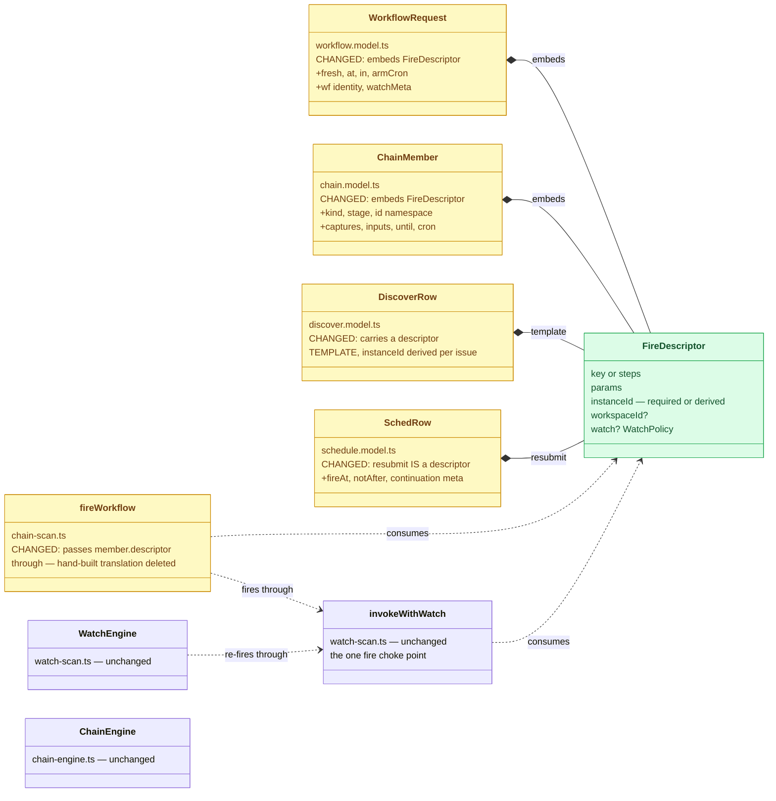
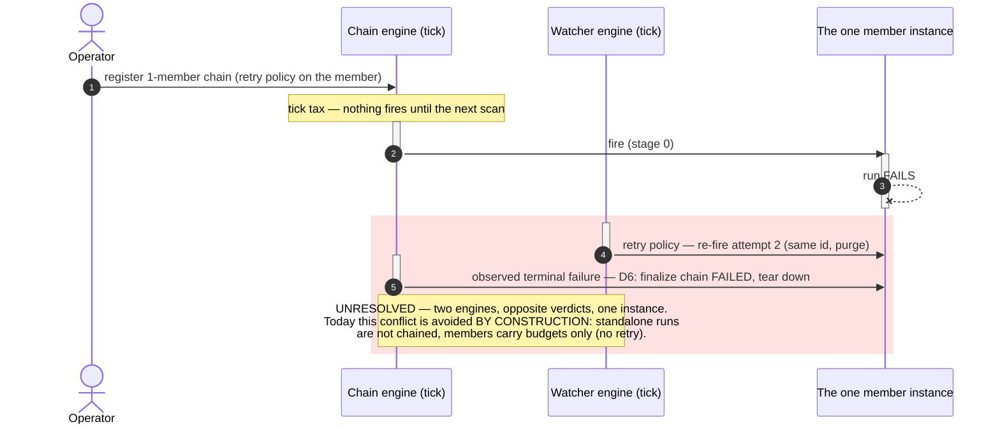

# The fire descriptor — one shape for "fire this workflow", every carrier

Status: Planning — design + change diagrams for review; grew out of the 2026-07-31
consolidation conversation on the per-member-budget review; nothing built
Established: 2026-07-31

## Origin

Reviewing [per-member-budget](./per-member-budget.md) surfaced the carrier table: the same
"fire this workflow, supervised like this" intent is spelled four ways — the run REQUEST
(standalone fires), the chain MEMBER (deferred to stage advance), the DISCOVER row (deferred
to issue arrival), the SCHED resubmit (deferred to a clock). The operator's probe: a single
workflow and a chain member have the same shape — consolidate the request structures.

Two sharpenings from that conversation:

1. **Unify with the MEMBER shape, not the chain request.** No chain registry row for a plain
   run, no tick latency — the consolidation is the DATA PLANE only.
2. **The member shape itself decomposes.** Lining up `WorkflowRequest` and `ChainMember`
   yields a common core plus two DISJOINT decoration sets — so neither "request = member"
   nor "member = request": both EMBED the same core.

## The decomposition

| | Fields | Belongs to |
| --- | --- | --- |
| **The core — a FIRE** | `key \| steps`, `params`, `instanceId` (required-or-derived), `workspaceId?`, `watch?` | every carrier, identically |
| **Sequencing decorations** | `kind`, `stage`, `id` (namespace), `captures` / `inputs` / `until`, `cron` | member only — how a fire threads into a sequence |
| **Fire-time mechanics** | `fresh`, `at` / `in`, `armCron`, wf identity, `watchMeta` | run request only — this particular firing |

Processing dispatches on the properties present: a bare descriptor fires NOW; descriptor +
`at`/`in` arms a `cron:sched` row; descriptor + sequencing decorations is a member the chain
engine fires on stage advance. One shape, three processings.

## What changes (class diagram)

Green = the new core; amber = existing shapes re-expressed over it (and the translation
seams that get deleted); default = untouched. The engines do not change.

## Required-or-derived instanceId

The descriptor makes the id a property of the CORE, so every carrier supplies or derives it:

- Caller-chosen (`--instance-id`) wins, unchanged.
- Otherwise DERIVED, readable: `<key>-<yymmdd>-<hhmmss>` (collision → `-2` suffix at
  registration — the same fail-loud posture as everywhere). Members already derive
  (`<chainId>-wN`); discover already derives per issue.
- Consequence: the WEAK registration form dies — no fire path ever waits for Dapr to mint a
  UUID, so mark-before-fire holds universally, and every run is human-addressable (workspace
  dir, runs ledger, traces, `h workflow status`).

**Decision for review:** the derivation scheme above, or `<key>-<n>` with a persisted
counter (prettier, but a new write per fire), or keep UUID fallback (rejected: it is the
weak form).

## The naming question (vocabulary — operator's call)

The glossary already says **"Triggers are data"**, and the `workflow-trigger` topic's
`{key, params}` payload is the DEGENERATE descriptor. Options:

- **(a) Grow `Trigger`**: "a trigger's payload is the fire descriptor" — stays inside the
  canonical dictionary, no new term; the topic name already matches.
- **(b) Mint `FireDescriptor`** (or `Fire`): sharper (a trigger is the EDGE that fires; the
  descriptor is WHAT it fires), but a new vocabulary entry + glossary/lint updates.

## The rejected consolidation — and why (sequence)

For the record, the control-plane version ("a single workflow is a one-member chain,
processed by the chain engine") was considered and REJECTED. Red = the conflict that kills
it; the tick tax and registry noise are secondary.

Revisit when: standalone runs need captures/threading (the one capability only chains have)
— that is the day the control-plane consolidation earns designing the arbitration.

## Scope and phases

1. **Phase 0 — this review**: naming decision (a/b), id-derivation scheme.
2. **Phase 1 — the shape**: descriptor type in workflow.model.ts (JS) + the Python sibling;
   `WorkflowRequest`/`ChainMember` re-expressed over it (wire-compatible: flattened JSON
   stays identical, so no surface breaks — the consolidation is in the TYPES and the seams,
   not the wire).
3. **Phase 2 — the seams**: chain-scan `fireWorkflow` passes the embedded descriptor through
   (translation deleted); discover/sched carriers re-typed.
4. **Phase 3 — required-or-derived id** + cookbook/docs; the weak registration branch in
   `invokeWithWatch` becomes dead and is removed.

Interaction with [per-member-budget](./per-member-budget.md): its `ChainMember.watch?` field
lands INSIDE the descriptor — build that plan first (it is smaller), then this one absorbs
the field placement.

## Log

- 2026-07-31 — Created from the consolidation conversation on the per-member-budget review;
  the data-plane/control-plane split and the rejected alternative recorded with its conflict
  diagram.
