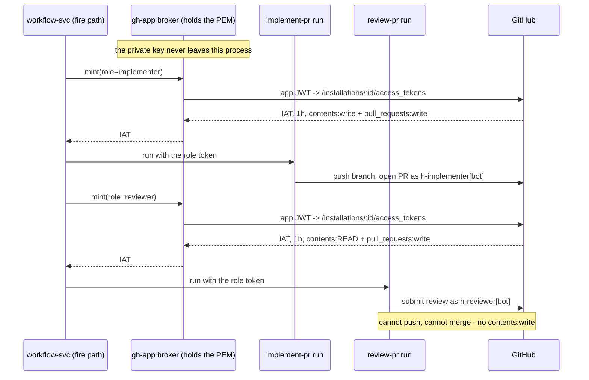

# GitHub App identities: one app per role, tokens minted per run

Status: Deferred — a design captured while discussing the §19 PAT exposure; nothing built, no app registered
Established: 2026-08-12
Revisit when: the next time a GitHub credential must be provisioned or rotated — including the
outstanding §19 rotation in [carried-followups](./carried-followups.md), which is the cheapest
moment to adopt the alternative instead — or when
[reviewer-identity-security](./reviewer-identity-security.md) reaches its minimal-surface-executor
slice, since this is the credential half of that idea.

## The idea

Replace the single maintainer PAT with **two GitHub Apps**, one per role, and mint short-lived
installation tokens per run instead of handing every agent one omnipotent long-lived credential.



## Why two apps, not one

The roles want genuinely different permissions, and one app forces granting the union:

| | implementer | reviewer |
| --- | --- | --- |
| Contents | **write** | **read** |
| Pull requests | write | write (reviews only) |
| Issues | write | read |
| Can push / merge | yes | **structurally no** |

The reviewer is the point: it reads a diff and writes an opinion, and needs no write access to
code at all. That is exactly the "minimal-surface per-run trust profile" CLAUDE.md describes as
what would replace the `review-pr` executor pin — turning a *convention* into a *capability*
boundary. A confused or compromised reviewer cannot push, because it holds no credential that can.

## What it does for h

- **The §19 credential class.** Not just a re-fix — it changes the failure mode. An installation
  token expires in an hour, so the `.git/config` persistence bug that started all this would have
  leaked something dead by lunchtime, instead of a standing exposure needing an operator rotation.
- **§16, branch protection binding nobody.** Protection on `main` is advisory today because h
  pushes with a token holding `admin: true`. An app installation is not a repo admin, so required
  checks would bind the loop while leaving the operator's own bypass intact — the "non-admin token
  for the loop" option, without provisioning a second PAT carrying all the same at-rest problems.
- **§11, the reviewer worktree question.** Does not answer "may the reviewer execute a PR's code",
  but removes its sharpest edge: the reviewer running untrusted code *while holding a push
  credential*.

## Mechanics (confirmed)

- Auth is two-step: a JWT signed with the app's private key (RS256, ≤10 min) is exchanged for an
  **installation access token** scoped to the installed repos, valid **1 hour**.
- Git over HTTPS uses username `x-access-token` with the IAT as the password — the same scheme the
  leaked URL used. h was already speaking App-shaped URLs with a PAT in them.
- PR creation, review submission and review comments all fall under `pull_requests: write`.
- Commit attribution to the bot needs the committer set to
  `<slug>[bot] <app-user-id>+<slug>[bot]@users.noreply.github.com`; otherwise commits carry
  whatever git config says while still being *pushed* by the app.

## The seam it lands on

Better than expected — it already exists. `packages/js/agent-server/src/git-auth.ts` resolves an
auth **kind** off the wire while keeping secrets in the service env:

```ts
resolveGitAuth(kind: "pat" | "ssh" | undefined, env) → GitAuth
```

Adding `"app"` — or better `"app:implementer" | "app:reviewer"` — fits the existing union. And the
role is **already known at fire time**: it is the chain member kind (`implement-pr` / `review-pr` /
`revise-pr`), decided at the same seam the executor-policy gate already occupies. So the change is
role → token, at a place that already branches on role.

## The risk this introduces, and the rule that follows

**The PEM is a bigger secret than the PAT.** It mints tokens for every repo the app is installed
on and never expires. This does not remove credential-at-rest, it RELOCATES it — and a private key
reaching an agent process the way the PAT did would be strictly worse than today.

So the broker is not optional: the key lives in exactly one process (workflow-svc is the natural
host — already the single registry writer and trust anchor), and agents only ever receive
short-lived role-scoped tokens. Any design where an agent can read the PEM is a non-starter.

## Open questions — settle before committing

1. **Does the hosted GitHub MCP accept an installation token?** `api.githubcopilot.com/mcp/` with
   `Bearer ${GH_TOKEN}` is how agents actually interact with PRs. This is the single biggest
   integration risk and is unverified.
2. **`workflows: write` is a separate permission** — without it, any push touching
   `.github/workflows/*` is rejected. The h-builds-h loop edits its own guard surface, so this
   would bite.
3. **1-hour expiry vs long agent runs.** h injects credentials per-operation already, which
   composes well, but a run pushing 70 minutes in needs a re-mint rather than a cached token.
4. **Unverified, and only matters if the reviewer should ever be a merge gate:** whether an app's
   approving review satisfies a required-review rule, and the exact self-approval restriction.
   Moot under today's policy — `review-pr` always submits COMMENT, never APPROVE, because human
   trust gates stay human.

## First slice, when this is revived

Stand up the two apps, put the broker behind the existing `GitAuth` union, and cut over
`implement-pr` ONLY — leaving review on the PAT until open question 1 is answered. That keeps the
risky unknown (MCP compatibility) off the critical path while the credential-lifetime win lands.
