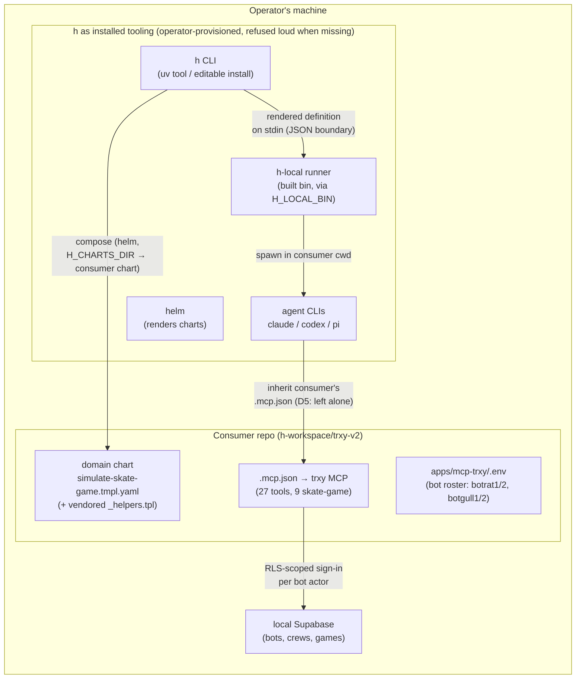

# h packaged — the local substrate + CLI as tooling other repos install

Status: Active — Phases 0+1+1b built 2026-08-13 (POC ran end-to-end; .h/config.toml discovery, charts search path, h doctor, --local boundary; the `h` consumer plugin published from the repo-root marketplace and installed into trxy); Phase 2 (install story) next
Established: 2026-08-12

## The idea

h is consumed today by being h's checkout: every run — even a `--local` one that needs no Dapr,
no services, no containers — starts from h's own repo, resolves its charts from `cli/charts`,
and spawns a runner built inside its own workspace. That was the right first shape. But the
operator now wants to compose **domain-specific agentic workflows in another repo** (trxy), and
that flips the question: what does h look like *packaged* — installed as tooling a consumer repo
uses, the way that repo already installs the nats CLI and `nats-server`?

The logical seed is the **local substrate + the `h` CLI**: `h delegate` and
`h workflow run <template> --local` already run without any service stack, so they are the part
of h a consumer repo could adopt without adopting h's infrastructure. The service substrate
(Dapr, engines, registries) stays out of scope — a consumer that wants durability points at a
running h stack, exactly as today.

Two real use-cases anchor this, both trxy (`h-workspace/trxy-v2`):

1. **Bot-simulation workflows via the trxy MCP** — trxy's MCP can control bot accounts; a
   domain workflow that drives a simulated team game of S.K.A.T.E. end-to-end is the first
   domain workflow, and the POC.
2. **h packages as installable tooling** — "install h" into trxy the way nats is installed:
   operator-provisioned, refused loud by name when missing, never auto-installed.

## Target shape



The load-bearing property (established by the archived
[direct-execution-runtime](impl/direct-execution-runtime.md) plan and re-verified today): the
**JS runner is already repo-agnostic** — every path it touches (`repoPath`, `worktreeRoot`,
`runsDir`, timeouts) arrives on the stdin job; it never reaches back into h's checkout. And D5
(MCP config left alone on the local substrate) means an agent running in the consumer's cwd
inherits the consumer's own `.mcp.json` unmodified — which is precisely the composition the
skate POC needs. All repo coupling lives on the **Python side**, in one file.

## Research findings (2026-08-12)

### 1. The seams already exist; they are just undocumented and defaulted to h's checkout

Every repo-relative path the CLI uses lives in `cli/h/src/h_cli/config.py`, each with an env
override already in place:

| Setting | Default (repo-relative) | Override |
| --- | --- | --- |
| `LOCAL_BIN` | `<repo>/packages/js/local-runtime/dist/bin.js` | `H_LOCAL_BIN` |
| `CHARTS_DIR` | `<repo>/cli/charts` | `H_CHARTS_DIR` |
| `H_WORKSPACE_DIR` | `<repo>/../h-workspace` | `H_WORKSPACE_DIR` |
| `LOCAL_WORKTREES_DIR` | `<repo>/../h-worktrees` | `H_LOCAL_WORKTREES_DIR` |
| `AGENT_RUNS_DIR` | `<repo>/../h-workspace/.runs` | `AGENT_RUNS_DIR` |
| `DOTENV_PATH` | `<repo>/.env` | `H_DOTENV` |
| `EVENTS_STORE_DIR` | `<runs>/../.nats` | `H_EVENTS_STORE` |

None of these appear in `.env.example` or `scripts/check-env-parity.mjs` — they are working
escape hatches nobody has been told about. The `local_runtime.py` refusal even names the
packaging story already: *"Run `bun install && bun run build` at the repo root (its one
prerequisite), or point `H_LOCAL_BIN` at the built bin.js."*
`packages/js/local-runtime/package.json` declares `"bin": {"h-local": "./dist/bin.js"}` —
currently unused by any caller; a latent affordance.

Runtime dependency surface of a `--local` run, in full: `node` (spawns the runner), `git`,
`helm` (composing refuses loud without it), the agent CLIs on PATH (`claude`/`codex`/`pi`/…,
operator-authenticated — the runner deliberately passes no `llmConfig`), and the built
`bin.js`. `bun` is build-time only. `.env` is a soft dependency (missing file → `{}`).
Setup steps are skipped unless `--with-setup`, so h's `skills/` tree is opt-in, not required.

### 2. Templates are the real gap: `H_CHARTS_DIR` is all-or-nothing

A consumer repo *can* point `H_CHARTS_DIR` at its own chart today, but:

- It **replaces** h's 16 templates rather than extending them — no search path, no overlay
  across chart roots. A consumer wanting h's `answer` plus its own `simulate-skate-game` must
  vendor h's chart wholesale or forgo the stock templates.
- The consumer must ship a **full helm chart**: `Chart.yaml`, `values.yaml`,
  `values.schema.json`, and critically `templates/_helpers.tpl` — `h.token`, `h.setupSteps`,
  `h.outputContractEpilogue` are the template-authoring contract and live in no package.
- h's template guards (`scripts/check-templates.mjs`, the syrupy goldens) hard-code
  `cli/charts/workflows/templates` — a consumer chart gets no gate.

Adjacent parked item: [carried-followups](carried-followups.md) §10 (compose-to-disk — authoring
a durable new template *file*) is the closest prior thinking; its trigger ("an AGENT needs to
author a durable new template") has not fired, and this plan does not build it — a consumer
authoring its own chart by hand is the ordinary path. §27 (a stdio MCP for the local substrate)
also stays parked: `h`-on-PATH is the consumer surface here.

### 3. Distribution precedent: operator-provisioned binaries + GitHub-source, not registries

The house rule is already codified twice:

- The event fabric (`events_fabric.py`): *"one binary the OPERATOR provisions (like the agent
  CLIs), spawned as a detached child, refused loud by name when missing — never
  auto-installed."* The nats-server refusal names the install source and stops.
- The ecosystem distributes by **GitHub source**, not registries: the root devDependency
  `@stiproot/code-comprehension` is `github:stiproot/code-comprehension`, and all six Claude
  Code plugin marketplaces in `.claude/settings.json` are `{"source": "github"}` repos.

Nothing in the repo has ever published to npm or PyPI: the JS packages carry bare unscoped
names (`local-runtime`, `agent-cli`, …) with `workspace:*` cross-deps; `h-cli`'s wheel would
ship without `cli/charts` and — the one hard blocker — `config.py` derives `_REPO_DIR` via
`Path(__file__).resolve().parents[3]`, which resolves to site-packages nonsense the moment the
package is installed non-editable. Registry publishing is real work with no current consumer;
the GitHub/operator-provisioned posture matches both the precedent and the actual need.

### 4. Boundary semantics have a gap a packaging design must answer

`managed_roots()` = (`H_WORKSPACE_DIR`, `H_LOCAL_WORKTREES_DIR`, **h's own repo**). Two
findings, both pre-existing:

- `h workflow run --local` never calls `assert_managed` — it takes `repo_root(Path.cwd())`
  unchecked, unlike `h delegate --cwd` and `h events serve --repo`. A hardening item
  independent of packaging, surfaced by it.
- Once h is *installed* rather than cloned, the third managed root (h's checkout) becomes
  meaningless — the design has to say what `managed_roots()` means for an installed h.
  (trxy-v2 itself needs no exception: `h-workspace/trxy-v2` is already inside the boundary.)

### 5. Prior art: the pressure is real and currently answered backwards

No plan proposes packaging or distributing h — this is the first. But the gitignored
`docs/plans/domain/` directory exists precisely because domain work on another repo (the trxy
fun-content arc) had nowhere to live: today the consumer is pulled **into** h (cloned under
`h-workspace/`, planned under h's `docs/plans/domain/`, run from h's checkout) rather than h
being pushed **out** to the consumer. That works — the fun-content arc completed on it — and
Phase 0 deliberately keeps it. What packaging changes is where the *domain artifacts*
(templates, workflow prose, sim runbooks) live: in the consumer repo, versioned with the domain
they encode.

## POC: the skate-game simulation workflow (grounded in trxy-v2 as of 2026-08-12)

trxy-v2 is further along than assumed — the MCP surface is complete and live-validated:

- `apps/mcp-trxy/` exposes **27 tools** over stdio (`bun --hot`), including **nine skate-game
  tools**: create/join/start/get/list, `trxy_submit_skate_video`, `trxy_vote_skate_submission`,
  `trxy_complete_skate_turn`, `trxy_admin_expire_skate_turn`. Every tool takes
  `env: 'local'|'prod'` (never defaulted); prod writes need `confirm: true`.
- **Bots are the actor axis**: six provisioned accounts (`botrat1/2` in crew *Bot Rats*,
  `botgull1/2` in crew *Bot Gulls*, `botsolo`, `trxybot`), driven per-call via the optional
  `actor` param, RLS-scoped real sign-ins (never service-role). Roster comes from
  `apps/mcp-trxy/.env` — **absent in the h-workspace checkout today**, so configuring it is a
  POC prerequisite, alongside local Supabase + `bun run bots:provision` (required again after
  any `db:reset`).
- **The algorithm already exists**: `apps/mcp-trxy/scripts/team-game-mcp.ts`
  (`bun run experiments:team-game-mcp`) plays Bot Rats vs Bot Gulls to completion through one
  MCP session and asserts 15 invariants, deciding every move *only* from what
  `trxy_get_skate_game` returns — by its own comment, the proof that an agent can see enough to
  play. A production team match (game 5167) was played through these tools on 2026-08-12.
- **Simulation needs no media**: omitting `video_url` on submit records a placeholder clip —
  the seam that makes an agent-driven match possible.
- Domain rules the workflow prose must encode: team letters live on `teams[].letterCount`
  (never players — "THE LETTER TRAP"), votes are `yes|re_do` and only the opposing team's
  active players may cast them (they toggle — vote exactly once per bot), submitting freezes
  the electorate, `trxy_admin_expire_skate_turn` is the one admin action a stalled match needs.
- One operational gotcha: an MCP host that caches tool schemas can silently strip arguments it
  hasn't seen (including `actor`). A fresh agent session connects fresh, so the POC is mostly
  immune, but the task prose should name `bun run mcp:call <tool> '<json>'` as the fallback and
  require the agent to report tool-unavailable rather than improvise.

**POC shape** — one domain template in the trxy clone, run on h's machinery with zero h changes:

- `trxy-v2/.h/charts/workflows/templates/simulate-skate-game.tmpl.yaml` — a standalone
  template (vendored `_helpers.tpl` + minimal `Chart.yaml`/`values.yaml`), one agent step whose
  task prose carries the game-driving algorithm (create team game with `crew_names` in rotation
  order → join all bots → start → loop: read view, branch on `turnTypeId`, submit placeholder,
  opposing bots vote, complete turn → report winner), params for `crews`/`env` (pinned `local`
  for the POC — prod writes land real rows on the live board), and an `outputs:` contract
  capturing `{gameId, winnerTeam, turns, letters}`.
- Fired as `H_CHARTS_DIR=<trxy>/.h/charts uv run h workflow run simulate-skate-game --local`
  with cwd inside the trxy clone (no worktree needed — the run mutates Supabase state, not the
  repo), so the agent inherits trxy's `.mcp.json` via D5.
- Success = a completed game verifiable via `trxy_get_skate_game` + the structured output
  block, i.e. the agentic sibling of `experiments:team-game-mcp`'s 15 checks.

## Recommendation

**Package h the way h packages nats: as operator-provisioned tooling, distributed as source
from GitHub — not as registry artifacts.** Concretely, "installing h" for a consumer repo
means: one h clone on the machine, built once (`bun install && bun run build`), the `h` CLI on
PATH (uv editable install today; `uv tool install` from git once the wheel is fixed), and the
consumer repo carrying only its **own domain chart + a few `H_*` env lines**. h's CLI refuses
loud by name when a piece is missing — exactly the nats posture, and exactly what the existing
refusal messages already say. Registry publishing (scoped npm names, PyPI) is deliberately
deferred: it demands name scoping, `workspace:*` resolution, and release machinery, for no
consumer the GitHub posture doesn't already serve.

Rejected alternatives:

- **npm + PyPI publishing now** — the wheel/`_REPO_DIR` blockers are fixable, but the unscoped
  JS names and absent release machinery make this the expensive path, and no current consumer
  needs artifacts a git clone doesn't provide. Deferred, not dropped (Phase 3).
- **Vendoring h into the consumer repo** (the `local-ci-execution` copy-the-pattern precedent)
  — right for a 200-line CI runner, wrong for a runtime with a JSON wire contract that will
  keep evolving; a copy rots the day it lands.
- **A consumer-facing MCP server instead of the CLI** — carried-followups §27, trigger unfired;
  Bash-shaped `h …` invocation is the working surface.

## Phases

### Phase 0 — the POC, on today's seams (no h changes) — COMPLETE 2026-08-13

Proven end-to-end, exactly as scoped and with **zero h changes**: the trxy clone provisioned
(local-only env keys copied from the operator's checkout — NOT re-provisioned, see finding 4),
`simulate-skate-game` authored in the clone's `.h/charts/workflows/` (branch
`local/h-packaged-poc`), fired as

```sh
cd <trxy clone> && H_CHARTS_DIR=<trxy>/.h/charts \
  uv run --project <h repo> h workflow run simulate-skate-game --local --instance-id skate-sim-poc-1
```

**Result: a complete 9-round, 18-turn team game of S.K.A.T.E. (game 50, local env) — Bot Rats
won, Bot Gulls spelled SKATE.** Output contract validated; run ledger under
`.runs/skate-sim-poc-1` (94 MCP tool calls, 95 agent turns, $2.79, claude-sonnet-4-6). The
agent decided every move from `trxy_get_skate_game`, exercised both vote paths, and used
`trxy_admin_expire_skate_turn` only where the mechanics forced it (see trxy findings).

**h-side findings → the Phase 1 backlog:**

1. **`H_CHARTS_DIR` all-or-nothing confirmed live** — with it set, `h template list` shows one
   template; h's 16 stock templates vanish. The overlay/search-path item is real.
2. **The minimal vendored helper set is tiny**: `h.token` + `h.outputContractEpilogue` (~30
   lines). Vendoring is cheap; the cost is silent drift from h's copy — a starter-chart or a
   drift check is the fix, not avoiding vendoring.
3. **Invocation is the clunkiest seam**: `H_CHARTS_DIR=… uv run --project <h repo> h …` from
   the consumer cwd. What a consumer wants is `h` on PATH plus per-repo config discovered from
   cwd (e.g. `.h/config`) supplying `H_CHARTS_DIR` et al. — firms up Phase 1 (config
   discovery) and Phase 2 (install).
4. **Shared-local-stack hazard (consumer-side ops)**: two checkouts of the same repo share one
   local Supabase (same `project_id` → same containers), and `bots:provision` generates its
   password per-checkout — re-running it from a second checkout rotates the shared bots'
   passwords and silently breaks the first. The POC copied credentials instead. A packaged h
   runbook must name this class of hazard: provisioning scripts that assume one checkout.
5. `--instance-id`, the run ledger, and contract validation all worked unchanged from the
   consumer repo — the observability story transfers for free.

**trxy-side findings (surfaced by the simulation — for trxy issues, not h work):**

1. A `re_do`-voted failed ATTEMPT turn stays active (`completedAt` null);
   `trxy_complete_skate_turn` won't advance past it while the deadline is future —
   `trxy_admin_expire_skate_turn` + a second complete was needed for every failure (5×). A
   simulated match shouldn't need admin tooling for its normal loop.
2. Re-submitting on a `re_do`-voted SET turn with `video_url` omitted violates the
   `tb_skate_videos_file_path_key` unique constraint — the placeholder path derives from
   game+turn only. Fix: derive per-submission (or the workaround: distinct `video_url`).
3. `winnerUsername` is null on a completed team game even though `winnerTeamId` is set —
   winner must be resolved via the teams array.
4. Still no roster-listing tool (the bogus-actor error remains the workaround).

### Phase 1 — harden the seams the POC leaned on — BUILT 2026-08-13 (core set)

Landed in one change set (all guards green: `make lint`, 457 CLI tests, goldens untouched):

- **Per-repo config discovery** — `<repo>/.h/config.toml`, discovered by walking up from cwd
  (git-style); precedence env var > config file > h-checkout default; keys
  `charts_dir`/`local_bin`/`workspace_dir`/`worktrees_dir`/`runs_dir`/`dotenv`/`events_store`;
  unknown keys and non-string values fail loud. Relative paths resolve against the repo
  carrying the file. Validated live: trxy's `.h/config.toml` (`charts_dir = ".h/charts"`)
  makes `h template list|get` and `--local` runs work from anywhere in the clone with no
  exported env.
- **Charts search path** — `charts_roots()` = configured primary, stock fallback;
  `chart_root_for()` resolves the owning chart per template; name collisions resolve to the
  primary (shadowing). All seven probe sites (template role/list/drift, workflow ×2, chain
  ×2) and helm's render migrated. Validated live: 16 templates listed from the trxy clone —
  `simulate-skate-game` beside the 15 stock ones, with a `chart` column showing ownership.
- **`h doctor`** — one-screen toolchain report (required binaries, agent CLIs, optional
  pieces incl. nats-server, the built runner, both chart roots, discovered consumer config).
  A report, never a gate; point-of-use refusals unchanged.
- **Boundary closed** — `h workflow run --local` now calls `assert_managed` on the invoking
  checkout like `delegate --cwd`/`events serve --repo`, with `--allow-external` (refused
  without `--local`). Validated live: refusal fires from an unmanaged scratch checkout.
- **Docs** — cli/README "consumer surface" section (config file, env pairs, search path,
  doctor, vendored-helper set); CLAUDE.md CLI line extended (check-steering enforces the
  pairing).

Still open in Phase 1:

- **`managed_roots()` for an INSTALLED h** (no checkout ⇒ the third root is wrong) and
  fail-loud `config.py` resolution when `_REPO_DIR` is not an h checkout — both deferred
  into Phase 2, whose install story is what makes them real.
- A **drift check for vendored helpers** (a consumer's `_helpers.tpl` vs h's) — parked until
  a second consumer chart exists; one copy drifting is caught by its own render breaking.

### Phase 1b — the consumer steering surface (the `h` plugin) — BUILT 2026-08-13

Phase 1 made the mechanics work from a consumer repo; this phase made the consumer's AGENTS
know they exist. The gap it closed: trxy consumed h through two artifacts (`.h/config.toml` +
the domain chart) and one operator's memory — nothing in trxy said what h is, when to reach
for it, or how to author a template. Steering context is part of what "h installed in a repo"
means, and it ships the way this ecosystem ships steering: a Claude Code plugin.

- **h is now its own plugin marketplace** — repo-root `.claude-plugin/marketplace.json` + the
  Codex sibling `.agents/plugins/marketplace.json`, publishing one plugin: **`h`**
  (`plugins/h/`), following the ecosystem standard (code-comprehension's layout + validate
  checks). Two skills, consumer-facing and deliberately env-agnostic:
  - `use-h` — what h is from a consumer's seat; the consumer contract (config discovery,
    chart search path, doctor); running (`h workflow run --local`, `h delegate`, panels,
    chains); what `--local` refuses and why; ledger/cost; safety. Reference:
    `references/cli-reference.md` (config-key/env table, command surface, event fabric).
  - `author-h-template` — the consumer-side authoring recipe (vendored helpers, gate, role,
    params-as-contract, output contract in its three places, safety posture in the template,
    verify-without-goldens). Reference: `references/starter-chart.md`, the canonical
    vendoring source — which also answers the open question below: consumer charts stay
    unguarded by h's repo-side gates; the render is the check, and the starter chart is the
    drift anchor.
- **Guarded**: `scripts/check-plugins.mjs` in `bun run lint` (mirrors the ecosystem's
  validate.sh — marketplace/manifest coherence, dir=name=entry, semver, Claude↔Codex version
  parity, `.skills` → `./skills/`, skill frontmatter exactly name+description, executable
  bundled scripts).
- **Installed into trxy** (the rebased `local/h-packaged-poc` branch): `h-marketplace`
  (`github: stiproot/h`) + `h@h-marketplace` in `.claude/settings.json`, plus a CLAUDE.md
  "h — agentic workflow tooling" section (consumer posture, `.h/` contract, run surface,
  plugin skills as the how-to home, the shared-local-Supabase hazard from Phase 0 finding 4)
  and a pointer in its "Where knowledge lives" skill roster.
- **Docs**: CLAUDE.md (h skills section — the marketplace-in-the-other-direction paragraph),
  cli/README consumer surface (install-the-plugin paragraph).

### Phase 2 — the install story

`uv tool install` of `h-cli` from GitHub actually works (wheel contents, path resolution, a
consumer-facing "installing h" runbook written in nats-install terms); `h-local` reachable via
its declared bin name; version handshake across the CLI ↔ runner JSON boundary once the two
can be installed at different times.

### Phase 3 — registry publishing (deferred)

Scoped npm names (`@stiproot/*`), PyPI `h-cli`, release machinery. Revisit when: a consumer
appears that cannot work from a git clone (a second operator, CI in a repo h doesn't own, or a
plugin-marketplace distribution of template packs).

## Open questions

- **Overlay vs replace for `H_CHARTS_DIR`** — search path, chart merge, or starter-chart
  vendoring? Phase 0 decides with evidence.
- **Where consumer domain plans live** — trxy has its own `docs/plans/`; h has gitignored
  `docs/plans/domain/`. Once templates live in the consumer repo, its plans likely should too,
  and h's `domain/` reverts to h-side scratch. Decide when the POC plan needs a home.
- **Guards for consumer charts** — `check-templates`/goldens don't reach a consumer chart. Ship
  a checkable contract (values.schema.json + a tiny validator) or accept unguarded consumer
  templates? *(Phase 1b's answer, for now: accepted unguarded — the `author-h-template` skill
  names the render as the check and the starter-chart reference is the vendoring/drift anchor.
  Revisit when a consumer chart breaks in a way a render wouldn't have caught.)*
- **The trxy MCP roster gap** — no tool lists available bot actors (the workaround is a
  deliberate bogus-actor error). Worth a trxy-side issue before the POC hard-codes names.
- **Sim environment posture** — POC pins `env=local`. What would ever justify a prod
  simulation (real rows, real board), and what gate would it require beyond `confirm: true`?

## Log

- **2026-08-12** — plan established from scheduled research: trxy-v2 MCP surface mapped (27
  tools, 9 skate, bots + reference simulation all in place), h local-substrate coupling audited
  (JS runner repo-agnostic; all coupling in `config.py` behind existing-but-undocumented env
  overrides; charts all-or-nothing; GitHub-source + operator-provisioned as the distribution
  precedent). POC scoped, phases drafted, nothing built.
- **2026-08-13** — Phase 0 executed and COMPLETE: consumer chart authored in the trxy clone
  (`.h/charts/workflows/`, branch `local/h-packaged-poc`, commit 766c88ba), full simulated
  team S.K.A.T.E. match driven through the trxy MCP on the local substrate ($2.79, 18 game
  turns, contract validated). Five h-side findings recorded into Phase 1; four trxy-side
  findings queued for trxy issues. Operator confirmed direction and clarified the model:
  NATS stays the event fabric only (optional, `h events`); a doctor-style presence check
  added to Phase 1.
- **2026-08-13 (later)** — Phase 1 core built and validated live from the trxy clone (see the
  phase section): config discovery, charts search path, `h doctor`, the `--local` boundary,
  docs. The consumer UX is now `cd <trxy clone> && h workflow run simulate-skate-game
  --local` with zero exported env. Installed-h boundary semantics + config fail-loud deferred
  to Phase 2; vendored-helper drift check parked pending a second consumer.
- **2026-08-13 (later still)** — Phase 1b: the consumer steering surface. trxy-v2 clone
  consolidated (main fast-forwarded, `local/h-packaged-poc` rebased onto it). h made its own
  plugin marketplace publishing the `h` plugin (`plugins/h/`: skills `use-h` +
  `author-h-template` with cli-reference and starter-chart references), guarded by
  `scripts/check-plugins.mjs` in lint; installed into trxy (`h@h-marketplace` in settings +
  a CLAUDE.md "h — agentic workflow tooling" section). The consumer-charts open question
  answered for now: unguarded, render-is-the-check, starter chart as the drift anchor.
