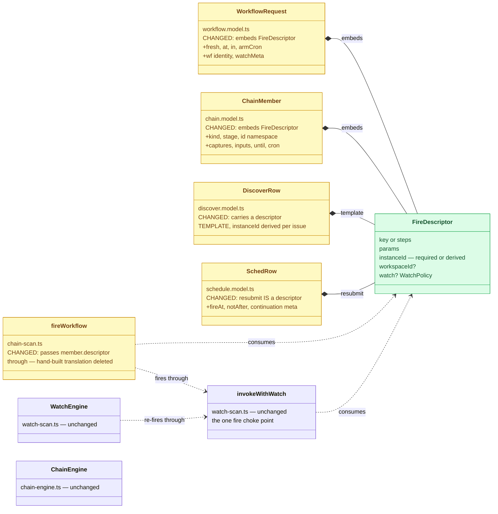
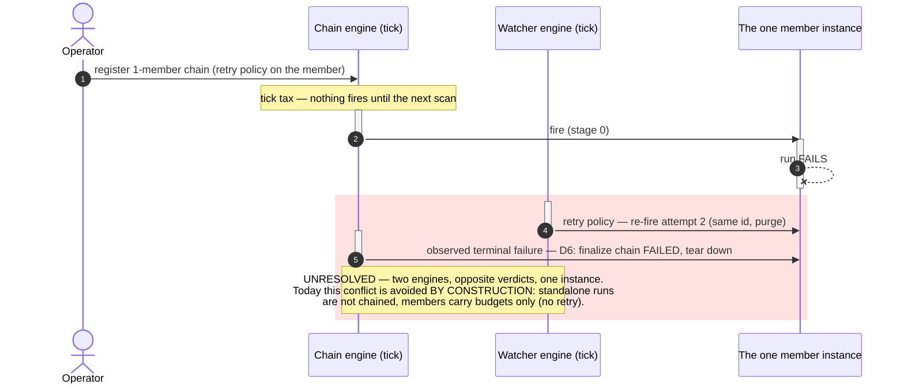

# The fire descriptor — one shape for "fire this workflow", every carrier

Status: Complete — built 2026-07-31, all phases; the descriptor is `Trigger`
(workflow.model.ts), embedded by `WorkflowRequest`/`ChainMember`, projected by the
discover/sched rows; every fire id is caller-chosen or derived readable; the weak
registration form is deleted. Wire and persisted shapes unchanged; 390 workflow-svc tests
green. (Build order swapped with per-member-budget by operator instruction — see Log.)
Established: 2026-07-31
Lifted to: [ARCHITECTURE.md](../../../ARCHITECTURE.md) — the grown Trigger primitives entry +
the glossary's "Fire descriptor / trigger payload" entry; [CLAUDE.md](../../../CLAUDE.md) —
the Trigger index bullet; code comments at `Trigger`/`deriveInstanceId`
(workflow.model.ts), `invokeWithWatch` (watch-scan.ts), and `ChainMember` (chain.model.ts)

## Origin

Reviewing [per-member-budget](../per-member-budget.md) surfaced the carrier table: the same
"fire this workflow, supervised like this" intent is spelled four ways — the run REQUEST
(standalone fires), the chain MEMBER (deferred to stage advance), the DISCOVER row (deferred
to issue arrival), the SCHED resubmit (deferred to a clock). The operator's probe: a single
workflow and a chain member have the same shape — consolidate the request structures.

Two sharpenings from that conversation:

1. **Unify with the MEMBER shape, not the chain request.** No chain registry row for a plain
   run, no tick latency — the consolidation is the DATA PLANE only.
2. **The member shape itself decomposes.** Lining up `WorkflowRequest` and `ChainMember`
   yields a common core plus two DISJOINT decoration sets — so neither "request = member"
   nor "member = request": both EMBED the same core.

## The decomposition

| | Fields | Belongs to |
| --- | --- | --- |
| **The core — a FIRE** | `key \| steps`, `params`, `instanceId` (required-or-derived), `workspaceId?`, `watch?` | every carrier, identically |
| **Sequencing decorations** | `kind`, `stage`, `id` (namespace), `captures` / `inputs` / `until`, `cron` | member only — how a fire threads into a sequence |
| **Fire-time mechanics** | `fresh`, `at` / `in`, `armCron`, wf identity, `watchMeta` | run request only — this particular firing |

Processing dispatches on the properties present: a bare descriptor fires NOW; descriptor +
`at`/`in` arms a `cron:sched` row; descriptor + sequencing decorations is a member the chain
engine fires on stage advance. One shape, three processings.

## What changes (class diagram)

Green = the new core; amber = existing shapes re-expressed over it (and the translation
seams that get deleted); default = untouched. The engines do not change.

## Required-or-derived instanceId

The descriptor makes the id a property of the CORE, so every carrier supplies or derives it:

- Caller-chosen (`--instance-id`) wins, unchanged.
- Otherwise DERIVED, readable: `<key>-<yymmdd>-<hhmmss>` (collision → `-2` suffix at
  registration — the same fail-loud posture as everywhere). Members already derive
  (`<chainId>-wN`); discover already derives per issue.
- Consequence: the WEAK registration form dies — no fire path ever waits for Dapr to mint a
  UUID, so mark-before-fire holds universally, and every run is human-addressable (workspace
  dir, runs ledger, traces, `h workflow status`).

**DECIDED 2026-07-31:** the scheme above — `<key>-<yymmdd>-<hhmmss>`, collision → loud
`-2` suffix, zero new state. Rejected: a persisted counter (a write per fire), and the UUID
fallback (it IS the weak registration form this kills).

## Naming — DECIDED 2026-07-31: grow `Trigger` (option a)

The glossary already says **"Triggers are data"**, and the `workflow-trigger` topic's
`{key, params}` payload is the DEGENERATE descriptor. Decision: no new vocabulary term —
the `Trigger` entry grows to "a trigger's PAYLOAD is the fire descriptor: {key|steps,
params, instanceId, workspaceId?, watch?}"; the type is named `Trigger` (or
`TriggerPayload` if the collision with the edge concept reads badly in code — settle at
Phase 1 with the glossary edit in the same change). Rejected: minting `FireDescriptor`
(sharper but a new dictionary entry; the vocabulary discipline favors deepening existing
terms over minting siblings).

## The rejected consolidation — and why (sequence)

For the record, the control-plane version ("a single workflow is a one-member chain,
processed by the chain engine") was considered and REJECTED. Red = the conflict that kills
it; the tick tax and registry noise are secondary.

Revisit when: standalone runs need captures/threading (the one capability only chains have)
— that is the day the control-plane consolidation earns designing the arbitration.

## Scope and phases

1. **Phase 0 — DONE 2026-07-31**: naming (grow Trigger) and id scheme (key-date-time +
   loud collision suffix) decided by the operator; both suggestions accepted as proposed.
2. **Phase 1 — the shape — DONE 2026-07-31**: `TriggerFields`/`Trigger` in
   workflow.model.ts; `WorkflowRequest`/`ChainMember` re-expressed over the spread
   (wire-compatible: flattened JSON stays identical — the consolidation is in the TYPES and
   the seams, not the wire). Siblings: js/agent-server's `WorkflowSubmit extends Trigger`,
   py/agent-server's `WorkflowSubmit(Trigger)`. Glossary + CLAUDE.md index grown in the
   same change.
3. **Phase 2 — the seams — DONE 2026-07-31**: chain-scan `fireWorkflow` passes the member's
   embedded descriptor through `invokeWithWatch` (the diagram's "fires through" edge — the
   hand-built field remapping is gone, and `member.watch`/`member.workspaceId` are live);
   discover/sched re-typed via PROJECTIONS (`discoverTrigger`, `schedTrigger`) — see Log.
4. **Phase 3 — required-or-derived id — DONE 2026-07-31**: `deriveInstanceId` (pure) +
   the collision-checking derivation in `invokeWithWatch`; the weak invoke-then-register
   branch deleted; run/:key, trigger events, and the saved-schedule tick pass `key` as the
   derivation base. Docs done in ARCHITECTURE/CLAUDE (cookbook untouched — no command
   changes; the visible delta is readable default instance ids on standalone fires).

Interaction with [per-member-budget](../per-member-budget.md): its `ChainMember.watch?` field
landed INSIDE the descriptor here (the build order was reversed by the operator), which
also delivered that plan's SERVER half — the member carries the policy, and the chain's
fire path registers it mark-before-fire at stage advance. Only its CLI mapping remains.

## Log

- 2026-07-31 — Created from the consolidation conversation on the per-member-budget review;
  the data-plane/control-plane split and the rejected alternative recorded with its conflict
  diagram.
- 2026-07-31 — Build order REVERSED by operator instruction ("implement fire-descriptor
  ourselves"): this plan built first. Coherent because the descriptor core CONTAINS `watch?`
  — embedding it in `ChainMember` and routing `fireWorkflow` through `invokeWithWatch`
  delivers per-member-budget's server half as a consequence; the field-placement question
  the old ordering existed to settle simply dissolved.
- 2026-07-31 — Naming settled at Phase 1: plain `Trigger` (no `TriggerPayload` needed — the
  only in-code neighbor is trigger.router's `TriggerEvent`, now documented as the
  DEGENERATE descriptor `{key, params}`).
- 2026-07-31 — Discover/sched "re-typed" decision: PROJECTIONS, not persisted-field
  renames. The wire-compatibility principle extends to REGISTRY rows — renaming
  `DiscoverRow.workflow→key` / restructuring `SchedRow.source` would orphan every live row
  in Redis. So the row types keep their persisted names and gain a pure projection to the
  descriptor (`discoverTrigger(row, issue)`, `schedTrigger(row)`), which the scans consume;
  the hand-built request construction in `fireDiscovered`/`fireSched` is what got deleted.
- 2026-07-31 — Derivation lives in the choke point: `WorkflowRequest` carries the
  descriptor's `key` as inert provenance (stripped before the invoke, never workflow
  input); `invokeWithWatch` derives `<key ?? wf.workflow ?? "run">-<yymmdd>-<hhmmss>` and
  probes `getStatus` for a free slot (UNKNOWN = free — the port's legacy missing-instance
  fallback earns its keep), suffixing `-2`…`-9` then failing loud. Every registration is
  now mark-before-fire.
- 2026-07-31 — Deliberately NOT converged in this pass: the watcher's `executeRetry`/
  `executeEscalate` and the recur cron's `fireCron` keep their direct `invoker.invoke`
  calls — retry manages its own row incarnation (epoch-fenced re-fire of the SAME id), and
  each already holds a concrete id, so no weak form survives there either. Converging them
  on the choke point is possible later hygiene, not required by this plan.
- 2026-07-31 — Validated: full JS lint + build + tests green (workflow-svc 390, incl. new
  coverage for `Trigger`, `deriveInstanceId`, choke-point derivation/collision/strip,
  per-member watch registration at stage fire, both projections); py agent-server 22 green.
  Live e2e note for the next stack session: standalone fires without `--instance-id` now
  land under readable derived ids everywhere (workspace dirs, run ledger, watch rows).
