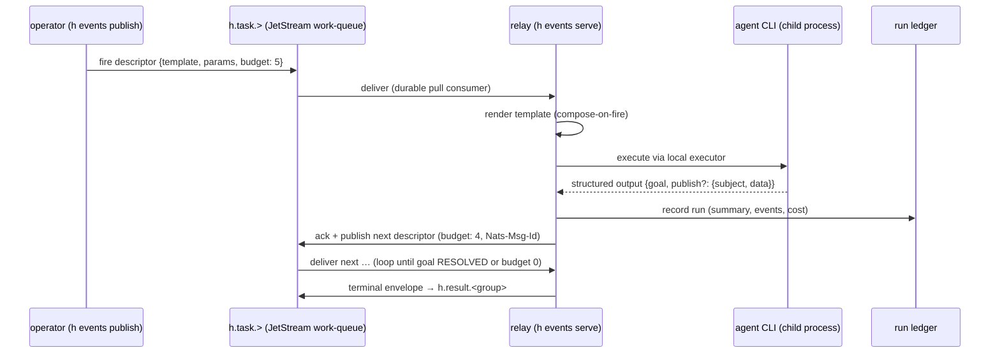

# NATS as the local substrate's event fabric

Status: Complete — the POC met all three exit criteria live (2026-08-06), every open question
has since been answered, and the follow-on increments were either absorbed by
[local-engine-parity](local-engine-parity.md), superseded by something better, or carried
out. Validated and closed 2026-08-26; see *Validation 2026-08-26* below.
Lifted to: CLAUDE.md's *Execution substrates* section owns the durable description — the three
streams (`h-tasks`/`h-results`/`h-journal`), the fire descriptor, the relay as a TRIGGER HOST
rather than an engine, the `publish:` loop edge and its `Nats-Msg-Id` dedup, the workspace pinning
rule, and the back-edge's ephemeral-vs-durable split; `cli/README.md` carries the command surface,
[docs/cookbook.md](../../cookbook.md) the stamped loop commands, and the `delegate-locally` skill the
when-to-use judgement. Open items carried to [carried-followups](../carried-followups.md) §36.
Established: 2026-08-06

## The idea

h composes work one way and executes it two. The service substrate has an event fabric — Dapr
pub/sub, the `workflow-trigger` topic, triggers-as-data — and everything interesting about the
fleet (chains, crons, the watcher, loose edges like `cron-disarm`) is built on durable events and
durable state. The local substrate has none: `h delegate` / `--local` is strictly one-shot —
compose, execute in-process, exit. Nothing can *fire* a local job except the operator's keyboard,
and nothing survives the process.

NATS (one ~20MB Go binary, `nats-server -js`, no containers, no cluster) can be to the local
substrate what Dapr pub/sub + Redis are to the service substrate: a local, durable event fabric
that local jobs can be fired FROM and publish INTO — opening event-driven loops where an agent
fulfils a task, publishes a result event, and that event fires the next agent. And because NATS
topologies extend (leaf nodes) and Dapr itself speaks JetStream (`pubsub.jetstream`, a supported
component), the same fabric scales up to the fleet without changing a single subject.

## Research: what NATS offers, mapped to h

| NATS piece | What it is | h mapping |
| --- | --- | --- |
| Core pub/sub | Subjects (`h.task.review`), wildcards, fire-and-forget, at-most-once | The `pubsub_publish` idiom, locally |
| Request-reply | Built-in inbox pattern; no subscriber ⇒ timeout, loud | Synchronous "ask an agent service" seam |
| Queue groups | N subscribers share a subject, one receives | Roster load-balancing without a scheduler |
| **JetStream streams** | Server-side persistence over subjects; storage/retention/replication configurable | Durable topics — the property local execution lacks entirely |
| **Pull consumers** | Durable, stateful cursors; explicit ack, ack-wait + in-progress extension, bounded redelivery (`MaxDeliver`), dead-letter advisories | The relay's work loop: a task event survives process death and is redelivered |
| Work-queue retention | Message deleted on ack; disjoint consumers | Exactly-one-execution task queues |
| `Nats-Msg-Id` dedup | Stream rejects duplicate ids inside a window | Idempotent publishes — mark-before-fire's sibling |
| **KV store** | JetStream-backed key/value with revisions and **watch** | A local registry surface (chain data, `wf:`-like rows) with push-based watch instead of a poll tick |
| Object store | Chunked large blobs over streams | Run artifacts (diffs, reports) if ever needed |
| Services framework (`micro`) | Register request-reply endpoints; free discovery/stats via `$SRV.PING/INFO/STATS` | Agent hosts as discoverable services — a stats surface with zero code |
| Per-message TTL (2.11) | Individual message expiry | Scheduled/expiring work items |
| Atomic batch publish (2.12) / fast batch (2.14) | N messages land atomically | Multi-event transitions (result + next-task as one commit) |
| **Leaf nodes** | A local server joins a remote cluster outbound-only; traffic stays local unless remote interest exists | The scale-up rung: laptop fabric ⇄ fleet fabric, same subjects |
| Synadia NGS | Managed global NATS | Optional far rung; not needed |

Client story: `nats.js` v3 (`@nats-io/transport-node` + `@nats-io/nats-core`, `@nats-io/jetstream`,
`@nats-io/kv`) explicitly supports Node **and Bun**. Fits the workspace as ordinary deps of a JS
package.

Dapr story: `pubsub.jetstream` is a supported Dapr pub/sub component (NATS Streaming is the
deprecated one; JetStream is its successor). So the fleet's Redis pub/sub could one day be swapped
for the same NATS the local substrate uses — one fabric, two substrates — without touching any
publisher/subscriber code.

## Design sketch

Three pieces, all local-substrate-native (no Dapr, no services, binary child processes only):

1. **The fabric** — `nats-server -js` run locally as a supervised child (`h events up|down|status`).
   Refuses loud if the binary is not installed (same posture as the agent CLIs: the operator
   provisions it — `brew install nats-server` / release binary). JetStream store dir lives beside
   the run ledger so a reset is one directory.
2. **The relay** — `h events serve`: a long-running local process holding a durable pull consumer
   on `h.task.>`. Each message is a **fire descriptor, the trigger payload made local**:
   `{template, params, agent?, model?, group, budget}`. The relay composes on fire (renders the
   template exactly as `--local` does today) and executes it through the existing local executor
   (`workflow-core` semantics, run ledger, output contract — nothing forked). It acks only after
   the run ledger records the outcome; a crash mid-run means redelivery, which is the point.
3. **The loop edge** — a template's structured output may carry a `publish` field
   (`{subject, data}`) beside `goal:`. The relay — not the agent — publishes it, after stamping
   the decremented step budget and the `Nats-Msg-Id`. An agent hands work to the next agent by
   *returning data*, staying substrate-agnostic exactly like chained workflows do; the machinery
   edge does the publishing, mirroring how the chain engine (not the member) fires the next stage.



### Invariants that carry over unchanged

- **A workflow never supervises, sequences, or recurs itself.** The relay is a *trigger host* —
  it fires jobs and forwards their declared publishes. It is NOT an engine: no retry policy
  judgment, no recurrence, no stage sequencing in the POC. If those grow here later, they grow as
  engine siblings reading durable state (KV watch instead of the cron tick), not as workflow
  smarts.
- **Triggers are data.** The message payload is the same fire-descriptor idea as
  `workflow-trigger` events — `{key|template, params, …}` — so a descriptor composed locally is
  meaningful to the fleet and vice versa. That is what makes the leaf-node rung real.
- **Budgets are mandatory.** An event loop is self-amplifying and delegates run as the operator
  (see the `delegate-locally` skill's safety rules). Every seed REQUIRES a step budget
  (`--max-steps`); the relay refuses to forward a publish once it hits zero and emits an
  `exhausted` terminal envelope instead — the loop-until-clean posture. A cost ceiling
  (sum of ledger `costUsd` per group) is the natural second fence.
- **Engine flags stay refused on `--local`.** Nothing here relaxes local-substrate refusals;
  `h events` is a new surface beside them, not a loosening.

### Proposed CLI surface (preview — not yet built)

```
h events up [--port 4222] [--store DIR]   # start local nats-server -js, idempotent, supervised
h events down | status                    # stop / inspect (server + stream + consumer state)
h events serve [--queue default]          # the relay: consume → compose-on-fire → execute → forward
h events publish --template answer -p task=@q.md --agent claude --max-steps 5 [--group NAME]
h events tail [SUBJECT]                   # watch h.result.> / h.task.> live (observability)
```

Implementation shape: a new package `packages/js/local-events/` (deps: `@nats-io/transport-node`,
`@nats-io/jetstream`; imports `local-runtime`'s executor + ports — the relay drives the SAME
executor, it never grows its own), plus `commands/events.py` + an infrastructure client in the CLI
mirroring `local_runtime.py`. Runs write the standard run ledger, so `h runs`/obs read loop runs beside
everything else; the group key is the loop's join key.

## POC scope (the basic event-driven loop)

Goal: prove the loop end-to-end, cheap and observable.

1. `h events up` brings up the fabric; `h events serve` arms the relay.
2. `h events publish` seeds a descriptor: agent A answers a task and its output contract carries
   `publish` naming the next task for agent B; B likewise; terminate on `goal: RESOLVED` or
   `--max-steps`.
3. Exit criteria:
   - ≥3 hand-offs across ≥2 different agent CLIs, all visible in `h runs` under one group.
   - Terminal envelope lands on `h.result.<group>`; `h events tail` shows the whole loop.
   - **Durability demo:** kill the relay mid-loop, restart it, and watch the in-flight task
     redeliver and the loop complete — the property that motivates JetStream over an in-process
     queue.
   - Budget demo: a seed with `--max-steps 2` stops with an `exhausted` envelope.

Non-goals for the POC (recorded so they aren't silently implied): KV-backed registries, chain
sequencing over events, leaf-node bridging, Dapr `pubsub.jetstream` swap, request-reply agent
services, the `micro` stats surface. Each is a candidate follow-on with its own preview.

## Open questions

- **Naming.** `h events` vs `h relay` vs folding under `h delegate`; and the h-glossary term for
  the relay (trigger host?) needs a canonical entry when this graduates beyond POC.
- **Server lifecycle.** Should `h events publish` auto-start the fabric (compose-on-demand) or
  refuse loud when it's down (explicit `up` first)? Leaning refuse-loud — symmetric with how
  `--local` refuses missing prerequisites by name.
- **Descriptor schema.** Exact shape + where it lives (`workflow-core`? `local-events`?) so a
  future fleet consumer of the same subjects reads one schema. Leaning: schema in
  `workflow-core`'s sibling position, guarded like the parity seam.
- **Ack timing for long agent runs.** Explicit-ack with `AckWait` + periodic in-progress extension
  while the CLI runs, vs. short AckWait + ack-on-receipt (losing redelivery). POC: in-progress
  extension; measure how it behaves on a 10-minute run.
- **Cost fence mechanics.** Per-group cost ceiling summed from run-ledger mirrors, checked by the
  relay before each forward — cheap and local, but only as accurate as ledger cost capture.


## Validation 2026-08-26 (pick-up pass, per `plan-management` step 2)

**1. Are the CLAIMS still true? Yes, and the plan under-claims its own delivery.**

All three POC exit criteria are stamped in the log with real group ids (`loop-260806-231849`,
`durab-260806`, `budget-260806`). The fabric has since grown a THIRD stream this doc never
mentions — `h-journal`, the run journal — and an engine host beside the relay, both landed by
local-engine-parity. Everything this plan proposed exists.

**2. Is the GOAL still wanted? It is DELIVERED — which is the version of "still wanted" that
closes a plan.** Every open question has an answer, and every listed next increment has a
disposition:

| Open question (§*Open questions*) | Answer |
| --- | --- |
| Naming: `h events` vs `h relay`; glossary term for the relay | `h events` won; the relay is documented as a **trigger host, NOT an engine** — it supervises, recurs and sequences nothing |
| Server lifecycle: auto-start vs refuse-loud | Both, correctly split: the journal preflight auto-ensures the fabric (idempotent `h events up` spawn), while the missing nats-server BINARY refuses loud — h manages the process, the operator provisions the binary |
| Descriptor schema and where it lives | `infrastructure/events_protocol.py`, deliberately NOT `workflow-core`. The leaning was wrong for a good reason: composing on fire IS the relay's job and composition lives in the Python CLI, so no JS package was created at all |
| Ack timing for long agent runs | In-progress extension, as leaned — and live-measured (120s claim, 30s extensions) rather than assumed |
| Cost fence mechanics | The only one still open — carried |

| Next increment (log tail) | Disposition |
| --- | --- |
| KV-backed chain data | The KV registries themselves LANDED (local-engine-parity increment 1) — a POC non-goal, now done. Chain data specifically is carried-followups §34 |
| `h events tail` history mode | **Superseded by something better.** Rather than giving `tail` a history mode, the back-edge split in two: `h events await` (ephemeral, replays from the stream start, so a loop that already finished still answers, leaving nothing durable behind) and `h events results --durable` (an acked consumer resuming at its last ack). "Replay for one answer" and "durable back-edge" are different jobs, and one flag on `tail` would have conflated them |
| Cost ceiling per group | Genuinely open — carried |
| Leaf-node bridge; Dapr `pubsub.jetstream` swap | Out of scope, and recorded as such in local-engine-parity too so it is not silently implied — carried |

**Lift honesty.** One gap is worth naming rather than papering over: the cookbook's stamped
section covers `up` / `serve` / `publish` but stops before the back-edge, so `events await` and
`events results` have prose homes (CLAUDE.md, `cli/README.md`) but no validated, stamped example.
That is a cookbook entry someone should add the next time they actually run one — it is not
written here, because a cookbook stamp asserts a command was run on a date, and inventing one
would be exactly the class of unfounded claim the retro contract exists to stop.

## Log

- 2026-08-06 — Research + design sketch written; awaiting operator preview of the CLI surface and
  the relay/loop primitive before POC implementation (per the preview convention).
- 2026-08-06 — Naming groundwork landed ahead of this plan: the fleet's host-run mode is now
  **host mode** and the direct substrate is the **local substrate** (`--local`, `local-runtime`,
  `h-local`), with both retirements enforced by `check-vocabulary.mjs`. This doc was updated to
  the settled vocabulary; the proposed package is `packages/js/local-events/`.
- 2026-08-06/07 — POC built, with one deliberate deviation from the sketch: **no new JS package.**
  Composing on fire IS the relay's job, and composition (helm render, identity/model merge) lives
  in the Python CLI — so the relay is `h events serve` in the CLI process, driving the existing
  `local-runtime` executor per step. A `local-events` JS package returns only if the relay ever
  needs to outlive the CLI. Implementation: `infrastructure/events_protocol.py` (pure descriptor/
  hand-off/budget/terminal shapes; fully unit-tested), `infrastructure/events_fabric.py`
  (nats-server lifecycle + JetStream streams/consumer/relay loop), `commands/events.py`
  (up/down/status/publish/serve/tail + the relay_step decision table, unit-tested via the
  monkeypatched runner seam). Loop protocol simplification: the hand-off is
  `publish: {task, agent?}` in the structured block (the subset validator allows undeclared keys
  beside a contract's declared ones, so the existing `answer` template carries the loop with no
  new template); "no publish field" IS the goal handshake; the relay stamps `Nats-Msg-Id` =
  `<group>:<step>` so a redelivered step's re-publish of its successor dedups instead of forking
  the loop; ack is the LAST effect.
- Findings while building: (1) `uv run --package h-cli pytest` from the repo ROOT collects the
  root pyproject's `testpaths = ["packages/py"]` — the CLI suite must run from `cli/h` (its 373
  tests vs the root's 52 — a green that checks the wrong suite reads identical to a real one).
  (2) `h events serve` runs agents with the operator's shell env + `.env` gaps exactly like
  `h delegate` — codex needed `CODEX_AUTH_MODE=chatgpt` exported in the serve shell (first live
  loop failed its codex step on this; the failure correctly landed as a `failed` terminal on
  `h.result.<group>`, which is the protocol doing its job).
- 2026-08-06 — **POC live-validated, all three exit criteria.** (1) Loop: `loop-260806-231849` —
  a 3-line poem written one line per step, claude → codex → claude, terminal `resolved` carrying
  the finished poem, 3 ledger runs under one group. (2) Durability: `durab-260806` — relay
  SIGKILLed 4s into step 2 (codex mid-run), restarted; the unacked step showed as
  `Outstanding Acks: 1`, redelivered ~2min later (`step 2/6 … (redelivery)` on the new relay),
  and the 4-step loop finished `resolved`. The ledger shows the expected kill artifact: TWO codex
  step-2 runs (the orphaned first attempt kept running but its parent was dead — its work was
  unread; the redelivered attempt's counted). (3) Budget: `budget-260806` — an always-hand-off
  task under `--max-steps 2` landed `exhausted` with the pending task recorded in the terminal.
  Ack-wait/heartbeat behavior matched design (120s claim, 30s in-progress extensions during agent
  runs). Cookbook section added with the stamps; CLAUDE.md + cli/README + delegate-locally skill
  updated. Next increments (each needs its own preview): cost ceiling per group, `h events tail`
  history mode, KV-backed chain data, leaf-node bridge to the fleet, Dapr `pubsub.jetstream`.
