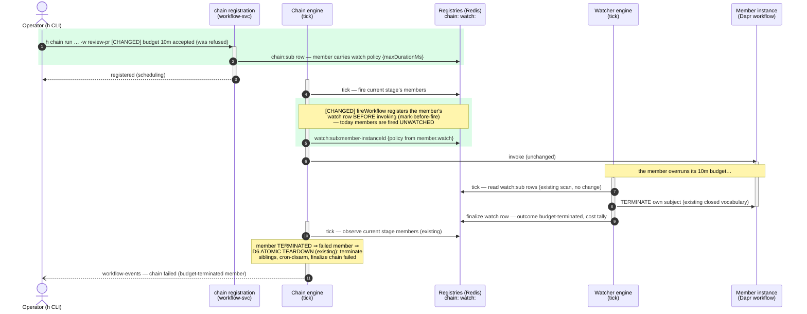
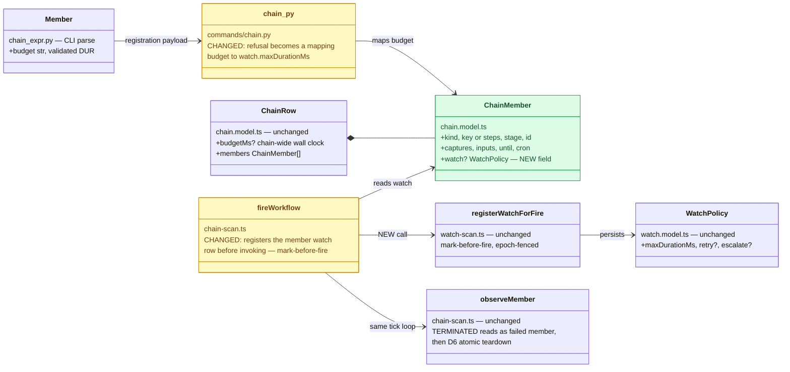
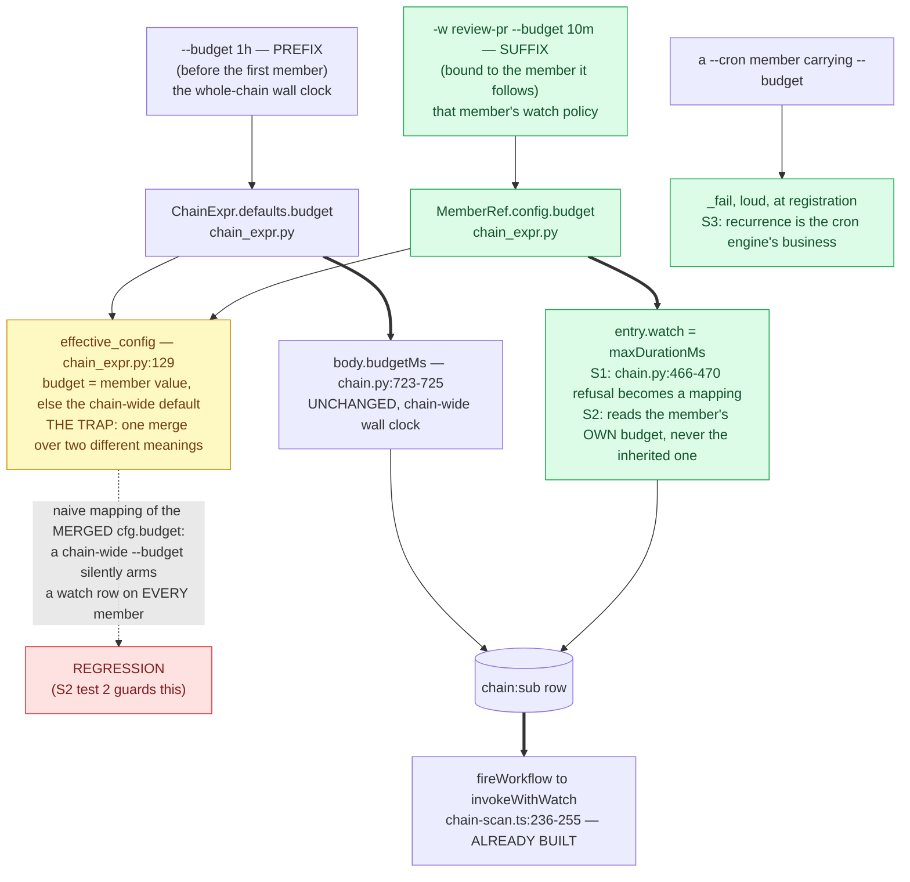

# Per-member `--budget` — a chain member the watcher can budget-terminate

Status: Complete — the CLI half landed via PR #108 (merged 2026-08-11), completing the feature:
a suffix `--budget` now arms that member's watch policy, the cron-member and `--local` cases are
refused by name, and `h chain list` surfaces it. The server half had already arrived inside
fire-descriptor. The LIVE acceptance run (watching the watcher actually budget-terminate a
member) still has not happened — it needs a service stack and is carried as
[carried-followups](../carried-followups.md) §1a, along with §1b, a chain-wide-budget-on-`--local`
silent drop found while verifying the review.
Established: 2026-07-31

Lifted to:
- **CLAUDE.md, the Chain primitive bullet** — the load-bearing design: `--budget` means different
  things by POSITION (prefix = whole-chain wall clock on the chain engine's clock; suffix = one
  member's watch policy on the watcher's), the two compose whichever-trips-first independently,
  and that is *why* `budget` is excluded from `effective_config`'s merge.
- **A comment at `chain_expr.py`'s `effective_config`** — why this one field does not inherit,
  stated where anyone tempted to "fix" the asymmetry will read it.
- **`cli/h/tests/test_chain.py`** — the regression guard that a prefix budget arms no member
  watch is a test, not prose; it is what actually holds the rule.
- **[carried-followups](../carried-followups.md) §1a, §1b** — the live acceptance run, and the
  chain-wide `--local` gap.

The rest of this document is the transient trail: the design as reviewed, the diagrams, and the
build log.

The carried item (carried-followups §1, from chain-composition-surface Slice E): `h chain run`
accepts a per-member `--budget DUR` in the chain expression and VALIDATES it, but `chain.py`
then refuses it. The chain-wide wall clock works; a member cannot yet carry a tighter (or
looser) budget than its siblings.

**The design in one sentence:** a member's `--budget` becomes a WATCH POLICY on that member's
instance — the chain engine keeps sequencing, the watcher keeps supervising, and the two meet
only through state both already read (the member's runtime status): no new engine vocabulary,
no chain-supervises-itself violation.

## What changes, in the flow (sequence)

Green = new interactions. Everything untinted is EXISTING machinery, untouched — that is the
point of the design: enforcement rides the watcher's existing budget-terminate + the chain's
existing member-failure teardown (D6).



## What changes, in the contracts (class diagram)

Green = new; amber = existing code whose shape/behavior changes; default = untouched.



## Design notes (why this shape)

- **The watcher stays 1:1 with a workflow instance — nothing becomes plural.** (Operator
  question, 2026-07-31.) A member IS a workflow instance (`<chainId>-wN`); today it is fired
  UNWATCHED (chain observation is sequencing, not supervision). The design gives each
  budgeted member its own ordinary single registration — three budgeted members ⇒ three
  instances ⇒ three independent watch rows.
- **Policy at registration, watcher at fire — deliberately two moments.** The chain:sub row
  CARRIES the member's policy from registration (diagram step 2); the watch row is armed
  mark-before-fire when that member's STAGE advances (step 5). Arming early would start the
  budget clock (`startedAt`) while earlier stages still run and mis-terminate a member that
  never fired.
- **Whoever fires, carries — supervision is a property of a FIRE, not a definition.**
  (Operator question, 2026-07-31.) Standalone: the fire REQUEST carries `watch` (transient;
  stripped off before the workflow sees it). Chain: the MEMBER entry in the chain:sub row
  carries it (durable, because the fire moment is deferred to stage advance). The discovery
  cron's row and sched continuations' resubmits are the same pattern. Every carrier converges
  on the one choke point, `registerWatchForFire`, at fire time; a SAVED workflow never
  persists a policy. Members even get the stronger mark-before-fire form always — their ids
  are deterministic, where a standalone generated-id fire registers just after scheduling.
- **Two budgets compose as whichever-trips-first.** A member can be terminated by its own
  watcher (member budget) or by the chain engine (chain-wide `budgetMs`, D6). Safe: terminate
  is idempotent and both engines only read the resulting terminal status.
- **No new vocabulary anywhere.** The watcher already budget-terminates its subject; the
  chain already treats a TERMINATED member as a failed member and tears down atomically
  (D6, incl. cron-disarm). The whole feature is two seams: carry the policy on the member,
  register it at fire time. Judgment stays out; both engines keep their closed vocabularies.
- **Mark-before-fire holds for members too**: the watch row lands before the invoke, so a
  crash between the two leaves a `scheduling` row the watch scan heals — members gain the
  same supervision guarantee every other fire path has.
- **Validation at registration (both sides), like captures/inputs**: a member `--budget` on
  a CRON member is refused (a cron member's recurrence is the cron engine's business); the
  chain-wide budget continues to bound the whole run independently.
- **Epoch interplay**: a loop-until-clean re-fire of a member bumps the member's watch epoch
  exactly as any re-fire does — a stale budget decision no-ops (existing fencing, free).
- **Cost visibility rides for free**: a watched member gets the watcher's finalization cost
  tally + per-agent day-ledger subtotals — closing the "chain members are invisible to the
  watch ledger" gap as a side effect.

## Remaining work — the CLI half (the build spec)

The server half is verified landed: `ChainMember` embeds `TriggerFields`, which carries `watch?`
(`chain.model.ts:83`, documented at `:80-82`), and `fireWorkflow` fires every member through
`invokeWithWatch`, attaching `watch: member.watch` with
`watchMeta {owner: "chain", chainId, member}` (`chain-scan.ts:236-255`). Nothing on the engine
side needs touching. What follows is the whole remaining change.

### S1. `chain.py` — the refusal becomes a mapping

`cli/h/src/h_cli/commands/chain.py:466-470` currently warns and drops the value:

```python
if cfg.budget:
    _warn(f"per-workflow --budget on '{member.label}' is not yet enforced …; ignored")
```

It becomes an emit onto the member entry, as `watch.maxDurationMs`, using the existing
`_budget_ms` helper (`chain.py:158`, which already assumes chain_expr validated the token):

```python
entry["watch"] = {"maxDurationMs": _budget_ms(<the member's own budget>)}
```

Placement: with the other `entry[...]` assignments (after `entry["fresh"]`), not at the current
warn site, so the entry is built in one place.

### S2. The inheritance trap — a member must NOT inherit the chain-wide budget

`effective_config` (`chain_expr.py:124-143`) merges member config over chain-wide defaults
**per field, and `budget` is one of the merged fields** (`:129`). So `cfg.budget` is already
the *inherited* value: `h chain run --budget 1h -w a -w b` gives every member `cfg.budget ==
"1h"`.

Mapping `cfg.budget` naively would therefore make a chain-wide `--budget` silently arm a
per-member watch row on every member — changing the meaning of an existing, documented flag
(`chain.py:609-611`: "`--budget` is the whole-chain wall clock"). That is a regression, not a
feature: the chain-wide budget already bounds the run via `body["budgetMs"]`
(`chain.py:723-725`), and the design note above is explicit that the two budgets compose as
whichever-trips-first *independently*.

**The rule to implement:** only a budget written in the member's OWN position arms a member
watch. Read the un-merged `member.config.budget` (the `MemberRef`'s own config) for the watch
mapping; keep `expr.defaults.budget` feeding `budgetMs` alone. `_member_entry` currently
receives only the merged `cfg`, so the member's own value must be threaded in — either pass
the raw `MemberRef.config.budget` alongside, or drop `budget` from `effective_config`'s merge
and let the chain-wide value be read from `expr.defaults` only at the `budgetMs` site.

Prefer the second if it is clean: `budget` is the one merged field whose two positions mean
*different things* (prefix = whole-chain wall clock; suffix = one member's watch policy),
which is what made the merge wrong in the first place. Whichever route, say so in a comment at
the site — the asymmetry is surprising and will be re-litigated otherwise.

### The CLI half, in one picture

Green = new; amber = existing code whose behavior changes (and the trap itself); red = the
regression the S2 rule exists to prevent. The whole design is that ONE flag token means two
different things depending on its POSITION, and today's per-field merge conflates them.



**Reading notes.** The two `==>` paths are the point: the prefix budget keeps flowing to
`budgetMs` alone and the suffix budget becomes a member watch policy, and they must never
cross. The dotted red edge is what happens if the implementer maps `cfg.budget` — the value
`effective_config` already merged — instead of the member's own; it is the one way this small
change can break an existing, documented flag. Everything below `chain:sub` is untouched: the
engine seam (`invokeWithWatch`) landed with fire-descriptor.

### S3. Refuse `--budget` on a `--cron` member

Loudly, at registration, via the existing `_fail`, beside the sibling refusals
(`chain.py:407-413`). A cron member's recurrence is the cron engine's business (D2/D4: the
chain never re-fires it, only observes `wf:<member>.resolved`), so a per-member wall clock on
it has no coherent subject. Message should name the member and say why, matching the tone of
the `--max-fires`/`--inline` refusals next to it.

### S4. Tests (`cli/h/tests/test_chain.py`)

1. A member `--budget 10m` puts `watch: {maxDurationMs: 600000}` on that member's entry in the
   registration body, and on no other member.
2. A chain-wide (prefix) `--budget 1h` sets `budgetMs` and arms **no** member `watch` —
   the S2 regression guard.
3. Both together: prefix `--budget 1h` + a suffix `--budget 10m` on one member ⇒ chain
   `budgetMs` from the prefix, one member watch from the suffix.
4. `--budget` on a `--cron` member exits non-zero with the refusal message.
5. Minutes/hours/bare-ms all map through `_budget_ms` correctly.

`chain_expr` already parses and validates `--budget` in both positions
(`test_chain_expr.py:70-90, 131-151`) — no parser change, and those tests must keep passing.
If S2 is implemented by dropping `budget` from `effective_config`,
`test_chain_expr.py:87-90` (which asserts budget merges) changes with it — that is a
deliberate contract change, not a broken test to paper over.

### Out of scope

Engine/server changes (done), `chain_expr` grammar (done), the cookbook entry and this plan's
archival (both follow the live acceptance run, not the code change).

## Acceptance

1. `h chain run … -w review-pr --budget 10m …` registers (no refusal); `h chain list` shows
   the member budget; the member's `watch:sub` row exists from fire time.
2. A member that overruns is terminated by the WATCHER (row finalized `budget-terminated`),
   and the chain finalizes failed via the existing D6 teardown — observed live.
3. A `--budget` on a `--cron` member is refused at registration, loudly.
4. Goldens/tests: chain_expr already parses; chain.py mapping tested; chain-scan fire path
   registers the watch row (unit); one e2e in the cookbook once validated.

## Log

- 2026-07-31 — Review spawned [fire-descriptor](./fire-descriptor.md): this plan's
  `ChainMember.watch?` field will land inside the descriptor; build THIS plan first, that
  one absorbs the placement.
- 2026-07-31 — Order reversed by operator instruction: fire-descriptor built (and archived)
  first. Its `Trigger` core CONTAINS `watch?`, so embedding it in `ChainMember` and routing
  `fireWorkflow` through `invokeWithWatch` landed this plan's engine/server seams as a
  consequence — with unit coverage (a member's watch policy registers as `watch:sub` under
  the member's deterministic id at stage fire, `{owner: "chain", chainId, member}` meta,
  stripped before the invoke). The sequence diagram's steps 2 and 5 are therefore DONE;
  what remains is step 1 (the CLI: `chain_expr` already parses `--budget`; `chain.py` maps
  it to `watch: {maxDurationMs}` instead of refusing, refuses it on a `--cron` member) and
  the acceptance list below.
- 2026-07-31 — Created from carried-followups §1 as the diagram-enrichment exercise of the
  `diagrams` skill (transient change diagrams, delta-color convention). Design reviewed via
  the rendered diagrams before any code.
