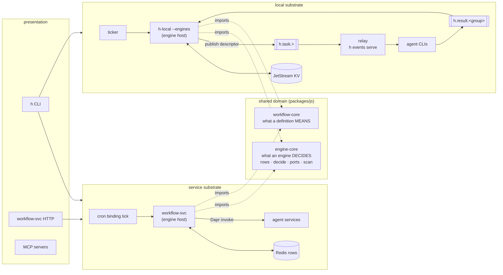

# Local engine parity — lifting the engines out of their host

Status: Active — extract the five engines into a shared core, host them locally on JetStream, and re-classify what the local substrate refuses
Established: 2026-08-16

## The thesis

The local substrate's gap list reads like five missing features — watcher, cron, schedule,
discover, chain-as-registration. It is not. **Every one of those engines is already a pure
function**, and has been since it was written. Where they lived when this plan was written (all
five now in `packages/js/engine-core` — increment 0):

```
apps/workflow-svc/src/domain/watch-engine.ts     decide(row, runtimeStatus, nowMs)
apps/workflow-svc/src/domain/chain-engine.ts     decide(...)
apps/workflow-svc/src/domain/cron-engine.ts      decide(...)
apps/workflow-svc/src/domain/discover-engine.ts  decide(row, runtimeStatus, todayFires, now)
apps/workflow-svc/src/domain/schedule-engine.ts  decide(row, nowMs)
```

Their imports are row models and `isDue`. Nothing about them is Dapr, Redis, or service-shaped.
What is service-shaped is only their three collaborators — durable rows, a clock, and a fire path.

So the local substrate does not lack engines. **It lacks an address for them.** The engines are
domain logic that was never lifted out of a host, which means exactly one process can reach it.

That gives the plan its shape, and its size: **one extraction plus one new component**, after which
the engines run unchanged on either substrate.

## Why this is the same move `workflow-core` already made

h has done this once, deliberately, and the result is the one place the two substrates already
have full parity:

| Concern | Where it lives | Parity today |
| --- | --- | --- |
| What a DEFINITION means (`{{token}}`/`$ref`, output contract, step shapes) | `packages/js/workflow-core` — **extracted**, imported by both | Full, and guarded by `scripts/check-runtime-parity.mjs` |
| What an ENGINE decides (supervise / sequence / recur / discover / schedule) | `packages/js/engine-core` — **extracted 2026-08-16** (was `apps/workflow-svc/src/domain/`) | Guarded; awaiting a second host |

The difference in outcome is entirely a difference in filing. `engine-core` is `workflow-core` for
the second half of the domain.

### The general rule this exposes

**Domain logic in `apps/*/domain/` that more than one host needs is a parity bug that has not
happened yet.** `packages/js/*` is the hexagon's shareable interior; `apps/*` are composition
roots. Something valuable in an app's domain folder is either genuinely host-specific (correct) or
mis-filed (a future gap). This is worth encoding — see [Hardening](#hardening-what-gets-a-guard).

## The shape



The seam that keeps this honest: **the engine host never composes.** It decides and emits
*descriptors*; the relay composes on fire. So the local host needs no helm and no Python — it is a
resident mode of the existing `h-local` binary. That is the same engines↔agent-services separation
workflow-svc already has, with NATS where Dapr was.

## Collaborator mapping

| Engine needs | Service substrate | Local substrate |
| --- | --- | --- |
| Durable rows, single-writer, epoch-fenced | Redis `watch:` `chain:` `cron:` `wf:` `exec:` | **JetStream KV buckets**. KV *offers* a real CAS (`update(key, value, revision)`) where Redis has read-then-write, and `NatsKv.putFenced` exposes it — but it is deliberately UNUSED (found while building 2a): the epoch fence lives in the SHARED scan, so fencing one substrate harder would be a behaviour difference dressed as an improvement. It becomes available the day the shared scan grows a fenced-save port method |
| A clock | Dapr cron binding → `POST /workflow-cron-tick` | A ticker in the resident engine host |
| A fire path | Dapr invoke / `workflow-trigger` topic | `h.task.>` — **already built** (the relay's work queue) |
| Terminating a running instance | Dapr terminate | Cancel a claim the relay owns (see increment 4's boundary) |
| A saved-definition store | Redis + `__workflow_index__` | A KV bucket (increment 1) |

## Decisions locked (operator, 2026-08-16)

1. **The engine host is a separate long-lived process, brought up by `h events up`.** The
   constraint that decides it: the host must be a SINGLETON (two tickers over the same rows
   double-fire every cron), while the relay must NOT be (work-queue retention exists precisely so
   several can share the queue). Binding a singleton to a thing you want to scale is the wrong
   coupling. `nats-server` and the engine host are *infrastructure* and come up together; the relay
   is *work* and stays operator-run. This mirrors the service substrate, where workflow-svc comes up
   with the stack and agents do the work.
2. **Singleton is enforced by the fabric, not by convention** — the host holds a KV lease key it
   renews; a second host sees the lease and refuses loud. Same shape as the service side's
   `watch:__tick__` heartbeat, and it gives `h events status` a real liveness answer rather than a
   pid.
3. **nats-server is a HARD dependency: missing binary ⇒ warn and exit.** Local mode is *minimal*
   mode, not *dependency-free* mode. One preflight, one message, one exit — every local command.
4. **The chain journal is absorbed by the chain KV row; the workflow (step) journal stays.** They
   are counterparts of different service-side things — see [The journal question](#the-journal-question).
5. **Architecture gets enforced by lint wherever it can be.** Every increment below ships its
   guard in the same change set, per the *Harden by encoding* principle.

## The wf: re-key (operator, 2026-08-17)

`cron-engine.decide` needs the last-fired instance's `runtimeStatus`, which Dapr answers on the
service substrate and nothing answers locally. Chasing that turned into a design change to a SHARED
registry, so it is recorded here rather than inside an increment.

### The decision

**`wf:` becomes instance-keyed: `wf:run:<instanceId>`.** Rows are never overwritten, every row is
stamped with the id of the primitive that caused it, and the three existing readers derive the key
they need.

```
wf:run:<instanceId>   { status, resolved?, subject (input), output,
                        chainId? cronId? schedId? discoverId?, memberIndex? … }
```

### Why the artifact key turned out not to be load-bearing

The claim that blocked this — that discovery dedup asks "have I ever dispatched for issue #123?"
with no instance id, so it MUST be artifact-keyed — is wrong, and the code says so:

```ts
export const issueInstanceId = (issueNumber: number): string => `feature-issue-${issueNumber}`;
```

The id is a pure function of the issue number, and `discoverTrigger` already fires with it. The
asker has forgotten which run dispatched the issue, which is true and irrelevant: the id does not
need remembering, it needs DERIVING.

That generalises, because h already guarantees it. Instance ids are **required-or-derived, never
Dapr-minted** — `issueInstanceId(n)`, `instanceIdAt(chainId, i)` = `<chainId>-w<i>`, and a cron row
carrying `currentInstanceId`. The system already pays for deterministic ids and simply was not
spending them.

The three readers, and what each does after the change:

| reader | asks | after |
| --- | --- | --- |
| `cron-scan` goal handshake | "has my target resolved?" | `getRun(row.currentInstanceId)` — and it COLLAPSES two calls into one, since the row carries status + output as well |
| `chain-scan` cron member | "has this cron's goal resolved?" | hop `cron:sub` (which the chain armed, so it can derive the id) → `getRun(currentInstanceId)` |
| `discover-scan` dedup | "already dispatched for issue N?" | `getRun(issueInstanceId(n))` |

### What it buys

- **The same-kind collision dies.** Two members in one STAGE sharing a `kind` currently derive the
  same `wf:` key and overwrite each other. Latent today (the chain reads Dapr, not `wf:`), and it
  would have become load-bearing the moment `wf:` backed status. Instance keying removes the state
  rather than guarding against it.
- **One convention on BOTH substrates.** `wf:` is h's own registry in `engine-core`, not Dapr's, so
  this lands on the service substrate too. That is the alignment goal served, not traded away.
- **A path to retiring the unknown-streak escape.** Dapr's status API is what returns `UNKNOWN` and
  forced that hatch into the engine. If `wf:run:` proves out, the service substrate can read it
  instead and the hatch becomes vestigial.

### Stamping

Every row is stamped with its parent primitive's id — `chainId`, `cronId`, `schedId`,
`discoverId`, plus `memberIndex`/`fireSeq` where they apply. Each is available at write time
without a lookup, because the thing that fires already knows what it is.

`invokeWithWatch` is the single seam this threads through — all seven fire paths funnel through it
(HTTP run routes ×2, the cron tick, trigger events, chain-scan, discover-scan, schedule-scan), and
`watchMeta` is already an ad-hoc version of exactly this passthrough. **The load-bearing case is the
watcher's usage-limit fallback**, which writes into `cron:sched:` — a registry it does not own — so
a continuation must INHERIT the original run's stamps or a retry silently detaches from its chain.

### Rejected along the way

- **Keep the artifact key, add `wf:run:` beside it** (two families under one prefix, the `cron:`
  precedent). Coherent, and it was my recommendation until the discover case collapsed. Rejected
  once the artifact key had no reader that needed it.
- **A composite key `wf:run:<repo>:<slug>:<workflow>:<instanceId>`**, giving artifact prefix-scans
  free via the codec's `:` → `.` subject hierarchy. Rejected: no caller needs artifact browsing
  today, and it costs unbounded key growth per artifact.
- **An alias/mapping registry** (deterministic friendly key → instance key). Rejected for two
  reasons: the pointer already exists on the primitive rows (`CronRow`/`ChainRow.currentInstanceId`),
  and a secondary index reintroduces exactly the drift class that deleting `__workflow_index__`
  removed. *Revisit when:* artifact-scoped lookups become HOT (a polling `h status`, a viz
  refreshing across many slugs) — at that point O(runs) per query stops being free.

### Blast radius, stated plainly

This is a change to a shared registry, so it touches the service substrate: three readers, the
`write-wf-row` activity, and the row model. Live `wf:` rows are keyed the old way and are
ORPHANED — per the repo's atomic-cutover convention that is a deliberate reset of operational
state, not a migration. It lands as its own step before the local invoker is built on top.

## The journal question

The run journal (`h-journal`, `h.journal.<group>`) publishes one record per completed unit:

| type | carries |
| --- | --- |
| `meta` | `definitionHash` (composition only — never params/budgets/seeds), group, kind |
| `stage` | the stage that COMPLETED, iteration, full post-capture chain data, member run ledger groups |
| `step` | one workflow step (or one parallel BRANCH), and its result |
| `terminal` | `completed` only — failed/exhausted runs stay resumable on purpose |

The answer splits, because the two granularities mirror different things:

- **Chain (`stage`) records → absorbed by the chain KV row.** These are the same information in two
  tenses: the journal is the log, the row is the snapshot. JetStream KV *is* a stream — a bucket
  with `history: N` makes each revision of the chain row a stage transition, replayable. The log
  comes free from the state, so one mechanism wins and it is the row.
- **Workflow (`step`) records → kept.** These have no registry counterpart on the service side,
  because nothing over there is "a workflow row you resume from" — the Dapr engine replays completed
  activities *internally*. The step journal is the local mirror of that replay, not a duplicate of a
  chain row. Retiring it would delete a capability, not a duplication.

So: not one mechanism, and not two competing ones — two mechanisms at different layers, which they
always were. The current design merely implemented both on the same stream, which made them look
like siblings.

**Consequence for foreground runs:** `h chain run --local` in a shell must keep working with no
resident engine host. So a chain has two hosts for one `decide`: the foreground driver (today's
`local-runtime/domain/chain.ts`, journaled) and the engine host (KV row). Same semantics, imported
from `engine-core` by both — which is exactly the drift risk the parity guard exists to catch.

## Progress

| # | Increment | Status | Guard |
| --- | --- | --- | --- |
| 0 | `engine-core` — the extraction | **Complete** | parity guard owns engine symbols ✓ |
| 1 | KV registries (saved store, `exec:`) | **Complete** | `check-kv-keys.mjs` ✓ · `check-refusal-classification.mjs` ✓ |
| R | **`wf:` re-key to `wf:run:<instanceId>` + parent stamps** — shared, lands on BOTH substrates | **Complete** | parity guard owns `wfRunKey`/`WfParentage` ✓ |
| 2 | Cron + schedule | **Next** | flag/capability agreement |
| 3 | Chain as a durable registration | Not started *(preview owed)* | — |
| 4 | Watcher + `exec:` fences | Not started *(preview owed)* | — |
| 5 | Discover — fan-out | Not started | — |
| — | Refusal re-classification | **Done** (1c) | `check-refusal-classification.mjs` ✓ |
| H | Hardening found in flight — lint parity + the dapr-mcp boundary | **Complete** | `check-lint-parity.mjs` |
| — | `engine host` in the glossary | **Done** (0c) | vocabulary guard |

Increment 0 sub-steps (one commit each, each green on `make lint` + `make test`):

- [x] 0a — package skeleton, row models + ports move *(green: build, lint, 286 + 41 tests)*
- [x] 0b — the five `decide` functions move *(green: build, lint, tests)*
- [x] 0c — the scans move, behind a new `IEventPublisher` port; depcruise blind spot fixed and
      **verified by planting a violation** *(green: build, lint, tests)*
- [x] 0d — parity guard extended to own the engine symbols, **verified firing**

## Increments

Each increment lands its own guard. Increments marked **(preview)** need the CLI surface shown to
the operator before implementation, per the standing convention.

### 0. `packages/js/engine-core` — the extraction

Move out of `apps/workflow-svc/src/domain/`:

- the row models (`watch.model`, `chain.model`, `cron.model`, `discover.model`, `schedule.model`,
  `wf.model`) and `scheduling.ts` (`isDue`/`assertValidCron`),
- the five `decide` functions and their decision types,
- the registry PORTS (`IWatchStore`, `IChainStore`, `ICronStore`, `IWfStore`, `ISourceReader`) —
  they are the seam both adapter sets implement.

**The scans move too — settled 2026-08-16 by measurement, not by argument.** The open question was
whether the `*-scan.ts` orchestrators (2823 lines, the bulk of the extraction) are portable or
service-bound. A full dependency inventory of all five scans plus the engines, `exec-policy.ts` and
`scheduling.ts` says portable: every import is a port, a row model, `effect`, `core`,
`workflow-core`, `cron-parser` — **with exactly one leak**, `DaprPublisherTag` from `core-dapr`,
in two places (`chain-scan.ts`'s cron-disarm + terminal publishes, `watch-scan.ts`'s terminal
`workflow-events` publish).

So the scans are already port-driven; they were simply never given a port for *publishing*. The
extraction adds one — `IEventPublisher` — with a Dapr adapter on one side and a NATS publish on
the other. Both substrates then share the sequencing and differ only in effects, which was the
recommendation; the measurement just made it cheap instead of risky.

Terminating a running instance is the second effect that differs, and it is already behind
`IWorkflowInvoker`. Increment 4 supplies the local implementation.

What stays in workflow-svc: the Dapr/Redis adapters, the HTTP routers, the activity registry. Its
domain folder should end up holding only what genuinely belongs to that host.

**Guard:** extend `scripts/check-runtime-parity.mjs` with `engine-core` as an owning package and
the engine symbols as owned — defining any of them elsewhere becomes a lint failure, the same way
`resolveRefs` already is.

### 1. KV registries — the substrate

Surface previewed and approved 2026-08-16. **Registry READS select their substrate with `--local`**,
matching the flag `h workflow run` / `h chain run` already use — `h workflow list --local`,
`h cron list --local`, `h agents deny claude --local`. Rejected: a config-file default (a second
concept to learn for a flag that already exists) and auto-detect-if-the-fabric-is-up (the source of
an answer would depend on invisible machine state, so a stopped fabric silently changes what
`h cron list` means).

Sub-steps:

- [x] 1a — the `kvKey`/`kvId` codec + `scripts/check-kv-keys.mjs`, both verified firing
- [x] 1b — the shared KV layer + the THREE stores increment 1 uses (`wf:`, saved store, `exec:`),
      tested against a real nats-server. Watch/chain/cron stores land with the engines that read
      them (increments 2–4) rather than as dead code ahead of them
- [x] 1c — the `exec:` policy fence on every local agent run (executor + delegate), and the refusal
      list re-classified into pending/permanent with its guard. **`write-wf-row` deliberately NOT
      un-refused** — see the 1c log
- [x] 1d — `--local` on the registry read commands, via a `registry` job kind (protocol v2)


A KV adapter for the ports above, plus the bucket layout and the single-writer rule carried over
from the flat Redis keyspace (a prefix names the one component that writes it).

Unlocks immediately:

- **`wf:` rows** — un-refuses `write-wf-row`, which cron's `goal: RESOLVED` handshake depends on.
- **A local saved-definition store** — so a task descriptor can carry `{key, params}` instead of
  embedded steps. That is triggers-as-data locally, and it un-refuses `-w KEY` on `--local`.
- **`exec:` policy reads** — `h agents deny/allow/budget` fences local runs. A usage-limited agent
  on a laptop is arguably more common than on a fleet.

**Guard:** a single-writer check over KV bucket names, the sibling of `check-state-keys`.

### 2. Cron + schedule

Surface previewed and approved 2026-08-16. `cron-engine.decide` needs exactly two external facts —
`resolved` (the `wf:` row) and the last-fired instance's `runtimeStatus` — and that determines the
whole design:

| piece | shape |
| --- | --- |
| Engine host | `h-local --engines`, resident, started detached by `h events up` beside nats-server |
| Singleton | a KV lease it renews each tick; a second host sees a live lease and exits loud |
| Tick | 60s, matching the Dapr binding, so `isDue` behaves identically on both substrates |
| `IWorkflowInvoker` (local) | `invoke` = publish a descriptor to `h.task.>`; `getStatus` = read an instance row; `terminate` = REFUSED (pending — only the watcher needs it, increment 4) |
| `instance:` registry | written ONLY by the relay (it executes, so it reports), read by the engine — the service split, mirrored |
| `CronStore` KV adapter | recur + discover + sched rows, config/heartbeat/ledger |
| The `wf:` bracket | 1c's deferred item, earning its place: the goal handshake is what reads it |

It degrades safely by construction: an instance row the relay never wrote reads `UNKNOWN`, and
`decide`'s existing unknown-streak escape re-fires the cadence after N ticks rather than pinning the
cron in flight forever.

**Deferred to increment 4: `h workflow pause|resume --local`.** Pause TERMINATES a running instance,
and terminate is the watcher's capability. `--at`/`--in` (pure scheduled fire) land here.

**Relay lifecycle (operator, 2026-08-16): `h events up --with-relay`.** A local cron fires by
publishing a descriptor, so nothing runs it unless a relay is draining the queue — but decision 1's
split (nats-server + engine host are infrastructure, the relay is work you watch) is worth keeping.
So the relay becomes an OPT-IN supervised child rather than either always-on or always-foreground,
and `h events status` reports all three. Arming a cron with no relay attached warns, naming
`h events serve`: the descriptors do queue durably, but arming into a queue nobody drains is the
quiet nothing this plan keeps eliminating.

Sub-steps:

- [x] 2a — the `CronStore` KV adapter (recur + discover + sched), tested against a real server
- [x] 2b — the local `IWorkflowInvoker` (+ the `wf:run` bracket, and the descriptor's `steps` variant)
- [ ] 2c — the engine host: resident mode, KV lease, tick, cron + sched scans
- [ ] 2d — `h events up [--with-relay]` supervises it; `h events status` reports it
- [ ] 2e — un-refuse `--cron`/`--max-fires`/`--at`/`--in`; `h cron|schedule list --local` answer
- [x] 2f — the `wf:` bracket in the local executor. **Done as part of 2b, not after it**: the
      invoker READS what the bracket WRITES, so split apart each half is inert. Landed with
      `goalResolved` lifted from `generic.workflow` into `engine-core` — a shared semantic that had
      been sitting in an app, exactly the misfiling the plan's thesis warns about

The value is operator-shaped: a nightly h-builds-h loop, or `--in 2h`, on a machine with no Dapr.

### 3. Chain as a durable registration **(preview)**

`chain:sub` in KV; the engine fires each stage as a task descriptor; the relay executes it.
Retires the chain half of the journal per the decision above. Foreground `h chain run --local`
keeps its driver-sequenced path — two hosts, one `decide`.

### 4. Watcher + `exec:` fences **(preview)**

The one increment with a genuine constraint: the watcher must TERMINATE a running instance, which
locally means cancelling work the engine host does not own. Only tractable for runs the **relay**
executes — so this is where "durable work goes through the fabric, not through your shell" becomes
a real boundary rather than a preference. Name it plainly in the surface.

Un-refuses `--watch`, `--retry`, `--fallback-agent/-model/-after/-max`, and per-member `--budget`.

### 5. Discover — fan-out

Needs `ISourceReader`; git-core's `GitHubClient` is TS, so the JS engine host imports it directly.
Nearly free once 1–4 exist.

## The refusal re-classification

Today `local-runtime/domain/activities.ts` holds one flat `REFUSED` map, and `workflow.py`'s
`_refuse_engine_flags` holds one flat flag list. Both are two lists wearing one coat. This work
forces the split, and making the split explicit is most of the plan's lasting value:

| Refusal | Class | After this plan |
| --- | --- | --- |
| `register-cron`, `register-discover` | **pending** — no engine here yet | available (2, 5) |
| `write-wf-row` | **pending** — no registry here yet | available (1) |
| `--cron`, `--max-fires`, `--at`, `--in` | **pending** | available (2) |
| `--watch`, `--retry`, `--fallback-*`, per-member `--budget` | **pending** | available (4), fabric-fired runs only |
| `-w KEY` with no chart template | **pending** — no saved store | available (1) |
| `run-itest` | **permanent** — needs an ephemeral k8s namespace | stays refused |
| `gc-worktrees` | **permanent** — a different workspace, not a missing capability | stays refused |
| `run-kimi`, `run-stub`, `run-dapr-agent`, `run-dapr-claude-loop`, `run-langgraph`, `run-claude-managed` | **permanent** — no agent-cli strategy exists | stays refused |
| `--via` | **permanent** — routing through a service's babysitter is meaningless with no services | stays refused |
| `--fresh` | **undecided** — means "purge and re-run a durable instance"; locally that is `--resume`'s inverse | decide deliberately, do not leave refused by inertia |

Saying *permanent* out loud is what stops "1-to-1 parity" from becoming an open-ended chase.

## Hardening — what gets a guard

Appetite confirmed as strong; each of these ships with its increment, not after.

1. **Engine ownership** — extend `check-runtime-parity.mjs` so the engine symbols may only be
   defined in `engine-core`. (Increment 0.)
2. **KV single-writer** — a bucket prefix names one owning module; a write from anywhere else
   fails. Sibling of `check-state-keys`. (Increment 1.)
3. **Refusal classification** — every entry in `activities.ts`'s `REFUSED` map must declare
   `pending` (naming the engine/registry it awaits) or `permanent` (naming the cluster/service it
   needs). Machine-checked, so the list cannot silently collapse back into a flat "needs an engine".
   (Increment 0, then maintained.)
4. **Flag/capability agreement** — the CLI's `_refuse_engine_flags` list and the engine host's
   declared capabilities must not disagree. A flag refused as "needs an engine" once that engine
   exists locally is a bug the machine should catch, not a review habit. (Increment 2 onward.)
5. **Misfiled domain logic** — the general rule from the thesis. Weakest to express generically;
   the tractable version is an allowlist: name the symbols each `apps/*/domain/` may legitimately
   own, and fail on additions that neither appear there nor in a shared package. Design it after
   increment 0, when the true residue of workflow-svc's domain folder is visible.
6. **Vocabulary** — `engine host` enters ARCHITECTURE.md's glossary as a substrate-NEUTRAL term:
   the process that holds the tick and runs the engines' `decide` against durable rows.
   workflow-svc *is* the service substrate's engine host; `h-local --engines` is the local one.
   Naming it neutrally is what makes the parity legible rather than incidental.

## Increment H — the hardening this work surfaced

Standing instruction from the operator (2026-08-16): **fix what we find, in flight.** A finding
parked is a finding that rots, and both of these were parked in the 0c log with revisit triggers.
They were unparked the same day.

### H1 — lint parity: two halves, each missing what the other had

The repo had drifted into two lint dialects, and neither gap was visible from inside its own half:

```
apps/*         tsc --noEmit + oxfmt (+ depcruise)   → no oxlint at all
packages/js/*  oxlint + oxfmt (+ depcruise)         → no tsc --noEmit
```

`tsc --noEmit` looks redundant in a package that already runs `tsc -p tsconfig.build.json` in its
build — except **that config excludes `src/**/*.test.ts`**, and vitest transpiles without
typechecking. So package test files were typechecked by NOTHING. Verified by planting
`const x: number = "nope"` in a package test: build passed, lint passed, tests passed.

The gap had accumulated real errors — 47 across four packages, every one invisible:

| package | what was hiding |
| --- | --- |
| `agent-cli` | 6 — three strategy tests never provided `HttpClient` (the house pattern exists in `claude.test.ts`), and three `extractMetrics(events)` calls missing an argument the interface has required for as long as it has had two parameters |
| `agent-server` | 1 — a `GitClient` stub whose `addWorktree` returned `void` where the port returns the effective path |
| `local-runtime` | 1 — a `WorkspacePort` stub missing `provision` entirely |
| `engine-core` | 39 — `noUncheckedIndexedAccess` narrowings in the test files that arrived with 0a/0b/0c |

All fixed, not suppressed. The two incomplete stubs are the ones worth noting: a test double that
does not satisfy its port is not testing the thing it appears to test, and both were silently
incomplete. `local-runtime`'s now `Effect.die`s on `provision` rather than no-opping — a stub that
must never be called should say so.

Every TS package now runs the same three checks (plus depcruise where it applies), enforced by
`scripts/check-lint-parity.mjs` and verified firing. Turning oxlint on across the apps surfaced 11
warnings, all cleared: three genuinely dead symbols, seven redundant `...(x ?? {})` spreads, and one
the linter got WRONG — `reaper.ts`'s `[...liveRuns]` snapshot is deliberate because the loop deletes
from the set it walks, so that one is suppressed with the reason rather than obeyed.

This is the same failure mode `check-tsc.mjs` guards from the other direction: **a missing check and
a hollow check are indistinguishable from the outside.**

### H2 — the dapr-mcp boundary violation, decided rather than parked

0c named an exception for `dapr-mcp`'s `IActorStore`/`IPubSub`, which type-import core-dapr's
service interfaces, on the grounds that restating ~10 methods and an error tag was a design call
about another service. Interrogating it properly reversed that in one observation: **`IStateStore`
sits in the same directory, in the same service, fully self-contained with its own
`DaprStateError`.** Restating IS this service's convention — the other two were the outliers, so
fixing them imposes nothing from outside.

The objection to restating was drift: two definitions of one interface. It does not apply here,
because both adapters delegate by IDENTITY (`Layer.effect(Port, CoreDaprTag)`). TypeScript is
structural, so the delegation still compiles — and if core-dapr's surface ever diverges, **that
assignment stops compiling.** The coupling was never removed; it was converted from a hidden import
into a compile-time check, which is strictly better than either the import or a hand-written mapping
layer.

The exception is deleted from the rule. Verified by planting the import back and watching
`domain-no-io-libs` fire.

### 1a log — the codec, and two bugs the discipline caught

The KV key mapping is the increment's highest-risk piece, because **NATS validates KV keys as
`/^[-/=.\w]+$/` and every h registry id is built from `:`** — `watch:sub:<id>`,
`cron:sub:<repo>:<slug>:<workflow>`, `wf:<repo>:<slug>:<workflow>`, `exec:config`. `%` is not in the
charset either, so percent-encoding (the Dapr fix) is unavailable.

This is the SAME failure shape as the 2026-07-15 Dapr path-key bug: the store accepts the write and
the read finds nothing, so the symptom is an empty registry rather than an error. Hence a codec plus
a guard, not a convention.

The mapping: `:` → `.` (h's segment separator becomes NATS's subject separator, so
`kv.watch("wf.acme/api.>")` selects every row for one repo — something the flat Redis keyspace could
never do), `A-Za-z0-9_-/` pass through (`/` is legal, and keeps `owner/name` readable), everything
else → `=XX`. Decoding is unambiguous because a literal `.` escapes to `=2E`, so a bare `.` can only
have come from a `:`.

Two bugs, both found by planting rather than reading:

- **The codec was character-wise and broke on the first non-BMP codepoint** — an emoji in a slug
  encodes as `=1F642`, five hex digits, and the decoder reads two. Now encodes UTF-8 BYTES, so `=XX`
  is always exactly two. Found by the totality test, which is why that test enumerates inputs no
  registry uses today: the Dapr scar was itself an input nobody had tried.
- **The guard's own regex matched nothing.** `[A-Za-z_$][\w$]*(?:[Kk]v)` cannot match the bare name
  `kv` — the leading class eats the `k`, leaving one character for a two-character suffix — so
  `check-kv-keys` reported success against a planted `kv.get("watch:sub:x")`. That is now four
  guard-pattern bugs in this plan (three in the depcruise rules, one here), **every one of which
  printed a green line**. A guard that matches nothing and a guard that finds nothing are
  indistinguishable from their output; only planting a violation separates them.

### 1b log — the KV layer, and a guard that fired on its own abstraction

Scope narrowed deliberately: 1b builds the shared KV layer plus the THREE stores increment 1 puts
to work (`wf:`, the saved-workflow store, `exec:`). The watch/chain/cron stores need the CAS fence
and are read only by engines that do not exist yet, so they land with those engines rather than as
dead code ahead of them.

Three things are genuinely simpler here than on Redis, and none is a shortcut:

- **Every index key disappears.** `__workflow_index__`, `watch:index`, `cron:discover-index` exist
  because Redis cannot enumerate a prefix. KV lists natively, so `list` reads the bucket — and
  index/row drift stops being a thing that can happen.
- **The epoch fence becomes a real CAS.** Rows keep `epoch` (a domain field both substrates
  compare); Redis enforces it read-then-write with a race in the middle, KV's `update(key, value,
  revision)` rejects a stale write outright.
- **No `run:` mirrors.** They exist so workflow-svc can see the run ledger over Dapr. Locally the
  ledger is on disk and the cost tally reads it directly.

**Tested against a REAL nats-server**, spawned per suite, not a fake. The bug this adapter exists to
prevent — a key the server accepts on write and loses on read — is precisely the one a fake cannot
reproduce. The first fixtures failed decode because they omitted required fields, which is the
adapter validating through each row's Schema rather than casting: a row from an older build fails
here rather than surfacing half-populated three layers away.

Two findings:

- **A skipped suite is a silent-green suite.** The first version skipped when `nats-server` was
  absent and explained itself with `console.warn` — which vitest SUPPRESSES when every test in a
  file is skipped. The run printed "6 skipped" and nothing else: the exact shape this plan keeps
  finding in guards, reproduced inside a test file. Now a missing binary FAILS with the install
  hint, `H_SKIP_NATS_TESTS=1` is an explicit greppable waiver (the spirit of `run-itest`'s
  skip/skipReason break-glass), and **CI installs nats-server** so the waiver never fires there.
- **`check-kv-keys` fired on `NatsKv` — the abstraction built to enforce it.** The port's first
  argument is a BUCKET, not a key, so "any `kv.<op>(` must wrap `kvKey`" was measuring the wrong
  thing. Restated as a CHOKEPOINT and it became both correct and stronger: exactly one module may
  hold a raw KV handle (`nats-kv.ts`), and inside it every operation encodes. A guard that fires on
  the abstraction built to satisfy it is a sign the invariant is stated at the wrong level. Both
  rules verified firing, plus a third check that fails if the chokepoint file is renamed away —
  otherwise rule 2 would silently stop applying while rule 1 kept passing.

### 1c log — the fence, and an item interrogated out of scope

**`write-wf-row` stays refused, deliberately.** The increment was scoped to un-refuse it, and
checking first showed that would build nothing: `write-wf-row` is **never a step in any template**.
`generic.workflow.ts` adds it as a BRACKET around a wf-identified run — "engine-driven, invisible to
the definition". So the local work is not un-refusing an activity, it is teaching the local executor
to bracket, and that is only useful once something READS those rows: the cron engine's `goal:
RESOLVED` handshake, increment 2. Un-refusing now would have produced an activity nothing calls and
a registry nobody reads — the same dead-code-ahead-of-need that 1b avoided. Its refusal reason now
names the bracket it waits for, so the deferral is legible rather than a gap.

**The refusal list is re-classified.** `pending` (waiting on machinery this substrate is growing —
`write-wf-row`, `register-cron`, `register-discover`) vs `permanent` (needs a cluster, a service, or
a workspace that is not this substrate's — `run-itest`, `gc-worktrees`, the service-only agents).
`RefusedActivityError` puts the class in its message, because the two call for different responses:
a pending refusal may be worth running on the service substrate today, a permanent one means compose
differently. `scripts/check-refusal-classification.mjs` enforces both that every entry declares a
class AND that a `pending` reason NAMES what lifts it — "not supported here" is exactly the
non-answer the split exists to eliminate. Both rules verified firing.

**The `exec:` fence is live on both local paths.** Same `activeDenial` decision function and the
same `exec:config` row shape as workflow-svc's `gatedExecutor`, so `h agents deny codex` means one
thing on both substrates. Two design points:

- In `delegate`, a denial becomes THAT agent's failed REPORT rather than a failure of the roster —
  the same shape a dead CLI produces. A fence that cost the siblings their answers would break the
  one property a roster exists for.
- The fabric URL is ENV (`NATS_URL`), not job data: it is one endpoint for the machine, so carrying
  it per job would put an environment fact in the wire protocol and make changing it a protocol
  bump. `local_runtime.py` stamps it from `EVENTS_URL` so one value is authoritative, and
  `test_local_fabric_url_sync.py` pins the runner's fallback to it — the sibling of the protocol and
  agent-name sync tests.

**The KV connection is LAZY**, and that is load-bearing rather than an optimisation: the layer is
built for every local job including an `h delegate` that reads no registry, so connecting eagerly
would turn a stopped fabric into a failure for work that never needed it — and would report it as a
raw transport error instead of the CLI's preflight message.

Verified end to end against a real nats-server, as a permanent test rather than a scratch script:
a policy written through `ExecPolicyStore` denies `codex` by name through `assertExecutorAllowed`
and leaves `claude` untouched. That join is what neither unit suite can show — a key-encoding
mistake would pass both and fence nothing.

### 1d log — the CLI's window, and a bug only plain `node` could find

The CLI does NOT speak to JetStream. Reads and writes go through the runner as a new `registry` job
kind (protocol v1 → v2), because registry ids contain `:` and every access has to encode — a second
copy of that codec in Python would drift, and its symptom would be an EMPTY listing rather than an
error. One codec, one holder of a raw KV handle, one answer.

What answers, and what refuses:

| command | `--local` |
| --- | --- |
| `h workflow list` / `get KEY` | reads the local saved-workflow store |
| `h agents list` / `deny` / `allow` | reads/writes the local `exec:` row — the fence local runs enforce |
| `h cron\|chain\|watch list` | **refuses by name**, naming the engine that lifts it |
| `h agents budget` | **refuses by name** — a budget is a WATCHER behaviour (its day tally writes the deny), not a stored number, so storing one with no watcher arms a fence nobody enforces |

The refusals are the interesting half. An empty table would assert "none registered" when the truth
is "no registry here", and those are different facts. `--local` is *accepted and then refused*
rather than absent, because a missing flag reads as "wrong command" while a refusing one says which
engine is missing and what to run meanwhile.

Three findings, in ascending order of how long they would have hidden:

- **The refusal helper shipped ungated.** First version had callers check `local` themselves; the
  check was missing, so every `h watch list` refused — caught immediately by the existing suite.
  The flag is now a PARAMETER (`refuse_pending_registry(name, local)`): a guard whose correctness
  depends on remembering to guard it is not one.
- **`cron-parser` v4 is CJS, and Node's ESM lexer cannot see its named exports.** `import {
  parseExpression }` throws `does not provide an export named 'parseExpression'` under plain `node`
  while passing under vitest and bun, whose interop is more permissive. It had been latent in
  `engine-core/scheduling.ts` since 0a and only surfaced when `bin.ts` first pulled engine-core in —
  because **the local runner is the only thing in this repo plain `node` executes.** Everything else
  is bundled or runs under a test runner. Worth remembering: that binary is the repo's only ESM
  conformance check.
- **A failed connection died as a DEFECT, printing a NatsError stack.** The KV layer's finalizer is
  a SECOND consumer of the connect promise, and `Effect.promise` has no error channel — so a
  refused connection killed the runner with a stack trace instead of letting the CLI say "is the
  local fabric up?". Fixed by catching on the promise, not just ignoring the effect. The envelope
  now also surfaces the CAUSE, since `WorkflowError`'s own message is the tagged-error default
  ("An error has occurred") and the user needs `CONNECTION_REFUSED`.

Verified end to end against a real nats-server: `h agents deny codex --local` → `h agents list
--local` shows DENIED → `h agents allow codex --local` clears it; `workflows.save` → `h workflow
list --local` → `h workflow get demo --local`; and with the fabric stopped, `local registry:
CONNECTION_REFUSED / Is the local fabric up? (h events up)`.

### R log — done, and what it cost

The re-key landed on both substrates in one change set, as designed. Green on `make lint`,
`make test` (JS 32/32) and `make test-py` (477).

What moved:

- `WfRow` is keyed by `instanceId`; `wfKey(identity)` → `wfRunKey(instanceId)`; the port's
  `getRow(WfIdentity)` → `getRun(instanceId)`. Subject (repo/slug/workflow) and the new
  `WfParentageFields` (chainId/memberIndex, cronId/fireSeq, schedId, discoverId/issueNumber) ride as
  optional FIELDS. `WfParentageFields` + `WfParentage` + the derived type follow the
  `TriggerFields`/`Trigger` pattern already in `workflow.model.ts`.
- The three readers, exactly as the diagrams predicted: cron reads `getRun(row.currentInstanceId)`
  (collapsing its separate goal-handshake read into the same row it already needed); discover reads
  `getRun(issueInstanceId(n))`; the chain takes the two-hop path through the cron row it armed —
  which required adding `CronStore` to `ChainScanEnv`, the one new coupling this created.
- Both store adapters (Dapr/Redis and JetStream KV) and `write-wf-row`, which now also stamps the
  parent.

Worth recording: **the tests that failed were the ones whose semantics genuinely changed** — the
discover dedup fixture (seeded by slug, now by derived instance id) and the chain's cron-member
fixture (seeded by artifact key, now needing both a cron row and a run row). Everything else
compiled through, which is the shape you want from a re-key: the churn concentrated where the
meaning moved.

A new test asserts the property the whole change exists for — two runs of one workflow on one slug
BOTH persist, where the artifact key silently kept only the second.

Still open, deliberately: `wfIdentityFrom` remains opt-in on repo+slug, so a run with no subject
writes no row. That was forced before (no repo ⇒ no key); now it is only tidiness, and increment 3
is the first caller for which it costs something. The trigger is recorded on the function itself.

### 2b log — the invoker, and the one honest divergence

`IWorkflowInvoker`'s three methods split three ways, and the split is what this substrate IS:

- **invoke** publishes a PRE-COMPOSED descriptor (`steps`, not `template`) to `h.task.>`; the relay
  executes it. The engine host never runs work, mirroring workflow-svc firing at agent services
  rather than running agents in-process. Idempotent by instance id via `Nats-Msg-Id`, so a
  re-decided tick cannot queue the same run twice.
- **getStatus** reads `wf:run:<instanceId>` — the row the run wrote about itself.
- **terminate** is REFUSED by name. A run executes inside the RELAY, so nothing here can stop it;
  that is a genuinely different capability, and only the watcher needs it (increment 4).

**The descriptor gained a second shape.** It carried `template` only — composed on fire, which is
right for a seeded loop and wrong for an engine, which decides rather than composes. It now carries
exactly one of `template` or `steps`, refused loud if both or neither: a descriptor ambiguous about
which definition ran is the sort of thing that only surfaces in a ledger months later. A
pre-composed descriptor also drops the top-level `agent`, because its steps already name their
executors (`run-<agent>`) and a second answer could contradict the first.

**The staleness rule is the one genuine divergence, and it earns its comment.** A `wf:` row is
written BY THE RUN, so a run that is killed leaves `running` behind and cannot correct it. Dapr does
not have this problem — it observes instances from outside and reports TERMINATED. Reporting a dead
run as RUNNING would pin a cron permanently, and `running` is not `UNKNOWN`, so the engines'
unknown-streak escape would never fire. So a `running` row older than 30 minutes reads as UNKNOWN,
handing it to exactly that escape. An unparseable timestamp is treated as stale for the same reason:
fail toward the escape, because a duplicate run is recoverable and a permanently pinned cron is not.

## Open questions

- **`--fresh` on the local substrate** — see the table above.
- **Who supervises `h events serve`?** Nothing does today; the operator runs it in a shell. If
  durable local work is the goal this needs an answer, but it is a separate decision from the
  engine host's lifecycle and should not be smuggled into this plan.
- **Does `h delegate` write a `wf:` row?** With KV always present it can, and it can read `exec:`
  policy. It still has nothing to resume, so it stays unjournaled. Confirm the split.
- **Bridging** — leaf-node to a fleet fabric, and Dapr `pubsub.jetstream` as the fleet's transport.
  Out of scope here; recorded so it is not silently implied. It becomes interesting only once both
  substrates read the same row shapes, which is what this plan delivers.

## Log

- 2026-08-16 — Established. Design settled in conversation with the operator: parity re-framed from
  "five missing features" to "one extraction plus one host", on the evidence that all five engines
  are already pure `decide` functions with no service coupling. Five decisions locked (see above);
  the journal question resolved by splitting chain-stage records (absorbed by a KV row with history)
  from workflow-step records (kept — the local mirror of Dapr's activity replay). Hardening appetite
  confirmed strong: every increment ships its guard in the same change set.
- 2026-08-16 — Increment 0 scoped. ~4600 lines are candidates; the five `decide` functions are only
  331 of them, the scans 2823. Dependency inventory closed the plan's one open design risk: the
  scans are already port-driven, leaking to a concrete adapter in exactly two places
  (`DaprPublisherTag`). The extraction therefore moves the scans and adds one `IEventPublisher`
  port, rather than leaving sequencing to drift across two hosts.
- 2026-08-16 — **0a done.** `packages/js/engine-core` created; 8 row models (+3 model test files),
  8 registry ports and `scheduling.ts` moved by `git mv`, relative imports intact. 57 import sites
  rewritten to `engine-core`; no re-export shims left behind (the models never belonged to that
  host, and shims would preserve the fiction that they do — the same call the `workflow-core`
  extraction made). Green on `bun run build`, `bun run lint`, and the suites: workflow-svc 286,
  engine-core 41. Two findings, both from guards rather than review:
  - **Apps are typechecked more loosely than packages.** The package tsconfig sets
    `noUncheckedIndexedAccess`; `apps/workflow-svc` does not. Two accesses that compiled in the app
    failed on arrival — `validateChain`'s index loop and `parseDurationMs`'s regex-group lookup
    (which was carrying a `!`). Both were provably safe and are now narrowed structurally. Moving
    code into a package tightens it; the latent question of whether apps should adopt the flag is
    NOT part of this plan.
  - **`domain-no-io-libs` has a workspace blind spot — verified, not suspected.** The rule forbids
    `domain/` importing `core-dapr`, and `chain-scan.ts`/`watch-scan.ts` do exactly that, yet
    depcruise reports no violation. Cause: the rule matches `node_modules/(…)`, while a workspace
    package resolves to `../../packages/js/core-dapr/dist/index.d.ts`. So the one concrete-adapter
    leak 0c was already going to remove was never actually being guarded. 0c fixes both halves —
    the import (behind `IEventPublisher`) and the rule (match the workspace path too). Deliberately
    NOT fixed in 0a: tightening the rule while the import still exists would just fail the build.
  - Steering/diagram guards caught the package's absence from CLAUDE.md + README.md and the
    `workflow-svc-class` manifest's now-dangling file paths; all three updated in this change set,
    and the diagram's prose now says which half of it lives in `engine-core`.
- 2026-08-16 — **0b done.** The five engines and their 10 test files moved; the package now holds
  the whole `row → decide` half of the domain. One naming consequence worth knowing: every engine
  names its function `decide` (correct in a module, ambiguous in a barrel), so `index.ts` qualifies
  them — `decideWatch` / `decideChain` / `decideCron` / `decideDiscover` / `decideSchedule`. The
  five scans import them aliased back to `decide`, so no call site inside a scan changed; when 0c
  moves the scans INTO this package they return to bare relative imports and the aliases serve only
  external hosts. Steering + the `workflow-svc-class` diagram updated again: workflow-svc's
  `domain/` block now states what it no longer holds, and the detail it used to carry moved to the
  `engine-core` block rather than being duplicated.
- 2026-08-16 — **0c done, and it was the increment that paid.** The five scans + `exec-policy`
  moved, `IEventPublisher` landed, and **`apps/workflow-svc/src/domain/` no longer exists** — the
  service is now adapters, routers and a composition root, with `engine-core` as its domain. That
  is the thesis stated structurally rather than argued.
  - **The publisher port.** Narrower than the Dapr publisher it replaces: no `pubsubName`. A
    component name is a Dapr deployment detail, so the host closes over `"pubsub"` and the engines
    name only a topic. Both call sites already `Effect.ignore`d the result; the error channel stays
    typed anyway, so an adapter can report and a future consumer can choose to care.
  - **The barrel had to split.** The scans live in the package they used to import, so `index.ts`
    (which exports them) could not also be their source — that is a cycle, and exactly what
    `no-circular` forbids. `internal.ts` is the primitives half; `index.ts` re-exports both.
  - **THE FINDING: three guard bugs, all of which produced a green run.** The `domain-no-io-libs`
    rule matched `node_modules/…`; a workspace package resolves *through* its symlink, and to a
    DIFFERENT path depending on where depcruise ran (`../../packages/js/core-dapr/…` from an app,
    `../core-dapr/…` from a sibling package, or a bare `core-dapr` when undeclared). The first fix
    matched only the app form. The second attempt scoped `from` to `packages/js/engine-core/src/`,
    which matches nothing at all because depcruise runs from the package dir and sources are
    package-relative — it cruised every file and reported success. Only planting a deliberate
    violation and watching it NOT fail revealed each one. Patterns now live in
    `scripts/dep-io-patterns.cjs` (matching the package name as a path segment, prefix-agnostic,
    plus the bare form), and the lesson is recorded there: **plant a violation before trusting a
    rule.**
  - **The fixed rule immediately caught two real pre-existing violations** — `dapr-mcp`'s
    `IActorStore`/`IPubSub` ports type-import `core-dapr` service interfaces. Both are DELIBERATE
    and documented in place (the port's shape is the adapter's, stated once rather than restating
    ~10 methods and an error tag). Whether to restate them locally is a design call about dapr-mcp
    and was NOT made as a side effect of this refactor: the exception is named in the rule, where
    it is visible, instead of the rule being weakened for everyone. **REVERSED same day — see
    increment H2:** the sibling port `IStateStore` already restates its interface locally, so
    restating is this service's own convention rather than an imposition.
  - `engine-core` carries its own `.dependency-cruiser.cjs` (`engine-core-is-pure`) — it is
    imported by every host, so one I/O dependency would pin all of them to a substrate.
    Verified firing.
  - Also surfaced: **`workflow-svc`'s lint script has no `oxlint` at all** (`tsc --noEmit` +
    `oxfmt` + `depcruise` only), so the moved code met a linter for the first time and produced
    warnings including a genuinely unused import. Not fixed here — it is a repo-wide question about
    which packages lint what. **RESOLVED same day — see increment H1.**
  - `engine host` entered ARCHITECTURE.md's glossary as a substrate-NEUTRAL term, and the
    Boundaries section gained the shared-core rule (a package can be domain all the way down, and
    carries its own purity config) — both durable, both lifted now rather than at archive time.
