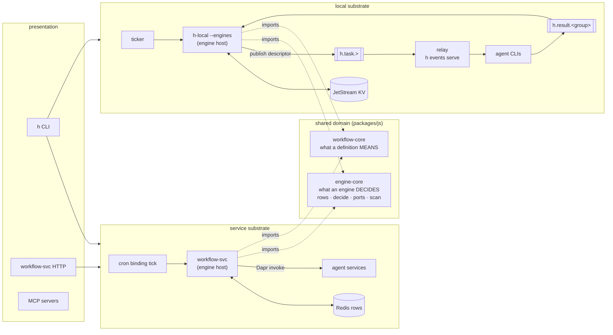

# Local engine parity — lifting the engines out of their host

Status: Active — extract the five engines into a shared core, host them locally on JetStream, and re-classify what the local substrate refuses
Established: 2026-08-16

## The thesis

The local substrate's gap list reads like five missing features — watcher, cron, schedule,
discover, chain-as-registration. It is not. **Every one of those engines is already a pure
function**, and has been since it was written:

```
apps/workflow-svc/src/domain/watch-engine.ts     decide(row, runtimeStatus, nowMs)
apps/workflow-svc/src/domain/chain-engine.ts     decide(...)
apps/workflow-svc/src/domain/cron-engine.ts      decide(...)
apps/workflow-svc/src/domain/discover-engine.ts  decide(row, runtimeStatus, todayFires, now)
apps/workflow-svc/src/domain/schedule-engine.ts  decide(row, nowMs)
```

Their imports are row models and `isDue`. Nothing about them is Dapr, Redis, or service-shaped.
What is service-shaped is only their three collaborators — durable rows, a clock, and a fire path.

So the local substrate does not lack engines. **It lacks an address for them.** The engines are
domain logic that was never lifted out of a host, which means exactly one process can reach it.

That gives the plan its shape, and its size: **one extraction plus one new component**, after which
the engines run unchanged on either substrate.

## Why this is the same move `workflow-core` already made

h has done this once, deliberately, and the result is the one place the two substrates already
have full parity:

| Concern | Where it lives | Parity today |
| --- | --- | --- |
| What a DEFINITION means (`{{token}}`/`$ref`, output contract, step shapes) | `packages/js/workflow-core` — **extracted**, imported by both | Full, and guarded by `scripts/check-runtime-parity.mjs` |
| What an ENGINE decides (supervise / sequence / recur / discover / schedule) | `apps/workflow-svc/src/domain/` — **not extracted** | None |

The difference in outcome is entirely a difference in filing. `engine-core` is `workflow-core` for
the second half of the domain.

### The general rule this exposes

**Domain logic in `apps/*/domain/` that more than one host needs is a parity bug that has not
happened yet.** `packages/js/*` is the hexagon's shareable interior; `apps/*` are composition
roots. Something valuable in an app's domain folder is either genuinely host-specific (correct) or
mis-filed (a future gap). This is worth encoding — see [Hardening](#hardening-what-gets-a-guard).

## The shape



The seam that keeps this honest: **the engine host never composes.** It decides and emits
*descriptors*; the relay composes on fire. So the local host needs no helm and no Python — it is a
resident mode of the existing `h-local` binary. That is the same engines↔agent-services separation
workflow-svc already has, with NATS where Dapr was.

## Collaborator mapping

| Engine needs | Service substrate | Local substrate |
| --- | --- | --- |
| Durable rows, single-writer, epoch-fenced | Redis `watch:` `chain:` `cron:` `wf:` `exec:` | **JetStream KV buckets** — CAS on revision is a *stronger* fence than the honour system Redis relies on |
| A clock | Dapr cron binding → `POST /workflow-cron-tick` | A ticker in the resident engine host |
| A fire path | Dapr invoke / `workflow-trigger` topic | `h.task.>` — **already built** (the relay's work queue) |
| Terminating a running instance | Dapr terminate | Cancel a claim the relay owns (see increment 4's boundary) |
| A saved-definition store | Redis + `__workflow_index__` | A KV bucket (increment 1) |

## Decisions locked (operator, 2026-08-16)

1. **The engine host is a separate long-lived process, brought up by `h events up`.** The
   constraint that decides it: the host must be a SINGLETON (two tickers over the same rows
   double-fire every cron), while the relay must NOT be (work-queue retention exists precisely so
   several can share the queue). Binding a singleton to a thing you want to scale is the wrong
   coupling. `nats-server` and the engine host are *infrastructure* and come up together; the relay
   is *work* and stays operator-run. This mirrors the service substrate, where workflow-svc comes up
   with the stack and agents do the work.
2. **Singleton is enforced by the fabric, not by convention** — the host holds a KV lease key it
   renews; a second host sees the lease and refuses loud. Same shape as the service side's
   `watch:__tick__` heartbeat, and it gives `h events status` a real liveness answer rather than a
   pid.
3. **nats-server is a HARD dependency: missing binary ⇒ warn and exit.** Local mode is *minimal*
   mode, not *dependency-free* mode. One preflight, one message, one exit — every local command.
4. **The chain journal is absorbed by the chain KV row; the workflow (step) journal stays.** They
   are counterparts of different service-side things — see [The journal question](#the-journal-question).
5. **Architecture gets enforced by lint wherever it can be.** Every increment below ships its
   guard in the same change set, per the *Harden by encoding* principle.

## The journal question

The run journal (`h-journal`, `h.journal.<group>`) publishes one record per completed unit:

| type | carries |
| --- | --- |
| `meta` | `definitionHash` (composition only — never params/budgets/seeds), group, kind |
| `stage` | the stage that COMPLETED, iteration, full post-capture chain data, member run ledger groups |
| `step` | one workflow step (or one parallel BRANCH), and its result |
| `terminal` | `completed` only — failed/exhausted runs stay resumable on purpose |

The answer splits, because the two granularities mirror different things:

- **Chain (`stage`) records → absorbed by the chain KV row.** These are the same information in two
  tenses: the journal is the log, the row is the snapshot. JetStream KV *is* a stream — a bucket
  with `history: N` makes each revision of the chain row a stage transition, replayable. The log
  comes free from the state, so one mechanism wins and it is the row.
- **Workflow (`step`) records → kept.** These have no registry counterpart on the service side,
  because nothing over there is "a workflow row you resume from" — the Dapr engine replays completed
  activities *internally*. The step journal is the local mirror of that replay, not a duplicate of a
  chain row. Retiring it would delete a capability, not a duplication.

So: not one mechanism, and not two competing ones — two mechanisms at different layers, which they
always were. The current design merely implemented both on the same stream, which made them look
like siblings.

**Consequence for foreground runs:** `h chain run --local` in a shell must keep working with no
resident engine host. So a chain has two hosts for one `decide`: the foreground driver (today's
`local-runtime/domain/chain.ts`, journaled) and the engine host (KV row). Same semantics, imported
from `engine-core` by both — which is exactly the drift risk the parity guard exists to catch.

## Progress

| # | Increment | Status | Guard |
| --- | --- | --- | --- |
| 0 | `engine-core` — the extraction | **In progress** | parity guard owns engine symbols |
| 1 | KV registries (`wf:`, saved store, `exec:`) | Not started *(preview owed)* | KV single-writer |
| 2 | Cron + schedule | Not started *(preview owed)* | flag/capability agreement |
| 3 | Chain as a durable registration | Not started *(preview owed)* | — |
| 4 | Watcher + `exec:` fences | Not started *(preview owed)* | — |
| 5 | Discover — fan-out | Not started | — |
| — | Refusal re-classification | Not started | classification guard |
| — | `engine host` in the glossary | Not started | vocabulary guard |

Increment 0 sub-steps (one commit each, each green on `make lint` + `make test`):

- [x] 0a — package skeleton, row models + ports move *(green: build, lint, 286 + 41 tests)*
- [ ] 0b — the five `decide` functions move
- [ ] 0c — the scans move, behind a new `IEventPublisher` port — **also fixes the depcruise blind
      spot found in 0a** (see Log)
- [ ] 0d — parity guard extended to own the engine symbols

## Increments

Each increment lands its own guard. Increments marked **(preview)** need the CLI surface shown to
the operator before implementation, per the standing convention.

### 0. `packages/js/engine-core` — the extraction

Move out of `apps/workflow-svc/src/domain/`:

- the row models (`watch.model`, `chain.model`, `cron.model`, `discover.model`, `schedule.model`,
  `wf.model`) and `scheduling.ts` (`isDue`/`assertValidCron`),
- the five `decide` functions and their decision types,
- the registry PORTS (`IWatchStore`, `IChainStore`, `ICronStore`, `IWfStore`, `ISourceReader`) —
  they are the seam both adapter sets implement.

**The scans move too — settled 2026-08-16 by measurement, not by argument.** The open question was
whether the `*-scan.ts` orchestrators (2823 lines, the bulk of the extraction) are portable or
service-bound. A full dependency inventory of all five scans plus the engines, `exec-policy.ts` and
`scheduling.ts` says portable: every import is a port, a row model, `effect`, `core`,
`workflow-core`, `cron-parser` — **with exactly one leak**, `DaprPublisherTag` from `core-dapr`,
in two places (`chain-scan.ts`'s cron-disarm + terminal publishes, `watch-scan.ts`'s terminal
`workflow-events` publish).

So the scans are already port-driven; they were simply never given a port for *publishing*. The
extraction adds one — `IEventPublisher` — with a Dapr adapter on one side and a NATS publish on
the other. Both substrates then share the sequencing and differ only in effects, which was the
recommendation; the measurement just made it cheap instead of risky.

Terminating a running instance is the second effect that differs, and it is already behind
`IWorkflowInvoker`. Increment 4 supplies the local implementation.

What stays in workflow-svc: the Dapr/Redis adapters, the HTTP routers, the activity registry. Its
domain folder should end up holding only what genuinely belongs to that host.

**Guard:** extend `scripts/check-runtime-parity.mjs` with `engine-core` as an owning package and
the engine symbols as owned — defining any of them elsewhere becomes a lint failure, the same way
`resolveRefs` already is.

### 1. KV registries — the substrate **(preview)**

A KV adapter for the ports above, plus the bucket layout and the single-writer rule carried over
from the flat Redis keyspace (a prefix names the one component that writes it).

Unlocks immediately:

- **`wf:` rows** — un-refuses `write-wf-row`, which cron's `goal: RESOLVED` handshake depends on.
- **A local saved-definition store** — so a task descriptor can carry `{key, params}` instead of
  embedded steps. That is triggers-as-data locally, and it un-refuses `-w KEY` on `--local`.
- **`exec:` policy reads** — `h agents deny/allow/budget` fences local runs. A usage-limited agent
  on a laptop is arguably more common than on a fleet.

**Guard:** a single-writer check over KV bucket names, the sibling of `check-state-keys`.

### 2. Cron + schedule — the cheapest parity **(preview)**

`schedule-engine.ts` is 26 lines of imports away from running as-is; `cron-engine.ts` needs only
`isDue` and the `wf:` goal flag from increment 1. Together they un-refuse `--cron`, `--max-fires`,
`--at`, `--in`, and `h workflow pause|resume`.

The value is operator-shaped: a nightly h-builds-h loop, or `--in 2h`, on a machine with no Dapr.

### 3. Chain as a durable registration **(preview)**

`chain:sub` in KV; the engine fires each stage as a task descriptor; the relay executes it.
Retires the chain half of the journal per the decision above. Foreground `h chain run --local`
keeps its driver-sequenced path — two hosts, one `decide`.

### 4. Watcher + `exec:` fences **(preview)**

The one increment with a genuine constraint: the watcher must TERMINATE a running instance, which
locally means cancelling work the engine host does not own. Only tractable for runs the **relay**
executes — so this is where "durable work goes through the fabric, not through your shell" becomes
a real boundary rather than a preference. Name it plainly in the surface.

Un-refuses `--watch`, `--retry`, `--fallback-agent/-model/-after/-max`, and per-member `--budget`.

### 5. Discover — fan-out

Needs `ISourceReader`; git-core's `GitHubClient` is TS, so the JS engine host imports it directly.
Nearly free once 1–4 exist.

## The refusal re-classification

Today `local-runtime/domain/activities.ts` holds one flat `REFUSED` map, and `workflow.py`'s
`_refuse_engine_flags` holds one flat flag list. Both are two lists wearing one coat. This work
forces the split, and making the split explicit is most of the plan's lasting value:

| Refusal | Class | After this plan |
| --- | --- | --- |
| `register-cron`, `register-discover` | **pending** — no engine here yet | available (2, 5) |
| `write-wf-row` | **pending** — no registry here yet | available (1) |
| `--cron`, `--max-fires`, `--at`, `--in` | **pending** | available (2) |
| `--watch`, `--retry`, `--fallback-*`, per-member `--budget` | **pending** | available (4), fabric-fired runs only |
| `-w KEY` with no chart template | **pending** — no saved store | available (1) |
| `run-itest` | **permanent** — needs an ephemeral k8s namespace | stays refused |
| `gc-worktrees` | **permanent** — a different workspace, not a missing capability | stays refused |
| `run-kimi`, `run-stub`, `run-dapr-agent`, `run-dapr-claude-loop`, `run-langgraph`, `run-claude-managed` | **permanent** — no agent-cli strategy exists | stays refused |
| `--via` | **permanent** — routing through a service's babysitter is meaningless with no services | stays refused |
| `--fresh` | **undecided** — means "purge and re-run a durable instance"; locally that is `--resume`'s inverse | decide deliberately, do not leave refused by inertia |

Saying *permanent* out loud is what stops "1-to-1 parity" from becoming an open-ended chase.

## Hardening — what gets a guard

Appetite confirmed as strong; each of these ships with its increment, not after.

1. **Engine ownership** — extend `check-runtime-parity.mjs` so the engine symbols may only be
   defined in `engine-core`. (Increment 0.)
2. **KV single-writer** — a bucket prefix names one owning module; a write from anywhere else
   fails. Sibling of `check-state-keys`. (Increment 1.)
3. **Refusal classification** — every entry in `activities.ts`'s `REFUSED` map must declare
   `pending` (naming the engine/registry it awaits) or `permanent` (naming the cluster/service it
   needs). Machine-checked, so the list cannot silently collapse back into a flat "needs an engine".
   (Increment 0, then maintained.)
4. **Flag/capability agreement** — the CLI's `_refuse_engine_flags` list and the engine host's
   declared capabilities must not disagree. A flag refused as "needs an engine" once that engine
   exists locally is a bug the machine should catch, not a review habit. (Increment 2 onward.)
5. **Misfiled domain logic** — the general rule from the thesis. Weakest to express generically;
   the tractable version is an allowlist: name the symbols each `apps/*/domain/` may legitimately
   own, and fail on additions that neither appear there nor in a shared package. Design it after
   increment 0, when the true residue of workflow-svc's domain folder is visible.
6. **Vocabulary** — `engine host` enters ARCHITECTURE.md's glossary as a substrate-NEUTRAL term:
   the process that holds the tick and runs the engines' `decide` against durable rows.
   workflow-svc *is* the service substrate's engine host; `h-local --engines` is the local one.
   Naming it neutrally is what makes the parity legible rather than incidental.

## Open questions

- **`--fresh` on the local substrate** — see the table above.
- **Who supervises `h events serve`?** Nothing does today; the operator runs it in a shell. If
  durable local work is the goal this needs an answer, but it is a separate decision from the
  engine host's lifecycle and should not be smuggled into this plan.
- **Does `h delegate` write a `wf:` row?** With KV always present it can, and it can read `exec:`
  policy. It still has nothing to resume, so it stays unjournaled. Confirm the split.
- **Bridging** — leaf-node to a fleet fabric, and Dapr `pubsub.jetstream` as the fleet's transport.
  Out of scope here; recorded so it is not silently implied. It becomes interesting only once both
  substrates read the same row shapes, which is what this plan delivers.

## Log

- 2026-08-16 — Established. Design settled in conversation with the operator: parity re-framed from
  "five missing features" to "one extraction plus one host", on the evidence that all five engines
  are already pure `decide` functions with no service coupling. Five decisions locked (see above);
  the journal question resolved by splitting chain-stage records (absorbed by a KV row with history)
  from workflow-step records (kept — the local mirror of Dapr's activity replay). Hardening appetite
  confirmed strong: every increment ships its guard in the same change set.
- 2026-08-16 — Increment 0 scoped. ~4600 lines are candidates; the five `decide` functions are only
  331 of them, the scans 2823. Dependency inventory closed the plan's one open design risk: the
  scans are already port-driven, leaking to a concrete adapter in exactly two places
  (`DaprPublisherTag`). The extraction therefore moves the scans and adds one `IEventPublisher`
  port, rather than leaving sequencing to drift across two hosts.
- 2026-08-16 — **0a done.** `packages/js/engine-core` created; 8 row models (+3 model test files),
  8 registry ports and `scheduling.ts` moved by `git mv`, relative imports intact. 57 import sites
  rewritten to `engine-core`; no re-export shims left behind (the models never belonged to that
  host, and shims would preserve the fiction that they do — the same call the `workflow-core`
  extraction made). Green on `bun run build`, `bun run lint`, and the suites: workflow-svc 286,
  engine-core 41. Two findings, both from guards rather than review:
  - **Apps are typechecked more loosely than packages.** The package tsconfig sets
    `noUncheckedIndexedAccess`; `apps/workflow-svc` does not. Two accesses that compiled in the app
    failed on arrival — `validateChain`'s index loop and `parseDurationMs`'s regex-group lookup
    (which was carrying a `!`). Both were provably safe and are now narrowed structurally. Moving
    code into a package tightens it; the latent question of whether apps should adopt the flag is
    NOT part of this plan.
  - **`domain-no-io-libs` has a workspace blind spot — verified, not suspected.** The rule forbids
    `domain/` importing `core-dapr`, and `chain-scan.ts`/`watch-scan.ts` do exactly that, yet
    depcruise reports no violation. Cause: the rule matches `node_modules/(…)`, while a workspace
    package resolves to `../../packages/js/core-dapr/dist/index.d.ts`. So the one concrete-adapter
    leak 0c was already going to remove was never actually being guarded. 0c fixes both halves —
    the import (behind `IEventPublisher`) and the rule (match the workspace path too). Deliberately
    NOT fixed in 0a: tightening the rule while the import still exists would just fail the build.
  - Steering/diagram guards caught the package's absence from CLAUDE.md + README.md and the
    `workflow-svc-class` manifest's now-dangling file paths; all three updated in this change set,
    and the diagram's prose now says which half of it lives in `engine-core`.
