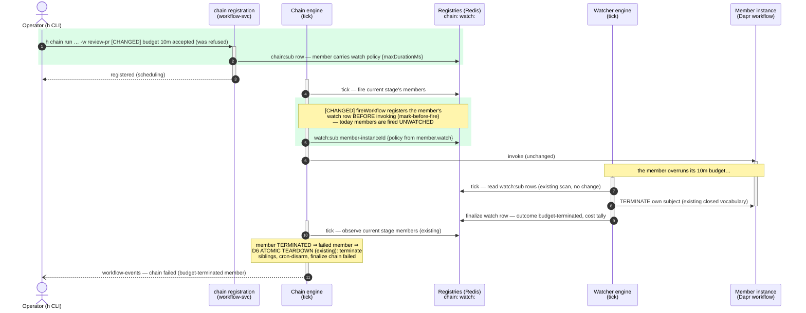
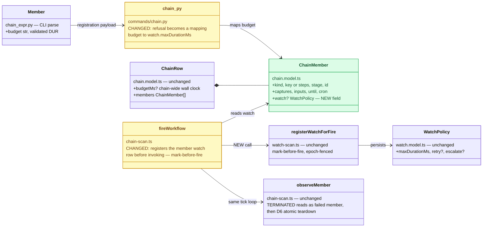

# Per-member `--budget` — a chain member the watcher can budget-terminate

Status: Planning — design + change diagrams for review; the CLI parses this today and refuses
it at registration ("not yet enforced"); nothing built
Established: 2026-07-31

The carried item (carried-followups §1, from chain-composition-surface Slice E): `h chain run`
accepts a per-member `--budget DUR` in the chain expression and VALIDATES it, but `chain.py`
then refuses it. The chain-wide wall clock works; a member cannot yet carry a tighter (or
looser) budget than its siblings.

**The design in one sentence:** a member's `--budget` becomes a WATCH POLICY on that member's
instance — the chain engine keeps sequencing, the watcher keeps supervising, and the two meet
only through state both already read (the member's runtime status): no new engine vocabulary,
no chain-supervises-itself violation.

## What changes, in the flow (sequence)

Green = new interactions. Everything untinted is EXISTING machinery, untouched — that is the
point of the design: enforcement rides the watcher's existing budget-terminate + the chain's
existing member-failure teardown (D6).

## What changes, in the contracts (class diagram)

Green = new; amber = existing code whose shape/behavior changes; default = untouched.

## Design notes (why this shape)

- **The watcher stays 1:1 with a workflow instance — nothing becomes plural.** (Operator
  question, 2026-07-31.) A member IS a workflow instance (`<chainId>-wN`); today it is fired
  UNWATCHED (chain observation is sequencing, not supervision). The design gives each
  budgeted member its own ordinary single registration — three budgeted members ⇒ three
  instances ⇒ three independent watch rows.
- **Policy at registration, watcher at fire — deliberately two moments.** The chain:sub row
  CARRIES the member's policy from registration (diagram step 2); the watch row is armed
  mark-before-fire when that member's STAGE advances (step 5). Arming early would start the
  budget clock (`startedAt`) while earlier stages still run and mis-terminate a member that
  never fired.
- **Whoever fires, carries — supervision is a property of a FIRE, not a definition.**
  (Operator question, 2026-07-31.) Standalone: the fire REQUEST carries `watch` (transient;
  stripped off before the workflow sees it). Chain: the MEMBER entry in the chain:sub row
  carries it (durable, because the fire moment is deferred to stage advance). The discovery
  cron's row and sched continuations' resubmits are the same pattern. Every carrier converges
  on the one choke point, `registerWatchForFire`, at fire time; a SAVED workflow never
  persists a policy. Members even get the stronger mark-before-fire form always — their ids
  are deterministic, where a standalone generated-id fire registers just after scheduling.
- **Two budgets compose as whichever-trips-first.** A member can be terminated by its own
  watcher (member budget) or by the chain engine (chain-wide `budgetMs`, D6). Safe: terminate
  is idempotent and both engines only read the resulting terminal status.
- **No new vocabulary anywhere.** The watcher already budget-terminates its subject; the
  chain already treats a TERMINATED member as a failed member and tears down atomically
  (D6, incl. cron-disarm). The whole feature is two seams: carry the policy on the member,
  register it at fire time. Judgment stays out; both engines keep their closed vocabularies.
- **Mark-before-fire holds for members too**: the watch row lands before the invoke, so a
  crash between the two leaves a `scheduling` row the watch scan heals — members gain the
  same supervision guarantee every other fire path has.
- **Validation at registration (both sides), like captures/inputs**: a member `--budget` on
  a CRON member is refused (a cron member's recurrence is the cron engine's business); the
  chain-wide budget continues to bound the whole run independently.
- **Epoch interplay**: a loop-until-clean re-fire of a member bumps the member's watch epoch
  exactly as any re-fire does — a stale budget decision no-ops (existing fencing, free).
- **Cost visibility rides for free**: a watched member gets the watcher's finalization cost
  tally + per-agent day-ledger subtotals — closing the "chain members are invisible to the
  watch ledger" gap as a side effect.

## Acceptance

1. `h chain run … -w review-pr --budget 10m …` registers (no refusal); `h chain list` shows
   the member budget; the member's `watch:sub` row exists from fire time.
2. A member that overruns is terminated by the WATCHER (row finalized `budget-terminated`),
   and the chain finalizes failed via the existing D6 teardown — observed live.
3. A `--budget` on a `--cron` member is refused at registration, loudly.
4. Goldens/tests: chain_expr already parses; chain.py mapping tested; chain-scan fire path
   registers the watch row (unit); one e2e in the cookbook once validated.

## Log

- 2026-07-31 — Created from carried-followups §1 as the diagram-enrichment exercise of the
  `diagrams` skill (transient change diagrams, delta-color convention). Design reviewed via
  the rendered diagrams before any code.
